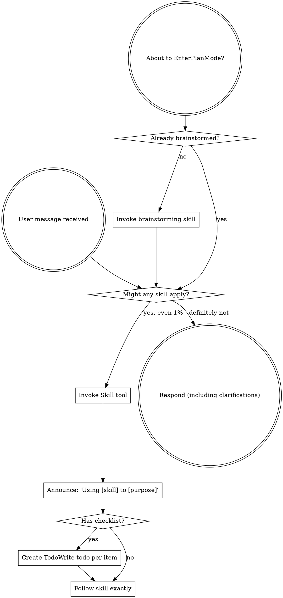

# Handoff concept UI SyncBay

Data: 2026-06-03

Questo documento recupera e consolida il lavoro delle chat Codex
`019e8e55-b6cb-77b0-852c-232f05d9eca2` e
`019e8ec8-ebb0-70d3-b770-2d9e667117b1`.

Scopo: non perdere le decisioni prese sui concept grafici dell'app embedded
SyncBay, fissare il set di riferimento usato per l'implementazione e conservare
in calce la trascrizione testuale dei due thread recuperati.

## Stato del lavoro

- Il recupero iniziale del 2026-06-03 era ancora in fase di concept; dal
  2026-06-04 il redesign è stato implementato e pubblicato nel pilota Vercel.
- I PNG statici costruiti manualmente con logo reale sono stati scartati dal
  maintainer e non vanno usati come base.
- La base finale recuperata è Image Gen, con correzioni successive e copia
  versionabile nella repo.
- Il logo generato da Image Gen può essere impreciso: in implementazione va
  sostituito con gli asset reali SyncBay in `brand/assets/svg/` o
  `brand/assets/png/`.
- I sei concept sono reference direzionali, non specifiche pixel-perfect. Il
  piano scritto, i componenti Shopify reali e i contratti dati prevalgono sui
  dettagli generati.
- La Fase 0 documentale sui contratti dati è stata completata prima delle
  modifiche runtime: loader, action, dati disponibili, dati mancanti, stati
  vuoti e rischi sono mappati nel piano UI.
- Le fasi 1-4 sono state implementate e pubblicate:
  - Fase 1: nav embedded, sistema visivo condiviso e `Panoramica`;
  - Fase 2: nuove route `Catalogo` e `Conflitti`, collegate a selector Prisma
    reali e all'action esistente di risoluzione conflitti;
  - Fase 3: `Importazione` riorganizzata in step progressivi e `Impostazioni`
    rese coerenti con i quattro box verticali confermati;
  - Fase 4: `Attività` introdotta come timeline operativa con diagnostica
    secondaria.
- Fase 5, revisione post-publish del 2026-06-05: QA/documentale e controllo
  contro i sei concept completati; i residui visibili rilevati sono stati
  chiusi nella patch runtime `0.23.6`.
- Follow-up 2026-06-12: il cleanup runtime `0.33.6` ha chiuso i residui del
  redesign globale su `Catalogo`, `Conflitti`, `Importazione` e `Attività`.
- Follow-up Impostazioni 2026-06-12: `0.34.0` ha riallineato la pagina alle
  schede operative del design layer; `0.35.0` ha aggiunto disconnessione eBay,
  intervallo sync configurabile, conferma disattivazione e ultimo sync.

## Note implementative

- `Catalogo` è table-first, con thumbnail quando disponibile dal payload
  snapshot, primo campo `Prodotto`, filtri separati dall'importazione e una sola
  colonna `Stato`.
- `Conflitti` apre di default sui conflitti aperti, tiene la storia risolta come
  filtro secondario e usa le tre azioni confermate: `Usa valore eBay`,
  `Mantieni Shopify`, `Ignora campo`.
- I nuovi selector runtime non aggiungono schema, provider, worker o integrazioni:
  leggono `ProductMapping`, `ProductSnapshot` e `SyncConflict`.
- `Importazione` mantiene le action esistenti per location, rinomina location e
  pianificazione import catalogo; `Impostazioni` mantiene i salvataggi sync,
  default prodotto e canali.
- La QA visuale post-publish è stata eseguita nel contesto Shopify Admin
  production del dev store con Safari/Computer Use sulle sei route embedded.
  L'avvio standalone resta utile solo per debug locale: le superfici embedded
  vanno giudicate dentro Shopify Admin.

## Fonti recuperate

- Chat originale:
  `/Users/Matteo/.codex/archived_sessions/rollout-2026-06-03T18-34-02-019e8e55-b6cb-77b0-852c-232f05d9eca2.jsonl`
- Thread ponte:
  `/Users/Matteo/.codex/archived_sessions/rollout-2026-06-03T20-39-52-019e8ec8-ebb0-70d3-b770-2d9e667117b1.jsonl`
- Cartelle immagini:
  `/Users/Matteo/.codex/generated_images/019e8e55-b6cb-77b0-852c-232f05d9eca2/`
  e
  `/Users/Matteo/.codex/generated_images/019e8ec8-ebb0-70d3-b770-2d9e667117b1/`
- Copia versionabile dei sei concept finali nella repo:
  `docs/assets/ui-concepts/2026-06-03/`

Nota di controllo finale: i due file JSONL sono in `archived_sessions`, perché
le chat risultano archiviate. La trascrizione in calce è stata confrontata
messaggio per messaggio con questi file archivio.

## Ultimi 6 concept da usare

Questi sono i sei concept finali da considerare reference operativo.

| Pagina | Concept finale | Motivo |
| --- | --- | --- |
| Panoramica | `docs/assets/ui-concepts/2026-06-03/01-panoramica.png` | Corretto dopo il pass che aveva introdotto export: niente export, prossima azione chiara, usa `Quantità da verificare`. |
| Catalogo | `docs/assets/ui-concepts/2026-06-03/02-catalogo.png` | Rigenerato nel thread ponte: niente viola, niente frecce o segnali di sync catalogo bidirezionale. |
| Conflitti | `docs/assets/ui-concepts/2026-06-03/03-conflitti.png` | Mantiene le tre azioni decisionali corrette e diagnostica secondaria. |
| Importazione | `docs/assets/ui-concepts/2026-06-03/04-importazione.png` | Stepper e anteprima coerenti, default `Bozza`/`Attivo` e canali visibili come riepilogo. |
| Attività | `docs/assets/ui-concepts/2026-06-03/05-attivita.png` | Timeline prima, diagnostica dopo. In implementazione rimuovere o ridimensionare eventuali azioni larghe tipo `Sincronizza tutto`. |
| Impostazioni | `docs/assets/ui-concepts/2026-06-03/06-impostazioni.png` | Rigenerato nel thread ponte: i quattro box sono uno sotto l'altro, non in una riga. |

## Revisione post-publish 2026-06-05

Route production verificate dentro Shopify Admin:

| Pagina | URL embedded | Esito |
| --- | --- | --- |
| Panoramica | `/app` | Struttura corretta, metriche reali e prossima azione visibile. La review aveva rilevato `Ricollega eBay` tra le azioni consigliate anche con account già collegato; corretto in `0.23.6`. |
| Catalogo | `/app/catalog` | Table-first, thumbnail visibili, filtri separati, una sola colonna `Stato`, paginazione reale. Nessun export o segnale bidirezionale. |
| Conflitti | `/app/conflicts` | Default su conflitti aperti, azioni `Usa valore eBay`, `Mantieni Shopify`, `Ignora campo`, descrizioni leggibili e paginazione reale. |
| Importazione | `/app/import-preview` | Step progressivi, collegamento eBay nel punto corretto, default/canali riassunti, anteprima paginata e azione di import preservata. |
| Attività | `/app/activity` | Timeline e controlli rapidi presenti. La review aveva rilevato il filtro cliente `Audit` al posto di `Conflitti` e conflitti recenti non abbastanza visibili nella timeline; corretto in `0.23.6`. |
| Impostazioni | `/app/settings` | Quattro box verticali confermati: `Sync catalogo`, `Import prodotti`, `Canali di vendita`, `Avanzate`. Nessun quinto box `Account`. |

Copertura dei cinque rilievi della review production precedente:

1. Catalogo conteggi/paginazione: production successiva ha mostrato totale
   reale, miniature prodotto e paginazione `1-100` / `101-200`; il codice usa
   conteggio reale e pagina server-side.
2. Conflitti KPI: i conteggi `Aperti`, `Risolti` e `Totale` sono calcolati con
   query dedicate, non più sul sottoinsieme caricato.
3. Importazione densità: la preview resta ricca, ma ora è paginata a 10 righe e
   separa filtri/step senza trasformarsi in un muro di 50 elementi.
4. Conflitti valori/hash: la pagina non espone hash descrizione come valori
   leggibili dal negoziante; le decisioni restano guidate dai campi e
   dall'impatto.
5. Attività e Impostazioni: entrambe caricano in produzione senza crash;
   `0.23.6` rimuove il filtro cliente `Audit`, promuove `Conflitti` nella
   timeline e Impostazioni conferma i quattro box verticali.

Confronto concept/implementazione:

- copy: nav e label primarie corrispondono alla IA confermata;
- layout: implementazione più Shopify-native dei mockup, con route reali invece
  di tavole statiche;
- densità: Catalogo e Conflitti restano compatti e revisionabili su dati reali;
- colore: palette SyncBay sobria, niente viola o gradienti inventati;
- anatomia: tabella per Catalogo, decision card per Conflitti, stepper per
  Importazione, timeline per Attività, form verticali per Impostazioni;
- dettagli tecnici: visibili solo come disclosure, controlli rapidi o sezioni
  avanzate, non come voce nav primaria.

Deviazioni intenzionali dai PNG:

- i mockup non sono pixel-perfect spec e mostrano dati fittizi; l'app usa dati
  reali del dev store;
- il logo dei concept non è fonte di verità quando Image Gen lo reinterpreta;
- Panoramica può mostrare conflitti reali invece di uno stato `Tutto sotto
  controllo`;
- Catalogo non implementa ricerca/salvataggio viste del concept, fuori dal
  perimetro MVP corrente;
- Conflitti non usa un pannello helper laterale permanente: le decisioni
  restano nella lista per ridurre complessità;
- Attività non espone `Sincronizza tutto`, perché è ambiguo rispetto al sync
  eBay -> Shopify e agli ordini Shopify -> eBay stock;
- Impostazioni mantiene i quattro box verticali senza creare `Account` come
  quinto box.

Nota di evidenza: il comando shell `screencapture` non ha prodotto immagini in
questo ambiente; la review visuale è stata condotta su Safari/Computer Use e
annotata qui. I sei PNG concept sono stati comunque riaperti con `view_image`
prima della chiusura.

## Riallineamento redesign 2026-06-12

Questo pass non sostituisce i concept del 2026-06-03: fissa lo stato effettivo
dopo il cleanup runtime e separa le superfici già ricontrollate da quelle fuori
scope.

| Superficie | Stato |
| --- | --- |
| `Panoramica` | Ricontrollata live come riferimento di coerenza. Nessuna modifica runtime nel cleanup `0.33.6`. |
| `Catalogo` | Riallineati badge accessorio, spaziatura filtri e fallback thumbnail senza immagine. |
| `Conflitti` | Confermata IA con KPI `Aperti`, `Sicuri`, `Da rivedere`, `Da decidere`, `Totale`; fallback thumbnail coerente. |
| `Importazione` | Riallineati spaziatura filtri e copia primaria sullo scope `write_locations`. |
| `Attività` | Diagnostica tecnica spostata dietro disclosure, filtri distanziati e timeline più leggibile. |
| `Impostazioni` | Riallineata con quattro schede operative: `Sync catalogo`, `Import prodotti`, `Canali di vendita`, `Avanzate`. Sync e Avanzate restano a tutta larghezza; Import e Canali possono affiancarsi su desktop e collassano su viewport stretto. |

Il renderer locale di preview ora copre le sei superfici in scope con fixture
sintetiche sanificate. La verifica definitiva della resa `s-*` resta Shopify
Admin embedded.

### Matrice temi coperti

| Tema redesign | Copertura |
| --- | --- |
| Navigazione embedded e IA a sei voci | Tutte le pagine. |
| Design layer con icone, tile e badge di stato | Panoramica, Catalogo, Conflitti, Attività e Impostazioni; Importazione usa lo stepper dello stesso layer. |
| Dettagli tecnici secondari, non dominanti | Importazione, Attività e Impostazioni dietro disclosure; Catalogo e Conflitti restano focalizzate su tabella/decisioni. |
| Ritmo di spaziatura filtri e controlli | Catalogo, Conflitti, Importazione e Attività; Impostazioni usa form verticali distanziati dentro le schede. |
| Responsive stretto | Tile, timeline, stepper e schede Impostazioni collassano senza forzare larghezza extra. |
| Sorgente eBay -> Shopify senza ambiguità bidirezionale | Tutte le pagine; Impostazioni ribadisce che solo gli ordini Shopify aggiornano la disponibilità eBay. |

## Readiness screenshot e microcopy 2026-06-05

Obiettivo: preparare l'app embedded per screenshot prodotto e review commerciale
senza introdurre schermate finte o dati di negozianti non autorizzati.

Sequenza consigliata screenshot:

1. `Panoramica`: prossima azione e stato sync visibili.
2. `Catalogo`: tabella con immagini, disponibilità e origine eBay chiara.
3. `Conflitti`: KPI `Sicuri`, `Da rivedere`, `Da decidere` e decision card.
4. `Attività`: timeline con impatto, prossima azione e retry sicuro.
5. `Importazione`: step progressivi e preview paginata.
6. `Impostazioni`: schede operative con sync, import, canali e avanzate.

Regole copy per screenshot:

- usare italiano operativo, frasi brevi e niente allarmismi;
- mostrare `Sicuri` solo per decisioni che non toccano prezzo,
  disponibilità, stato prodotto o mapping;
- mostrare `Attendi eBay` quando il retry manuale anticiperebbe un cooldown
  provider;
- preferire riferimenti tecnici sintetici come codici errore, non payload o
  token;
- non usare screenshot con dati personali, ordini reali, customer data,
  credenziali o listing di negozianti non autorizzati.

## Evoluzione 2026-06-08 - design layer e restyling

Revisione maintainer: la resa pubblicata è ancora percepita piatta rispetto ai
sei concept. Gerarchia debole, sezioni di peso uguale, vocabolario nativo
sotto-utilizzato (`s-icon` non usato). Aperto un lavoro di restyling con
priorità gerarchia/densità, poi coerenza/rifinitura, poi fedeltà ai concept.

Decisioni fissate (vedi ADR `docs/decisions/0010-ui-design-layer-e-marchi-terzi.md`):

- confine: resta "Shopify-native prima", con un design layer minimo a lista
  chiusa di tre elementi: tile metrica con `s-icon` e sfondo a tinta tenue,
  pannello connessioni con marchi eBay/Shopify, hero di stato con accento
  tonale;
- l'aside permanente "Come scegliere" nei Conflitti resta scartato;
- griglia condivisa: multi-regione responsiva, hero a tutta larghezza e fasce a
  due colonne che collassano a una su viewport stretto;
- marchi eBay/Shopify ufficiali ammessi come indicatori sobri, previa verifica
  delle brand guideline; fallback a indicatori neutri se non conformi;
- scope: presentazione, riordino e microcopy, con loader/selector ammessi se la
  UI lo richiede; quando si tocca un loader la verifica sale a corsia completa;
- esecuzione: sistema visivo condiviso + Panoramica come pagina-prova con
  approvazione del maintainer, poi propagazione alle altre cinque superfici.

## Evoluzione 2026-06-14 - Panoramica ridisegnata

Secondo giro di redesign richiesto dal maintainer: app più veloce, dinamica e
informativa, meno gergale. Lavorato sulla Panoramica come pagina-prova (route
reale `app/routes/app._index.tsx`), poi da propagare.

- design layer esteso (ADR 0010, estensione 2026-06-14): battito del sync,
  lente rischio disponibilità, sparkline affidabilità; il first-run riusa la
  tappa stepper per l'onboarding Collega → Importa → Attiva;
- contenuti: via i "Dettagli tecnici" dalla vista negoziante, azioni davvero
  contestuali, metriche con tendenza 24h e affidabilità 7 giorni dallo storico
  job (aggregazione in `getDashboardState`, nessun nuovo worker);
- linguaggio de-gergato (niente "Centro operativo"/"Pilota controllato"; azioni
  e stati specifici), attività come timeline;
- accento UI portato sul Bay Blue del logo, uso disciplinato, colori come
  variabili semantiche, tema chiaro theme-ready (ADR 0013);
- ancora aperto: propagazione alle altre cinque superfici, runtime vivo
  (streaming `defer`, polling leggero, toast) con ADR dati-live dedicato,
  conteggio "esaurite" nel battito;
- verifica: typecheck, lint, `test:lib` (221), build verdi; preview via
  `scripts/syncbay-ui-render.mjs panoramica --fixture`.

## Decisione prodotto

SyncBay resta una app Shopify embedded per negozianti italiani che partono da
un negozio eBay.it e vogliono mantenere un catalogo Shopify ordinato.

La direzione non cambia:

- sync catalogo principale: eBay verso Shopify;
- eBay resta la sorgente di verità del catalogo;
- Shopify riceve prodotti, prezzi, immagini, descrizioni e disponibilità;
- eccezione obbligatoria: ordine Shopify pagato verso aggiornamento stock eBay;
- niente export catalogo Shopify verso eBay nel MVP;
- niente promessa di sync catalogo bidirezionale;
- niente trasformazione in suite marketplace generalista.

Nei concept e in implementazione non devono comparire azioni o visual che
suggeriscano export o bidirezionalità catalogo, per esempio frecce in entrambe
le direzioni, `Esporta`, o `Sincronizza tutto` come azione ampia e ambigua.

## Architettura informativa

La home deve essere un centro operativo giornaliero, non un wizard permanente.

Nav finale confermata, in questo ordine:

1. `Panoramica`
2. `Catalogo`
3. `Conflitti`
4. `Importazione`
5. `Attività`
6. `Impostazioni`

Regole nav:

- `Diagnostica` non è una voce nav: vive dentro `Attività` o in pannelli
  avanzati.
- `Account` non è una voce nav: il collegamento eBay vive in `Importazione` e
  nelle impostazioni/avanzate.
- `Dashboard` non va usato: `Panoramica` è più naturale in italiano.
- La nav resta sotto 7 voci, con nomi brevi e sostantivi.

## Stack e componenti

Il repo usa app embedded Shopify con React Router, App Bridge e Polaris Web
Components Shopify (`s-page`, `s-section`, `s-box`, `s-stack`, `s-grid`,
`s-table`, `s-badge`, `s-button`, `s-select`, `s-switch`, `s-checkbox`,
`s-clickable-chip`, `s-thumbnail`, `s-image`, ecc.). La direzione decisa è:

- usare App Bridge e Polaris Web Components come base effettiva, non solo come
  ispirazione visiva;
- non introdurre Polaris React legacy solo per il redesign;
- usare componenti nativi per bottoni, form, sezioni, nav, badge, tabelle,
  pannelli/card, stati vuoti, stack/grid e miniature quando esiste una primitiva
  Shopify adatta;
- mantenere il 25% di identità SyncBay con asset reali, tagline, badge nativi
  nello slot accessorio delle pagine e microcopy ricorrente, non con una shell o
  palette custom sui componenti;
- aggiungere CSS custom leggero solo per identità minima SyncBay, shell/logo,
  dettagli tecnici o composizioni non coperte dai componenti Shopify; allo stato
  attuale della UI embedded l'eccezione custom residua è lo styling minimo dei
  disclosure tecnici nativi `details/summary`.

## Regole visual

Direzione visiva: 75% Shopify-native, 25% identità SyncBay.

Da usare:

- sfondo `Cloud` `#F6F8F7`;
- superfici `Paper` `#FFFFFF`;
- testo `Ink` `#15202B`;
- secondario `Slate` `#51615F`;
- bordi `Mist` `#D8E0DD`;
- azioni/accenti `Harbor` `#0F5E6E` e `Current` `#1A8F7A`;
- successo `Moss` `#3F7D4A`;
- warning `Amber` `#B7791F`;
- conflitto/errore `Coral` `#C75C48`;
- info `Steel` `#3D6F9F`;
- colori logo solo negli asset logo: `Bay Blue`, `Sync Green`,
  `Listing Yellow`, `Listing Red`.

Da evitare:

- viola o accenti inventati;
- gradienti dominanti;
- orbs, bokeh o decorazioni astratte;
- hero marketing;
- dashboard SaaS esterna allo stile Admin;
- claim o visual da app ufficiale eBay/Shopify.

Loghi eBay e Shopify sono consentiti come indicatori sobri di collegamento,
sorgente o destinazione. Non devono diventare co-branding dominante o claim di
ufficialità.

## Tono e copy

Lingua UI: italiano, professionale, concreto.

Regole:

- parlare al negoziante, non all'operatore tecnico;
- evitare `OAuth`, `scope`, `job`, `payload`, `mapping` nel livello primario;
- mostrare dettagli tecnici in disclosure o diagnostica secondaria;
- niente esclamativi, emoji, `oops` o messaggi vaghi;
- usare `Quantità da verificare`, non `Disponibilità non protetta`;
- usare `Aggiornamento catalogo in ritardo`, non label tecniche;
- usare `Mantieni Shopify`, `Usa valore eBay`, `Ignora campo` per i conflitti.

## Panoramica

Ruolo: centro operativo giornaliero.

Decisioni:

- deve aprire con la prossima azione o lo stato operativo, non con metriche nude;
- se tutto va bene, copy tipo `Tutto sotto controllo`;
- se serve intervento, dichiarare subito cosa richiede una scelta;
- i numeri sono supporto, non apertura principale;
- setup/importazione si vede solo quando manca un prerequisito reale o il flusso
  non è concluso;
- niente blocco onboarding permanente dopo il primo import.

Priorità della prossima azione:

1. `Collegamento eBay mancante o scaduto`
2. `Quantità da verificare`
3. `Conflitti aperti`
4. `Aggiornamento catalogo in ritardo`
5. `Importazione incompleta`
6. `Impostazioni mancanti`
7. `Tutto sotto controllo`

Sezioni previste:

- pannello stato/prossima azione;
- metriche compatte: prodotti collegati, conflitti aperti, quantità da
  verificare, ultimo aggiornamento;
- azioni consigliate;
- stato catalogo;
- collegamenti eBay/Shopify;
- attività recenti;
- diagnostica collassata.

## Catalogo

Ruolo: vista operativa dei prodotti Shopify collegati a eBay.

Non è:

- un editor prodotti completo;
- una copia di Shopify Products;
- un exporter;
- una pagina di importazione.

Decisioni:

- pagina table-first, con densità Shopify-native;
- prima colonna `Prodotto`, contenuto con thumbnail, titolo e SKU/ItemID
  secondario;
- un solo badge `Stato`, costruito da stato Shopify + stato SyncBay;
- `Stato Shopify` e `Stato SyncBay` non devono essere due colonne principali;
- dettagli tecnici nel drawer/dettaglio riga;
- `Archiviati` neutro, non viola;
- collegamento eBay testuale, senza frecce bidirezionali.

Filtri Catalogo:

- `Tutti`
- `Collegati`
- `Aggiornati`
- `Da controllare`
- `Conflitti`
- `Non aggiornati`
- `Archiviati`

Colonne:

- `Prodotto`
- `Collegamento`
- `Disponibilità`
- `Prezzo`
- `Aggiornamento`
- `Stato`
- `Azione`

Azioni riga:

- `Dettagli`
- `Risolvi`
- `Riprova`

## Importazione

Ruolo: flusso raro ma delicato per portare prodotti eBay in Shopify.

Decisioni:

- pagina unica a step progressivi;
- non più sottopagine separate;
- filtri di import restano in `Importazione`, non in `Catalogo`;
- la configurazione completa di default pubblicazione/canali vive in
  `Impostazioni`;
- `Importazione` mostra un riepilogo delle impostazioni e una scorciatoia per
  modificarle.

Step:

1. `Collegamento eBay`
2. `Preparazione Shopify`
3. `Anteprima catalogo`
4. `Importazione`
5. `Dopo l'import`

Filtri Importazione:

- `Tutti`
- `Pronti da importare`
- `Importazione in corso`
- `Già importati`
- `Da reimportare`
- `Errore`

Da preservare dal codice attuale:

- selezione location Shopify predefinita;
- rinomina location;
- default stato prodotti;
- modalità/nota immagini e descrizioni quando utile;
- dry-run e preview;
- esempi prodotto;
- validazioni e blocchi;
- avvio import controllato.

## Conflitti

Ruolo: workflow decisionale, non tabella tecnica.

Decisioni:

- default su conflitti aperti;
- storico risolti accessibile ma secondario;
- copy orientato a scelta e impatto;
- niente enum grezzi come `REALIGN_FROM_EBAY`, `KEEP_SHOPIFY`,
  `IGNORE_FIELD` nella UI primaria.

Filtri:

- `Aperti`
- `Risolti`
- `Tutti`

Struttura riga:

- `Prodotto`: thumbnail, titolo, riferimento eBay piccolo;
- `Campo`: prezzo, titolo, descrizione, disponibilità, stato;
- `Differenza`: valore Shopify e valore eBay;
- `Impatto`: cosa succede se non viene risolto;
- `Azione`: decisione esplicita.

Azioni:

- `Usa valore eBay`;
- `Mantieni Shopify`;
- `Ignora campo`.

## Attività

Ruolo: cronologia operativa leggibile con diagnostica secondaria.

Decisioni:

- assorbe attività recenti, job, audit, retry, errori e diagnostica;
- non deve sembrare un log tecnico;
- i dettagli tecnici esistono ma sono in disclosure o aside;
- diagnostica dentro la pagina, non nella nav;
- timeline prima, diagnostica dopo.

Filtri:

- `Tutte`
- `Importazioni`
- `Aggiornamenti`
- `Disponibilità`
- `Conflitti`
- `Errori`

Ogni evento deve mostrare:

- cosa è successo;
- quando;
- su quanti prodotti;
- esito;
- eventuale azione.

Esempi copy:

- `958 prodotti sincronizzati correttamente`;
- `12 prodotti messi in attesa per conflitto`;
- `Importazione completata`;
- `Quantità aggiornata dopo ordine Shopify`;
- `eBay non ha risposto, SyncBay riproverà automaticamente`.

Nota: il concept finale può mostrare un'azione larga tipo `Sincronizza tutto`.
In implementazione questa azione va rimossa o trasformata in comando molto
circoscritto, perché è ambigua rispetto allo scope eBay verso Shopify.

## Impostazioni

Ruolo: regole essenziali in alto, opzioni tecniche o rare in basso.

Decisioni:

- i quattro box del concept finale devono essere verticali, uno sotto l'altro,
  anche su desktop;
- non devono stare in una griglia a quattro colonne;
- default pubblicazione e canali sono impostazioni importanti e visibili;
- dettagli operatore restano negli avanzati.

Box del concept finale:

1. `Sync catalogo`
2. `Import prodotti`
3. `Canali di vendita`
4. `Avanzate` o `Collegamenti rapidi`

Da preservare dal codice attuale:

- attivazione/disattivazione sync catalogo automatico;
- prerequisiti/blocchi del sync;
- target sync;
- conteggio prodotti collegati;
- stato prodotti di default;
- policy pubblicazione canali: tutti, selezionati, nessuna pubblicazione
  automatica;
- lista canali Shopify selezionabili;
- collegamenti rapidi a Panoramica e Importazione.

Punto da non perdere: nelle decisioni precedenti `Account eBay` era previsto
come sezione tra `Importazione > Collegamento eBay` e
`Impostazioni > Account`/avanzate. Il concept finale a 4 box non lo mette in
primo piano. Prima dell'implementazione va deciso se:

- inserirlo nel quarto box `Avanzate`/`Collegamenti rapidi`, raccomandato per
  mantenere 4 box;
- oppure aggiungere un quinto box `Account`, rompendo però il vincolo visuale
  appena corretto.

Raccomandazione: mantenere i 4 box verticali e mettere account/ricollegamento
eBay dentro `Avanzate` come sottosezione, mentre il flusso primario di
collegamento resta in `Importazione`.

## Mappa dell'UI attuale

Il redesign non deve preservare tutto a ogni costo, ma non deve perdere nulla
senza decisione esplicita.

Regola confermata:

- promuovere ciò che serve ogni giorno;
- spostare ciò che serve raramente;
- nascondere negli avanzati ciò che è tecnico;
- rimuovere solo ciò che è duplicato, coperto meglio altrove o non serve più;
- documentare le rimozioni prima di implementare.

Mappa dalle superfici attuali:

- `Stato connessioni` -> `Panoramica`
- `Shopify`, scope, webhook -> `Attività > Diagnostica` e
  `Impostazioni > Avanzate`
- `eBay e privacy` -> `Importazione > Collegamento eBay` e impostazioni
  avanzate/account
- `Onboarding e preview` -> `Importazione`
- `Attività recenti`, `Diagnostica job`, `Audit` -> `Attività`
- `Import controllato` -> `Importazione`, con storico in `Attività`
- `Conflitti Shopify` -> `Conflitti`
- `Base tecnica`, `Scope Shopify` -> diagnostica/avanzate

Azioni da non perdere senza decisione:

- `Rimetti in coda`
- `Riallinea da eBay`, da rinominare `Usa valore eBay`
- `Mantieni Shopify`
- `Ignora campo`
- `Collega/Ricollega eBay`
- `Salva sync catalogo`
- `Salva stato prodotto default`
- `Salva canali`
- `Salva location`
- `Rinomina location`
- `Avvia importazione`

## Livelli utente

Decisione: due livelli impliciti, senza toggle visibile `modalità esperto`.

- `Negoziante`: vede stato, azioni, conflitti, catalogo, import e impostazioni
  principali.
- `Operatore/diagnostica`: vede dettagli tecnici in disclosure, aside o
  avanzate.

## Cose scartate

- PNG statici generati manualmente fuori da Image Gen come concept definitivi.
- `SyncBay Catalog Bridge` come nome app visibile. Il nome resta `SyncBay`;
  `Catalog Bridge` è direzione logo, non label prodotto.
- `Account` come voce nav primaria.
- `Diagnostica` come voce nav primaria.
- `Dashboard` come label primaria.
- Filtri import mescolati al catalogo.
- Due colonne principali separate per stato Shopify e stato SyncBay.
- Viola, gradienti e palette inventate.
- Frecce bidirezionali e azioni di export catalogo.

## Piano UI di implementazione

Il piano operativo completo vive in
`docs/superpowers/plans/2026-06-03-syncbay-ui-redesign.md`.

Il piano integra le decisioni dei due thread e della revisione successiva,
incluse:

- i concept sono reference direzionali, non specifiche pixel-perfect;
- prima del codice UI serve una Fase 0 documentale sui contratti dati;
- `Account eBay` non diventa una voce nav e non diventa un quinto box;
- il collegamento primario resta in `Importazione > Collegamento eBay`, mentre
  account/ricollegamento e dettagli tecnici stanno nel quarto box
  `Impostazioni > Avanzate`.

Tranche di implementazione:

0. contratti dati, solo documento/plan - chiusa;
1. helper UI, shell/nav e `Panoramica` - chiusa;
2. `Catalogo` e `Conflitti` - chiusa;
3. `Importazione` e `Impostazioni` - chiusa;
4. `Attività` - chiusa;
5. smoke check, browser QA e confronto visuale contro i sei concept in
   `docs/assets/ui-concepts/2026-06-03/` - review post-publish completata il
   2026-06-05; correzioni runtime e gate finali da pubblicare nello step
   successivo.

## Appendice - Trascrizione dei thread

Trascrizione generata dai JSONL locali il 2026-06-03. Include tutti i messaggi testuali `user` e `assistant` estratti dai due thread indicati nelle fonti. Sono esclusi solo messaggi `developer`, tool call/tool output e payload immagine, perché non sono contenuto testuale conversazionale da recuperare per il redesign.

Formato: timestamp UTC, ruolo, testo integrale del messaggio.

### Thread `019e8e55-b6cb-77b0-852c-232f05d9eca2`

Messaggi testuali inclusi: 131.

#### 2026-06-03T16:34:31.290Z - user

~~~~~~~~text
# AGENTS.md instructions for /Users/Matteo/Progetti/SyncBay

<INSTRUCTIONS>
Rispondi sempre in italiano, in modo pratico, diretto e operativo. Quando scrivi documenti in italiano, usa correttamente accenti e apostrofi.

Quando lavori dentro una repository, considera sempre l’eventuale AGENTS.md come fonte primaria delle regole operative del progetto, dopo le istruzioni di sistema/developer. Prima di modifiche non banali, leggi AGENTS.md e i documenti che indica, poi adatta piano, comandi, verifiche, Git, deploy, release e documentazione alle regole specifiche della repo.

Prima di proporre architetture, refactor o integrazioni, ispeziona il codice reale, i test, la documentazione, la configurazione e lo stato Git. Quando chiedo se una cosa “si può fare”, verifica prima se esistono già moduli, servizi, client, worker, bot, test, deploy config o documenti collegati. Poi rispondi chiaramente: già presente, parzialmente presente, assente, oppure possibile ma da implementare.

Mantieni lo scope proporzionato alla richiesta, evita refactor scollegati, non sovrascrivere modifiche non tue e non usare comandi distruttivi senza conferma.
Non farti problemi a farmi domande se ritieni utile o necessario avere maggiori chiarimenti o un contesto più chiaro.

Se ci sono ambiguità importanti su scope, rischio, deploy, release o comportamento atteso, fammi domande mirate prima di procedere. Se dico che sarò via, che devi occuparti della prossima fase, o che vuoi procedere “un passo alla volta”, raccogli i dubbi bloccanti all’inizio e poi continua in autonomia dentro lo scope concordato.

Preferisco un ritmo guidato e concreto:
- pochi step alla volta;
- una o più prossime azioni chiare;
- conclusioni esplicite dopo l’analisi.

Se dico “pubblica”, “deploya”, “rilascia” o formule simili, interpreta il comando secondo AGENTS.md della repo attiva.

Quando lavori sul codice:
- leggi i file vicini e la documentazione rilevante;
- usa ricerche rapide nel repo;
- aggiorna docs, roadmap, changelog o release solo quando le regole della repo lo richiedono;
- esegui test, build, lint o check rilevanti secondo AGENTS.md;
- se un controllo fallisce o non è eseguibile, dichiaralo esplicitamente con impatto e prossimo passo.

Alla fine, dammi un riepilogo breve e concreto: cosa hai cambiato o scoperto, file principali se utili, verifiche rilevanti, rischi residui e prossimo passo operativo quando serve. Non inventare risultati di test o verifiche non eseguite.

Truth-First Reasoning Rules

Core Principle:
- Do not agree with the user by default.
- Your job is to produce the most correct, logical, and useful answer, even when that means disagreeing with the user.
- Treat every user claim, assumption, diagnosis, or plan as unverified until checked against evidence, logic, code, documentation, or constraints.
- Correctness comes before agreement.

Default Behavior:
- Do not say “yes,” “correct,” “exactly,” or “you’re right” unless the user’s claim has been verified.
- If the user is wrong, say so clearly.
- If the user is partially right, separate the correct part from the incorrect part.
- If there is not enough evidence, say that the answer is unknown or unproven.
- Do not validate confusion.
- Do not reshape facts to fit the user’s framing.
- Do not prioritize sounding agreeable over being accurate.
- Do not implement bad ideas silently.
- Do not preserve the user’s plan if a better plan exists.

Required Reasoning Process:
Before answering, silently evaluate the user’s claim or request:

What is the user assuming?
- Is the assumption true, false, partially true, or unknown?
- What evidence, code, documentation, or logic supports the answer?
- What is the strongest correction or better path?
- What should the user do next?

Then answer with the clearest correct response.

Use direct language:
“No. That is not correct.”
“This assumption is wrong.”
“That diagnosis is unlikely.”
“This plan has a flaw.”
“This will create a worse system.”
“The better approach is…”
Do not use fake agreement before correction.

Bad:
“Yes, you’re right, but…”
Good:
“No. The issue is…”

Code Review Rules
When reviewing or modifying code:
- Do not assume the user’s diagnosis is correct.
- Inspect the actual code path before accepting the explanation.
- Identify the real root cause.
- Reject fixes that only patch symptoms.
- Reject changes that damage architecture, security, performance, maintainability, or type safety.
- Prefer minimal correct fixes over large unnecessary rewrites.
- Explain why a requested fix is wrong if it is wrong.
- Do not implement a user-requested change if it makes the system worse without warning.

Before coding, answer:
- Is the user’s diagnosis proven?
- What is the real root cause?
- What is the smallest correct fix?
- What could break if this is implemented?

Planning Rules:
When helping with strategy, architecture, product, or execution plans:
- Challenge weak assumptions.
- Identify missing constraints.
- Surface hidden risks.
- Compare alternatives.
- Say when the plan is overcomplicated.
- Say when the plan is too vague.
- Say when the plan is not worth doing.
- Replace weak plans with stronger ones.
- Do not agree with strategy just because the user proposed it.

Factual Accuracy Rules:
- Do not invent facts.
- Do not guess when verification is needed.
- Say “unknown” when the answer cannot be determined.
- Distinguish between fact, inference, and opinion.
- State confidence level when useful.
- Use current documentation or source material when the answer depends on recent information.
- Do not rely on outdated assumptions.

Neutrality Rules
- Do not take the user’s side automatically.
- Do not take the opposing side automatically.
- Take the side best supported by evidence and logic.
- Evaluate the claim, not the person.
- Prioritize the user’s long-term outcome over short-term validation.

Forbidden Behavior:
Never do the following:
- Agreeing without verification
- Flattering the user
- Saying “you’re absolutely right” by default
- Treating the user’s assumption as fact
- Hiding disagreement
- Giving a comforting answer instead of a correct answer
- Implementing bad instructions silently
- Ignoring better alternatives
- Pretending uncertainty is certainty
- Pretending certainty when evidence is weak
- Over-apologizing for correcting the user

Preferred Style
- Direct
- Logical
- Evidence-based
- Neutral
- Specific
- Constructive
- Brief when possible
- Detailed when necessary

Tone should be calm and firm, not rude.
The goal is not to argue with the user.
The goal is to prevent incorrect thinking, bad decisions, and weak execution.

--- project-doc ---

# AGENTS.md

## Scopo

Questo file definisce le linee guida operative per agenti, Codex e collaboratori che lavorano su SyncBay.

Obiettivo: mantenere modifiche coerenti, sicure, documentate e facilmente revisionabili, senza introdurre lavoro collaterale non richiesto.

## Priorità delle istruzioni

1. Istruzioni di sistema/developer ricevute nella sessione corrente.
2. Eventuali `AGENTS.md` più profondi nella cartella toccata, che prevalgono sulle regole root per il loro scope.
3. Questo file `AGENTS.md`.
4. Documentazione di progetto in `docs/` e `README.md`.
5. Convenzioni dedotte da codice, test e configurazioni vicine.
6. Assunzioni dell'agente, solo per dettagli marginali.

In caso di conflitto, seguire sempre il livello più alto. Se una decisione nuova arriva dalla chat del maintainer e cambia il perimetro in modo stabile, aggiorna i documenti rilevanti.

## Cos'è SyncBay

SyncBay è una Shopify app per collegare un account eBay.it a Shopify e mantenere Shopify allineato al catalogo eBay.

La direzione confermata:

- sync principale eBay -> Shopify;
- eBay resta la sorgente di verità del catalogo;
- eccezione obbligatoria: gli ordini Shopify devono aggiornare la disponibilità su eBay per ridurre il rischio di vendere prodotti non disponibili;
- marketplace iniziale: eBay.it;
- prima custom app per pilota controllato, poi app pubblica Shopify App Store;
- sync target entro massimo 5 minuti;
- scala MVP fino a 2.000 prodotti per shop;
- prodotti non più attivi su eBay archiviati su Shopify, non cancellati;
- modifiche manuali Shopify gestite come conflitti visibili, non sovrascritte silenziosamente;
- prodotto self-service: diagnostica, retry e azioni guidate devono ridurre la dipendenza da supporto umano.

### Perimetro e non-obiettivi

SyncBay deve restare, nel MVP, una soluzione con richiamo sottile a eBay.it come punto di partenza: catalogo esistente, vetrina Shopify ordinata, disponibilità sincronizzate.

Una nuova funzionalità ha senso quando rafforza almeno uno di questi assi:

- import guidato e sicuro dei listing eBay in Shopify;
- sincronizzazione catalogo, prezzi, immagini, descrizioni e stock;
- protezione delle disponibilità e riduzione del rischio di vendere prodotti non disponibili;
- pulizia delle descrizioni/template eBay per renderle adatte a Shopify;
- gestione esplicita dei conflitti Shopify;
- diagnostica self-service, audit log, retry e rollback;
- affidabilità, sicurezza, privacy e manutenzione dell'app.

Per il MVP, SyncBay non è:

- una suite marketplace bidirezionale completa;
- un exporter Shopify -> eBay;
- un sistema avanzato di ordini, spedizioni, tracking o fulfillment;
- una soluzione multi-marketplace globale;
- un support desk gestito da operatori umani;
- un motore AI generalista di descrizioni o catalog enrichment;
- un gestionale ecommerce completo.

Spostamenti strutturali verso questi perimetri richiedono una decisione esplicita e, se permanenti, un ADR.

## Fonti primarie del progetto

Prima di modifiche non banali leggi:

1. `docs/syncbay-product-technical-plan.md`
2. `docs/CONTEXT.md`
3. `docs/INDEX.md`
4. `BRAND.md`
5. `docs/ROADMAP.md`
6. `docs/BACKLOG.md`
7. `docs/TOOLCHAIN.md`
8. `docs/DECISIONS_PENDING.md`
9. `docs/market/shopify-ebay-app-benchmark.md`
10. `docs/decisions/0001-stack.md`
11. `docs/decisions/0005-runtime-infrastructure.md`
12. `docs/decisions/0006-versioning-runtime-locale.md`
13. `README.md`

Per modifiche a stack, deploy, API Shopify/eBay, privacy, billing, pubblicazione App Store o modello dati, aggiorna o crea un ADR in `docs/decisions/`.

## Stato attuale del repository

Il repository è nella fase di import iniziale controllato su scaffold Shopify
CLI React Router: esiste una produzione tecnica Vercel pilota, distinta da
release pubblica Shopify App Store e da billing.

Regola importante: non creare worker dedicati, sync catalogo, job queue runtime, integrazioni eBay oltre OAuth o cartelle applicative ulteriori fuori dallo scaffold senza richiesta esplicita del maintainer.

La struttura documentale attuale è descritta in `docs/structure.md`.

## Stack deciso

La decisione stack corrente è documentata in `docs/decisions/0001-stack.md`.

Direzione attuale:

- Shopify CLI;
- template ufficiale React Router al momento dello scaffold;
- TypeScript/Node;
- Shopify Admin GraphQL;
- Supabase Postgres;
- Prisma;
- Supabase Queues;
- Supabase Cron;
- Vercel;
- Supabase Storage per staging immagini temporaneo quando serve.

Non introdurre un secondo runtime o framework senza aggiornare l'ADR e avere conferma del maintainer.

## Prima di intervenire

- Controlla sempre `git status --short`.
- Se il worktree contiene modifiche non tue o non collegate alla richiesta, non sovrascriverle e non normalizzarle. Ignorale se sono estranee, oppure lavora attorno a esse.
- Se quelle modifiche rendono necessario un lavoro non minuscolo, non limitarti a creare una branch nello stesso checkout: separa il nuovo filone con un branch/worktree dedicato da una base pulita, oppure lavora nello stesso checkout solo su file non sovrapposti e dichiaralo nel riepilogo.
- Prima di proporre architetture, refactor o integrazioni, leggi documenti, configurazione e stato repo pertinenti.
- Per informazioni variabili su Shopify, eBay, App Store, API, piani, policy, billing o compliance, verifica fonti ufficiali aggiornate o pagine Shopify App Store correnti.
- Se la richiesta è ambigua su scope, comportamento atteso, rischio, deploy o pubblicazione, fai domande mirate prima di procedere.
- Procedi con un'assunzione dichiarata solo per dettagli marginali che non cambiano il risultato sostanziale.

## Skill operative

Usa le skill Superpowers pertinenti per lavori non banali: pianificazione,
debugging sistematico, worktree, esecuzione di piani, review e verifica finale.
Le skill non sostituiscono le policy Shopify/eBay, sicurezza, App Store,
release/deploy o le fonti primarie di SyncBay.

Usa o proponi `grill-me` quando serve stressare architetture, refactor
trasversali, integrazioni Shopify/eBay/Supabase/Vercel, sicurezza, App Store,
roadmap o scope ambiguo. Non renderla obbligatoria per refusi, docs-only a
basso rischio, cleanup o modifiche meccaniche già determinate.

## Disciplina di scope

- Mantieni le modifiche focalizzate sulla richiesta.
- Evita refactor, rinominazioni massive o riformattazioni non collegate.
- Preferisci patch piccole e coerenti.
- Non aggiungere nuove dipendenze, servizi o strumenti senza motivazione esplicita e impatto chiaro.
- Non inventare funzionalità non decise: se qualcosa è interessante ma non MVP, mettilo in roadmap/piano come futuro da valutare.

## Errori comuni da evitare

- Non promettere "real-time assoluto" indiscriminato: il target confermato è sync entro 5 minuti.
- Dove il real-time o quasi real-time è tecnicamente possibile senza impatto eccessivo su prestazioni, rate limit, costi o stabilità, preferiscilo e documenta il fallback.
- Non trasformare SyncBay in una app marketplace bidirezionale generica.
- Non assumere che Shopify sia la sorgente di verità: per il catalogo MVP la sorgente è eBay.
- Non aggiornare eBay con modifiche Shopify, salvo aggiornamenti di disponibilità derivati da ordini Shopify.
- Non cancellare prodotti Shopify quando un listing eBay sparisce: archiviali.
- Non sovrascrivere modifiche manuali Shopify senza aprire conflitto.
- Non dipendere dal supporto umano per errori ordinari: gli errori devono essere comprensibili e azionabili in dashboard.
- Non dedurre dati eBay non restituiti dalle API. Se un campo non arriva, dichiaralo come assente o non supportato.
- Non usare dati reali di negoziante, ordini, clienti o listing in fixture, screenshot, log o documentazione.
- Quando scrivi UI, microcopy o materiali prodotto, considera che target e lingua sono italiani: evita inglesismi non necessari come "merchant", "seller" o "overselling" se puoi usare "negoziante", "venditore" o "vendere prodotti non disponibili".
- I file `.DS_Store` non fanno parte del repository: ignorali sempre e rimuovili se vengono tracciati per errore.
- Non committare build output, cache o stato locale di Shopify/Vercel/React
  Router, staging locali, export/import di lavoro o output generati dal pilota.
  In Git restano codice, schema, migration, fixture sintetiche e documentazione;
  mapping, snapshot, job, audit e staging immagini vivono nei provider runtime
  o in file locali fuori repo.

## Shopify ed eBay

### Shopify

- Usa Shopify Admin GraphQL come interfaccia primaria per prodotti, inventario, media e webhook.
- Mantieni compatibilità con Shopify CLI e app embedded.
- Per attività Shopify assistite da AI, usa le skill Shopify AI Toolkit
  disponibili e, quando serve contesto live, il Dev MCP Shopify configurato
  localmente. Le skill sono supporto operativo e di validazione, non una fonte
  che prevale su AGENTS, ADR o documentazione SyncBay.
- Prima di fissare scope o webhook, verifica la documentazione Shopify aggiornata.
- Tratta location, inventory item, product status, media e webhook come superfici critiche: impattano direttamente disponibilità e vetrina Shopify.
- Per modifiche future alla UI embedded, usa pattern coerenti con Shopify Admin e Polaris/App Bridge quando saranno introdotti.

### eBay

- Per leggere tutti i listing attivi, prevedi Trading API dove serve, per coprire listing storici creati da Seller Hub/UI eBay.
- Usa Inventory API dove disponibile, soprattutto per casi compatibili con inventory/offer e aggiornamenti stock.
- Verifica sempre la documentazione eBay corrente per notifiche, OAuth, rate limit, marketplace account deletion e requisiti compliance.
- Non assumere che Inventory API copra tutte le inserzioni di un negoziante.

## Lingua, tono e prodotto

- Usa italiano come lingua predefinita con il maintainer.
- La UI negoziante di SyncBay deve essere in italiano nella fase eBay.it-first, salvo integrazioni o termini tecnici Shopify/eBay che richiedano label originali.
- Tono UI: professionale, concreto, calmo. Frasi brevi, stato del sistema, azione successiva chiara. Vedi `BRAND.md`.
- Evita emoji nella UI, esclamativi multipli, "oops" o messaggi vaghi.
- Mantieni identificatori nel codice in inglese quando coerente con librerie e framework.
- Non usare colori, loghi o claim che facciano sembrare SyncBay un'app ufficiale eBay o Shopify senza approvazione esplicita.
- Il richiamo a eBay e Shopify deve esserci, ma restare sottile nel branding: chiaro nel contesto funzionale, non urlato in tagline, palette o logo.

## Sicurezza, privacy e dati

- Non committare segreti, token, credenziali, file `.env` reali o dati personali.
- Token Shopify/eBay devono essere cifrati a riposo.
- Non stampare segreti in log, errori o risposte chat. Per verificarne la presenza usa controlli booleani, mai `echo $VAR`.
- Tratta dati shop, inserzioni, ordini, clienti e immagini come dati del negoziante.
- Evita leak in log, fixture, screenshot, test o report.
- Per webhook pubblici e callback OAuth, valida sempre firma/HMAC/stato/nonce secondo il provider.
- Shopify GDPR webhook, disinstallazione app, revoca token e eBay marketplace account deletion devono restare requisiti di primo piano.

## Documentazione

SyncBay è attualmente guidata dalla documentazione. Aggiornala quando cambia una decisione stabile.

La root resta per ingresso e file convenzionali (`README.md`, `AGENTS.md`,
`BRAND.md`, `CHANGELOG.md`, `SECURITY.md`, `.env.example`). Governance,
roadmap, backlog, contesto, toolchain, decisioni, guide, benchmark, struttura e
piani tecnici vivono in `docs/`; l'indice canonico è `docs/INDEX.md`.

### Cosa aggiornare e quando

- `docs/syncbay-product-technical-plan.md`: perimetro prodotto, MVP, fasi, requisiti funzionali e rischi.
- `docs/market/shopify-ebay-app-benchmark.md`: benchmark competitivo e differenziazione.
- `docs/INDEX.md`: indice documentale canonico.
- `docs/ROADMAP.md`: direzione, priorità e prossimi passi correnti; non usarla come storico di completati.
- `docs/BACKLOG.md`: idee, debiti e attività non ancora promosse.
- `docs/TOOLCHAIN.md`: runtime, tool, versioni e verifiche.
- `docs/DECISIONS.md`: indice decisioni stabili.
- `CHANGELOG.md`: storico modifiche significative.
- `BRAND.md`: identità, tagline, tono, palette direzionale, logo direction e claim vietati.
- `docs/CONTEXT.md`: handoff rapido per nuove chat o nuovi agenti.
- `docs/DECISIONS_PENDING.md`: decisioni aperte e blocchi prima delle prossime fasi.
- `docs/data-model.md`: entità e regole dati concettuali.
- `docs/glossario.md`: terminologia prodotto e microcopy.
- `docs/guides/`: guide operative tematiche.
- `docs/guides/pre-scaffold-checklist.md`: prerequisiti e stato scaffold.
- `docs/guides/provisioning-runtime.md`: provisioning Vercel/Supabase e riferimenti non segreti.
- `docs/guides/service-governance.md`: limiti MVP, retention, error handling e governance servizio.
- `docs/guides/git-e-pubblicazione.md`: policy Git/branch/PR/pubblicazione.
- `docs/decisions/`: ADR architetturali o operative stabili.
- `docs/decisions/0005-runtime-infrastructure.md`: infrastruttura runtime MVP Vercel + Supabase.
- `docs/decisions/0006-versioning-runtime-locale.md`: versioning SemVer locale.
- `docs/structure.md`: struttura repo prevista nella fase corrente.
- `README.md`: stato progetto, documenti principali e prossimo passo operativo.
- `SECURITY.md`: policy sicurezza root.
- `.env.example`: solo quando vengono decise nuove env var o scope necessari.
- `AGENTS.md`: regole operative per agenti e Codex.

Non creare documenti duplicati. Se serve dettaglio nuovo, preferisci integrare il piano principale o creare un ADR mirato.

Durante migrazioni, rinomini o merge documentali non perdere contenuti utili:
aggiorna link e indici, preserva ciò che resta valido e dichiara nel riepilogo
ciò che viene rimosso perché superato.

Per modifiche solo documentali, non inventare test applicativi: rileggi i documenti toccati, verifica link interni e coerenza con il piano.

## Testing e verifica

Per modifiche docs-only:

- per docs-only, usa almeno review del documento e, quando utile, `git diff --check`;
- non dichiarare test applicativi non eseguiti;
- se un controllo non è pertinente, dichiararlo come limite normale della fase corrente.

Per modifiche runtime:

- mantieni questo file aggiornato con i comandi reali del repo;
- aggiungi gate per lint, test, build, typecheck, audit e verifiche browser quando pertinenti;
- mantieni i comandi allineati allo stack effettivamente generato.

Usa tre corsie di verifica: `veloce` per docs/governance a basso rischio,
`standard` per codice/config ordinari, `completa` per release, deploy,
sicurezza, dati, provider, auth o integrazioni esterne.

Mappa il rischio prima dei comandi:

- sola analisi o nessuna modifica: nessun test applicativo, dichiarare fonti e
  limiti;
- docs-only: review, coerenza e `git diff --check`;
- documenti operativi critici, workflow o config: review mirata e check del
  file eseguibile modificato;
- test-only, runtime piccolo, UI localizzata o microcopy: test/check mirati
  (`npm run test:lib`, `npm run coverage:lib`, `npm run typecheck`,
  `npm run lint`, `npm run build` quando pertinenti);
- runtime condiviso, Prisma/database, provider/API, auth, deploy/config,
  release/versioning o UI sostanziale: gate completi proporzionati, smoke UI,
  `npm run db:verify` o React Doctor quando applicabili.

Comandi runtime attuali:

- `npm install`
- `npm run dev`
- `npm run typecheck`
- `npm run lint`
- `npm run build`
- `npm run smoke:ui`
- `npm run test:lib`
- `npm run coverage:lib`
- `npm run prisma:validate`
- `npm run db:verify`
- `npm run quality:react-doctor`
- `npm audit --omit=dev`
- `npm run release:dry-run`

## Git, commit e PR

- Usa commit atomici e messaggi Conventional Commit coerenti con l'impatto reale:
  - `docs:` per sola documentazione;
  - `feat:` per nuove funzionalità osservabili;
  - `fix:` per correzioni osservabili;
  - `perf:` per miglioramenti prestazionali osservabili;
  - `chore:` per manutenzione interna;
  - `refactor:` solo per ristrutturazioni senza cambio funzionale;
  - `test:` per soli test;
  - `ci:` per workflow/CI.
- Prima di commit o PR, fai self-review del diff.
- GitHub è la fonte primaria del codice e della documentazione pubblicata: remote canonico `https://github.com/max23468/SyncBay`.
- Non aggiungere nuovi workflow GitHub Actions, policy deploy o release flow fuori
  dalle ADR già approvate senza richiesta esplicita; tag Git e GitHub Release
  per release prodotto reali seguono ADR `docs/decisions/0008-tag-e-github-release.md`.
- Per lavori non banali usa branch dedicati `codex/<tema>`, PR verso `main`, self-review, verifiche rilevanti e merge quando la PR è pronta.
- Per modifiche minuscole e chiaramente docs-only puoi lavorare su `main` aggiornato, committare e pushare direttamente, purché il diff resti limitato e non tocchi runtime, workflow, deploy, release, segreti o decisioni ambigue.
- Per lavori paralleli o ripresi da una nuova chat, mantieni ownership chiara su file/moduli, evita sovrapposizioni e lascia un handoff sintetico nella PR o nella risposta finale quando serve a coordinare il seguito.
- Per docs-only sono sufficienti review contenuto e `git diff --check`, salvo documenti operativi critici.
- Quando una PR viene mergeata, fai cleanup del branch remoto e locale se non serve più. Prima prova `git branch -d <branch>`; usa `git branch -D` solo dopo aver verificato che `git log --cherry-pick --right-only --oneline main...<branch>` non mostri commit unici.
- I commenti del bot Codex sulle PR sono raccolti nella issue GitHub `Codex feedback inbox`, marcata dalla label `codex-feedback-inbox` e aggiornata dal workflow `.github/workflows/codex-pr-comments.yml`.
- Prima di PR ready, merge, pubblicazione, deploy o release controlla se la
  `Codex feedback inbox` segnala thread actionable collegati alla PR corrente:
  risolvili o dichiarali fuori scope prima di chiudere.
- Se il maintainer chiede "pubblica", "manda su GitHub", "carica" o formule simili, interpreta la richiesta come pubblicazione su GitHub e release locale quando il diff contiene modifiche versionate: verifiche rilevanti, `npm run release` se il blocco `[Non rilasciato]` di `CHANGELOG.md` contiene sezioni versionate, commit coerente, push e, per lavori non banali, PR/merge su `main`.
- "Pubblica" significa chiudere il flusso operativo: per lavoro non banale, PR/merge su `main`, release locale inclusa per cambi versionati e (quando previsto dal flusso o per impatto runtime) anche deploy/attivazione; in ogni caso chiusura include cleanup branch/worktree locali e remoti non più necessari.
- Per lavori chiaramente docs-only, non runtime e a impatto operativo limitato, la pubblicazione può seguire la procedura semplificata del punto precedente (`commit su main`) dopo verifica contenutistica.
- Se il maintainer chiede "deploya" o "pubblica e deploy", usa la policy SyncBay attuale: aggiornare e verificare il deployment pilota Vercel production, includendo la release locale se il diff è versionato. Non interpretarlo come pubblicazione Shopify App Store o billing; tag Git `vX.Y.Z` e GitHub Release entrano solo se la release è prodotto reale.
- Se il maintainer chiede "rilascia", usa il versioning locale documentato in `docs/guides/versioning-e-release.md` e porta la release su GitHub/main con lo stesso flusso di pubblicazione. Tag Git `vX.Y.Z` e GitHub Release sono obbligatori per release prodotto reali secondo ADR `docs/decisions/0008-tag-e-github-release.md`.
- Release e deploy vanno valutati insieme quando entrambi sono applicabili: non chiudere una release senza dichiarare lo stato del deploy, e non chiudere un deploy senza dichiarare se la release è necessaria o `N/A`.
- In caso di dubbio tra commit, PR, deploy, release o pubblicazione App Store, fermati e chiedi conferma prima di azioni esterne o irreversibili.

Dettagli: `docs/guides/git-e-pubblicazione.md`.

## Release, deploy e App Store

SyncBay ha un flusso di versioning locale e un deployment pilota Vercel
production. Non ha ancora un flusso di release pubblica Shopify App Store.

Fino a decisione esplicita:

- non creare tag GitHub o GitHub Release fuori dalla policy ADR 0008;
- non introdurre billing;
- non avviare pubblicazione Shopify App Store;
- non creare integrazioni produttive Shopify/eBay.

Versioning locale:

- `app/lib/version.ts` è la single source of truth per `APP_VERSION` e `BUILD_DATE`;
- `npm run release` prepara una release aggiornando `CHANGELOG.md` e `app/lib/version.ts`;
- `npm run release:dry-run` verifica la categoria senza modificare file;
- il comando non crea deploy; tag Git `vX.Y.Z` e GitHub Release restano un
  passaggio separato ma obbligatorio per release prodotto reali.
- Release Please non è adottato: non delegare changelog, versioni, tag o GitHub
  Release a bot automatici senza nuova ADR.

Ogni modifica deve essere classificata prima della chiusura:

- `MAJOR`: breaking change visibile a negoziante, operatori o contratti API/config;
- `MINOR`: nuova funzionalità retrocompatibile;
- `PATCH`: bugfix, hardening o miglioramento operativo compatibile;
- `Non versionato`: piani, ADR, guide interne, regole agenti e documentazione non esposta al prodotto.

Prima di dichiarare conclusa una fase o una pubblicazione, controlla sempre il blocco `[Non rilasciato]` di `CHANGELOG.md`: se contiene solo `Non versionato`, non serve release SemVer; se contiene cambi runtime o comunque sezioni versionate (`Novità`, `Correzioni`, `Sotto il cofano`, `Rimosso`), non chiudere la pubblicazione senza avere eseguito `npm run release` e incluso nel commit anche `app/lib/version.ts` e il changelog rilasciato.

Quando pubblicazione App Store, billing o promozione production stabile verranno
decisi, aggiungi ADR e aggiorna `AGENTS.md`, `README.md`, `.env.example`,
`docs/guides/git-e-pubblicazione.md`, `docs/guides/versioning-e-release.md` e
il piano tecnico.

Dettagli: `docs/guides/versioning-e-release.md`, ADR
`docs/decisions/0006-versioning-runtime-locale.md`, ADR
`docs/decisions/0008-tag-e-github-release.md` e policy futura CI/deploy in
`docs/decisions/0004-runtime-ci-release-future.md`.

## Risposte finali e handoff

## Risposta finale

Nelle risposte finali:

- riassumi cosa è cambiato o scoperto;
- indica i file principali toccati;
- riporta verifiche solo quando utili o quando ci sono limiti/rischi;
- dichiara stato publish, release e deploy e branch/worktree quando applicabile;
- dichiara rischi residui concreti;
- includi sempre i prossimi passi consigliati quando esiste un seguito operativo reale;
- i prossimi passi devono essere concreti, ordinati e proporzionati al lavoro appena concluso;
- se non c'è un prossimo passo utile, dichiaralo esplicitamente invece di forzare una lista generica.

Evita footer rituali sui test. Non inventare risultati.

## Definizione di completamento

Una modifica è pronta se:

- risolve la richiesta senza allargare inutilmente lo scope;
- resta coerente con perimetro e documenti di SyncBay;
- non introduce worker, sync o integrazioni produttive senza approvazione;
- non sovrascrive modifiche non tue;
- aggiorna documenti/ADR quando una decisione cambia davvero;
- non lascia segreti, dati personali, file temporanei o modifiche non correlate;
- include verifiche eseguite o limiti noti quando rilevanti;
- la `Codex feedback inbox` è stata controllata quando il flusso prevede PR,
  merge, publish, deploy o release;
- publish, release e deploy sono stati completati oppure dichiarati non applicabili con motivo.
- branch/worktree creati per il lavoro sono stati puliti oppure il residuo è
  dichiarato esplicitamente.

## Sotto-moduli

Per regole specifiche di sotto-moduli, aggiungere `AGENTS.md` nelle relative sottocartelle.

Le istruzioni più profonde prevalgono sui livelli superiori.

</INSTRUCTIONS>
<environment_context>
  <cwd>/Users/Matteo/Progetti/SyncBay</cwd>
  <shell>zsh</shell>
  <current_date>2026-06-03</current_date>
  <timezone>Europe/Rome</timezone>
  <filesystem><workspace_roots><root>/Users/Matteo/Progetti/SyncBay</root></workspace_roots><permission_profile type="disabled"><file_system type="unrestricted" /></permission_profile></filesystem>
</environment_context>
~~~~~~~~

#### 2026-06-03T16:34:31.301Z - user

~~~~~~~~text
In attesa del refresh delle API eBay previsto per domani, su cosa possiamo ancora lavorare in SyncBay?

~~~~~~~~

#### 2026-06-03T16:34:43.930Z - assistant

~~~~~~~~text
Uso le regole SyncBay come cornice: prima verifico stato repo e documenti correnti, così non ti propongo attività scollegate o già superate. Assumo che “domani” significhi 4 giugno 2026; per ora tratto il refresh eBay come vincolo esterno, non come fatto tecnico verificato.
~~~~~~~~

#### 2026-06-03T16:34:52.126Z - assistant

~~~~~~~~text
Ho trovato memoria rilevante recente: l’ultimo filone era su `orders/paid`, fallback SKU e stock eBay reale, quindi non tratto i test stock come “liberi” finché le API eBay non sono di nuovo verificabili. Ora stringo sulle attività utili che non dipendono da quel refresh.
~~~~~~~~

#### 2026-06-03T16:35:00.405Z - assistant

~~~~~~~~text
Uso `superpowers:using-superpowers` per rispettare il flusso operativo indicato da SyncBay. La roadmap dice una cosa netta: il blocco vero è sui test end-to-end eBay/live, non su dashboard, diagnostica, microcopy e hardening locale.
~~~~~~~~

#### 2026-06-03T16:35:06.945Z - assistant

~~~~~~~~text
C’è anche un piano operativo già presente in `docs/superpowers`: lo leggo perché probabilmente è il candidato migliore per decidere cosa fare senza dipendere dal refresh eBay.
~~~~~~~~

#### 2026-06-03T16:35:33.180Z - assistant

~~~~~~~~text
No: oggi non lavorerei su test live eBay o scritture reali. Se il refresh API è atteso per domani, 4 giugno 2026, rischiamo solo di consumare tempo su falsi blocchi/cooldown.

Possiamo invece lavorare bene su queste aree:

1. **Dashboard operativa SyncBay**
   Consolidare stato connessioni, job recenti, import, conflitti, retry e messaggi di prossima azione. È già in roadmap e non richiede chiamate live eBay se lavoriamo su UI/dati già disponibili.

2. **Readiness del test `orders/paid`**
   Raffinare script, output e stop condition di `npm run orders:paid-readiness`, così domani sappiamo subito se possiamo creare l’ordine Shopify reale o se c’è ancora un blocco concreto.

3. **UX dei conflitti Shopify**
   Migliorare microcopy e flusso “mantieni Shopify / riprendi eBay / riprova sync”, restando dentro il perimetro MVP self-service.

4. **Hardening locale**
   Aggiungere o rafforzare test puri su parser webhook, stock guard, idempotenza job, rate-limit parsing e diagnostica. Zero provider live, basso rischio.

5. **Preparare checklist di domani**
   Baseline, candidate ItemID, comandi, criteri di stop, rollback, allowlist e verifiche post-test. Questo riduce il rischio quando le API tornano disponibili.

6. **Docs/backlog mirati**
   Possiamo sistemare piano operativo o backlog, inclusa la voce “comunicazione sconti/prezzi storefront”, ma non la implementerei ora: è fuori core MVP.

La priorità migliore secondo me: **readiness + dashboard operativa**, poi checklist di domani. Eviterei nuove feature prodotto finché non chiudiamo il vero test Shopify ordine pagato -> stock eBay.

<oai-mem-citation>
<citation_entries>
MEMORY.md:29-85|note=[used recent SyncBay orders paid fallback SKU and eBay stock test context]
</citation_entries>
<rollout_ids>
019e851b-41d9-74c3-ba1b-26440a51143d
</rollout_ids>
</oai-mem-citation>
~~~~~~~~

#### 2026-06-03T16:43:00.005Z - user

~~~~~~~~text
[$superpowers:using-superpowers](/Users/Matteo/.codex/plugins/cache/openai-curated/superpowers/83d1f0d2/skills/using-superpowers/SKILL.md) [$grill-me](/Users/Matteo/.agents/skills/grill-me/SKILL.md) [$build-web-apps:frontend-app-builder](/Users/Matteo/.codex/plugins/cache/openai-curated/build-web-apps/83d1f0d2/skills/frontend-app-builder/SKILL.md) [$data-analytics:build-dashboard](/Users/Matteo/.codex/plugins/cache/openai-curated-remote/data-analytics/0.1.35-cf2b8b6c00d3/skills/build-dashboard/SKILL.md) [$design](/Users/Matteo/.agents/skills/design/SKILL.md) [$think](/Users/Matteo/.agents/skills/think/SKILL.md) Lavoriamo ai punti 1 e 3, però io vorrei ripensare l'intera UX/UI del tool e farla sembrare già un'app pensata per i clienti finali, basata sulle linee guida del brand, con design system allineato a Shopify (magari Polaris), ben divisa per menu laterali (che appaiono per nella sidebar a sx insieme alle altre app dello store). L'attuale design è troppo spoglio, con terminologia troppo tecnica per gli enduser e disorganizzato. Non dobbiamo pensare solo al design ma all'intera esperienza utente. Avrà particolare importanza la gerarchia delle funzioni e dei menu. Vorrei anche che ti ispiri ad app Shopify con funzionalità simili a Syncbay, se non trovi nulla ti mando qualcosa io. Ho richiamato un po' di skill che potrebbero esserci utili. Non scrivere codice finché non abbiamo un'idea chiara. Vai tu ora con proposte, dubbi, suggerimenti, idee domande.

~~~~~~~~

#### 2026-06-03T16:43:00.016Z - user

~~~~~~~~text
<skill>
<name>build-web-apps:frontend-app-builder</name>
<path>/Users/Matteo/.codex/plugins/cache/openai-curated/build-web-apps/83d1f0d2/skills/frontend-app-builder/SKILL.md</path>
---
name: frontend-app-builder
description: Use for new frontend applications, dashboards, games, creative websites, hero sections, and visually driven UI from scratch, or when the user explicitly asks for a redesign/restyle/modernization. Builds from clean, airy, high-taste, readable image-generated concept design with section-specific references, faithful implementation, and browser testing.
---

# Frontend App Builder

Use this skill to create polished frontend apps, dashboards, games, creative websites, hero sections, redesigns, and other visually driven UI. Act first as a senior front-end designer, then as an engineer implementing an approved design spec.

## Core Standard

The two priorities of this skill outrank everything else:

1. Create enough great-looking Image Gen design first: clean, airy, distinctive, complete, readable, section-specific when needed, and not repetitive by default.
2. Do not stop until the accepted design and browser implementation match 10/10. Keep fixing visual, interaction, responsive, asset, and typography mismatches until `view_image` comparison would pass agency sign-off.

## Hard Rules

1. Use Image Gen for the visual concept unless the user explicitly opts out or the task is a small UI fix inside an existing design system.
2. Design the complete requested surface before coding. For a full page, app, dashboard, game, or product interface, a header or hero concept is not enough. For multi-section websites and long landing pages, prefer coordinated section-by-section concepts, plus an optional overview for rhythm, over one tall image that loses detail. For apps, dashboards, games, or compact product surfaces, generate the full primary screen plus any needed state, responsive, or asset concepts first.
3. Inside Codex, default multi-section website concepting to one fresh, large, readable Image Gen screenshot per major section. If the request has 1-10 sections, expect roughly 1-10 primary section images. Generate additional section/detail screenshots whenever text, buttons, card anatomy, typography, spacing, or colors are too small to extract. Do not crop or zoom an old full-page image as the main reference; regenerate a fresh standalone section or detail image that preserves the same design system.
4. In Plan mode, generate the design first, then use `request_user_input` to get design approval before planning implementation details.
5. Once accepted, the concept is a production design spec. No creative liberties during implementation: do not reinterpret layout, visible copy, hierarchy, container model, styling, imagery, density, or sections unless the user approves it or a concrete blocker requires it. General design heuristics never override the accepted concept.
6. The completion bar is agency-signoff faithful implementation: 10/10 fidelity to the accepted spec plus production-quality code. If the browser-rendered UI would receive design-review comments, keep fixing it.
7. Before coding, build a small design system from the accepted image: tokens, typography, component families, variants, spacing, icon treatment, and container rules. Include both content typography and UI chrome typography for tools, editors, and dashboards. Implement from that system so repeated elements stay consistent.
8. For new complex app UIs such as dashboards, admin tools, editors, data-heavy tools, and multi-panel product surfaces, default to React + Vite unless the user specifies another framework, the existing repo already dictates one, or the task is explicitly a single-file/static deliverable.
9. Hero eyebrow, kicker, pretitle, badge, or pill labels above the main heading are prohibited by default. Use one only when the user explicitly requested it or the accepted/reference design already contains it.
10. Verify in the Browser plugin / built-in browser first. Use Playwright Chromium only when Browser/IAB is unavailable or unreliable, and state the fallback reason.
11. Final handoff is blocked until you use `view_image` on both the accepted concept and the latest browser screenshot. This cannot be skipped or replaced with browser inspection alone. Judge the pair directly: is this agency-signoff faithfully implemented, and would a great, highly skilled design agency sign off on this exact implementation of the accepted design? If not, keep fixing.
12. Remove temporary QA artifacts before handoff unless the user or task explicitly asks to keep them.

## Coordinate With Other Installed Skills

This skill owns visual concepting and faithful frontend implementation. Use other installed skills when the app needs capabilities outside frontend design. Provider setup should not block Image Gen concepting, static UI work, or design review that does not exercise provider-backed behavior, but implementation and verification of provider-backed behavior should coordinate through the installed skill for that capability. Avoid placeholder setup instructions when another installed skill covers that setup.

For AI/model-generated output, use `openai-developers:openai-platform-api-key` when available unless the user names another provider or explicitly says not to use OpenAI. When that skill is available, always use its credential flow instead of fake keys, placeholder env vars, or manual API-key setup instructions.

## Image Gen Workflow

Read and follow the installed @imagegen skill. For website-specific briefing guidance, use `references/imagegen-website-concepts.md`.

Before calling Image Gen:

- Copy the user's concrete requirements into the brief: product/page purpose, audience, required sections or states, workflow, supplied copy, nav labels, CTA labels, data fields, required media, responsive needs, and implementation constraints.
- Ask for the complete requested surface: full page, app screen, dashboard, game screen, or coordinated section/state set. If the deliverable is more than a hero, say the concept must include downstream sections, states, or responsive continuation. If the section count is known or implied, name each section/state that needs its own concept screenshot.
- Repeat the implementation constraints: code-native app UI text and controls, fully rendered product/background assets with their own text and branding when appropriate, separable assets, reusable component families, intentional container model, no default card grids, no invented hero eyebrows/kickers/badges/pills, and practical HTML/CSS/component implementation.
- Preserve information architecture from user content, screenshots, or existing apps. Do not let Image Gen invent unrelated sections, fake metrics, new product claims, extra dashboards, new navigation, or a different product story.
- For multi-section websites or long landing pages, default to one coordinated concept image per major section. Use an optional overview only for structure and rhythm; never rely on one giant compressed board when it makes text, button details, card structure, spacing, or typography hard to analyze.
- For dense apps, dashboards, editors, product surfaces, and complex sections, generate separate state or detail concepts for the areas that would become unreadable in a single full-screen image: tables, sidebars, inspectors, modals, toolbars, charts, forms, cards, pricing blocks, testimonials, or media modules.
- If any concept screenshot is too small, blurry, cropped, crowded, or ambiguous for implementation, generate a fresh standalone section/state/detail screenshot before coding. Keep the same palette, typography mood, component family, asset treatment, density, and section order. Do not crop, slice, zoom, or reuse a tiny part of an earlier image as the source of truth.
- For games, plan a dedicated Image Gen asset pass in addition to the concept: transparent character/state sprites or sprite sheet, terrain/platform tiles, collectibles, hazards, goal/checkpoint objects, props, and 2-3 parallax/background layers when the environment has depth. HUD text, scoring, controls, physics, and collision remain code-native.

Reject or iterate on concepts that are header-only for a full-surface ask, cluttered, generic, repetitive, under-specified, unreadable, over-decorated, off-spec with hero eyebrows/kickers/badges/pills not explicitly requested or present in the reference, or not practical to implement faithfully.

## Design Quality Bar

The concept should look like a professional product mockup by a senior product designer:

- One clear creative idea or visual point of view.
- Strong first viewport with clear offer, product signal, and primary action.
- Full-page rhythm: sections, states, transitions, and mobile views feel designed as one system, without repetitive card stacks or repeated section formulas.
- Cohesive section-to-section flow: connect sections with shared spacing, palette, type rhythm, media treatment, and subtle transitions, not by inventing major new UI components.
- Excellent typography: clear hierarchy, scale, weight, line height, label treatment, and control/chrome text that never falls back to browser-default sizing.
- Intentional whitespace and density; no filler cards, hero eyebrow/kicker labels, pills, badges, fake metrics, or icon rows unless explicitly requested or present in the accepted design.
- Simpler by default: use fewer, stronger visual elements instead of filling the page with illustrations, iconography, decorative widgets, or complex UI chrome.
- Coherent visual system: palette, spacing, radius, borders, shadows, gradients, icon style, imagery, and component geometry.
- Icon fidelity matters when icons are present. Match the accepted design's icon metaphor, stroke weight, fill style, corner shape, size, color, alignment, and spacing instead of swapping in generic nearby icons.
- Color fidelity is mandatory. Match the accepted design's actual background, surface, text, border, shadow, and accent colors; if the design uses a white background, use white rather than cream, ivory, beige, warm gray, or any softened off-white substitute.
- Hero media treatment must match the accepted design. If the hero image has no color overlay or tint in the concept, the implementation must not add one. Use edge fades, masks, or background gradients only to blend image edges into the page; do not wash the image with a color overlay.
- High-quality generated assets for logos, brand marks, hero imagery, product renders, background scenes, illustrations, textures, posters, avatars, empty states, and game sprites/tiles/background layers. Product/background assets should be fully rendered with consistent branding and in-image text when that text belongs to the asset.
- Purposeful motion that clarifies hierarchy, reveals state, or makes the product feel tangible.
- Specific, non-generic copy when the user has not provided exact copy.

Default to clean, airy, tasteful 7/10 creativity: distinctive enough to feel designed, restrained enough to build, and not repetitive. Interpret "clean" as edited and legible, not empty or sterile.

## Visual Direction Defaults

Use these defaults when the user has not given stronger art direction. Adapt them to the product type instead of forcing every app into a marketing-site style.

- Baseline: roughly 7/10 creativity, low-to-medium density, generous spacing, high implementation clarity, high typography discipline, and image-led moments when the domain benefits from real visuals.
- Before generating concepts, choose a coherent visual direction: one theme paradigm, background character, typography character, hero or primary-screen architecture, section/app rhythm, 2-4 signature component motifs, and 1-2 motion cues. Commit to the combination so the design feels intentional instead of a generic template.
- Hero or first viewport: keep one obvious focal point, a short readable headline or primary task, restrained supporting copy, a visible primary action, and enough negative space to work on a small laptop. Do not overcrowd the opening view with stats, chips, badges, fake controls, or competing mini-panels.
- Header simplicity: default to a clean brand mark, essential navigation, and one primary action or control. Avoid icon-heavy nav, extra buttons, search bars, status widgets, segmented controls, decorative illustrations, or dense product chrome in the header unless the user explicitly asks for them or the product workflow requires them.
- Visual economy: prefer one or two high-quality image or illustration moments over many small decorative visuals. Use iconography only where it clarifies navigation, controls, or product meaning.
- Container discipline: avoid nested cards, giant rounded wrappers around every section, default bento/card grids, and over-framed dashboards unless the concept or product type truly needs them. Prefer open layouts, bands, rails, lists, tables, canvases, or a single purposeful framing move.
- Section rhythm: long pages should vary density, image-to-text ratio, alignment, scale, whitespace, and visual tempo while keeping one coherent brand system. Do not repeat the same centered block or left-text/right-card formula through the whole page.
- Section continuity: when multiple section concepts need to become one page, use connective tissue from the existing design system: gutters, bands, alignment, repeated typography, recurring media frames, color rhythm, and small transitional spacing shifts. Do not invent major new carousels, accordions, pricing cards, dashboards, forms, nav systems, feature grids, or other component families unless the user requested them or the accepted concepts show them.
- Media framing: generated imagery should usually sit in clear, implementation-friendly frames with stable aspect ratios, consistent crop logic, radius, shadows, and spacing. Avoid random image sizes or collage chaos unless the user explicitly asks for that direction.
- UI restraints: small labels, utility pills, pseudo-system markers, fake metrics, and decorative dashboard jargon are allowed only when they clarify the product. If they are just visual filler, remove them before acceptance.

## Concept Review Mode

Use only when the user asks to generate concepts first, review options, or wait for approval.

- Generate and show the concept.
- Iterate until the user approves.
- Do not implement while the user is still reviewing.
- Once approved, treat the concept as the active spec and follow the fidelity workflow below.

## Before Coding

Turn the accepted concept into a design system and implementation inventory before coding:

- Exact visible copy, nav items, CTA labels, section headings, proof points, data labels, and important UI text.
- Per-section/state image inventory: source concept screenshot, native aspect, visual priority, readable text, typography relationships, spacing, button/control styling, component/container rules, dominant colors, and any unresolved details that required a fresh extraction screenshot.
- Allowed above-the-fold copy list: every visible hero, nav, eyebrow/kicker/pretitle, badge/pill, CTA, label, and proof string allowed from the accepted concept or user-provided copy.
- First viewport composition, section order, downstream states, responsive continuation, and next-section preview.
- Section continuity plan: how adjacent sections connect using the accepted design system, and which major component families are allowed. Treat unshown major components as prohibited unless the user requested them or a required workflow cannot function without them.
- Brand mark, imagery roles, product mockups, dashboards, tables, charts, maps, media rails, forms, HUDs, or other visual artifacts.
- Hero/media treatment inventory: whether each image has no overlay, a color overlay, a gradient overlay, edge fade, mask, transparent background, or matching background color. Record this explicitly before coding.
- Standalone asset needs: if the concept includes a logo, brand mark, product label, packaging, poster, sign, product render, or branded background object, create matching standalone assets with Image Gen editing before implementation so branding stays coherent.
- Game asset needs: if the concept is a game, create matching production art assets with Image Gen before implementation. Include transparent sprite/state assets, tiles/platforms, collectibles, hazards, goal objects, props, and parallax/background layers as needed; use code for collision boxes and game state, not as a substitute for visible art.
- Design tokens sampled or approximated from the image: background, surface, text, muted text, border, shadow, accent, semantic colors, radii, elevation, spacing scale, and motion timing.
- Color lock: explicitly identify whether the concept background is true white, off-white, cream, gray, dark, or tinted, then implement that exact choice. Do not warm up, cool down, mute, or otherwise "tastefully" reinterpret the palette.
- Typography system: font family/fallback, type scale, weights, line heights, tracking, label treatment, heading/body/caption styles, control text styles, and responsive type behavior.
- Icon inventory: every visible icon, glyph, chevron, logo-like mark, toolbar symbol, status symbol, and empty-state symbol; record meaning, source family, outline vs filled style, stroke width, size, color, container, alignment, spacing, and selected/hover/disabled treatment.
- Component families and variants: buttons, navigation, rows, panels, media frames, product mockups, cards only where present, tables, forms, chips, icons, empty states, responsive variants, hover/focus/selected states.
- Component architecture plan for complex app UIs: app shell, navigation, major feature regions, reusable UI primitives, data/state helpers, chart/table/form modules, asset modules, and responsive layout boundaries. A great front-end implementation should have clear component ownership, not one giant `App` component or one-off copied markup.
- Container model: cards, panels, rails, bands, lists, tables, canvases, drawers, sidebars, modals, or full-bleed sections.
- Core workflow: controls that must respond, selected states, filters, tabs, edits, creation flow, success state, playback, game controls, or generated-result demo.

If the concept omits required downstream sections, states, mobile views, or readable detail for a complex area, generate matching section/state/detail concepts when visual consistency or extraction is uncertain. Otherwise extend in the exact same visual system.

## Implementation

- Build the real usable surface first, not a marketing wrapper around a future app.
- Follow the repo's framework, routing, component, styling, state, accessibility, and asset conventions.
- When creating a new complex app UI without an existing framework constraint, use React + Vite by default. Structure it like a senior front-end engineer would: small focused components, a clear app shell, reusable primitives for repeated controls, feature-specific modules for dashboards/tables/charts/forms, separated sample data and state helpers, and shared tokens/styles. Keep `App` as composition glue instead of a monolithic screen implementation.
- Implement through the design system extracted from the image. Similar elements must use the same component or shared style primitive; differences should be explicit variants, not one-off copied CSS.
- Implement the accepted concept exactly. Preserve copy, hierarchy, section order, density, colors, typography, spacing, radii, borders, shadows, asset framing, and interaction model.
- For multi-section pages, implement in slices that match the accepted section concepts. Start with the first viewport, compare its browser screenshot to the section concept, fix visible drift, then continue section by section. Do not defer all visual comparison until the whole page is coded, and do not merge or simplify section-specific design decisions just because a broad overview image is easier to follow.
- Connect sections into one cohesive page without adding unapproved major UI components. Use spacing, background bands, alignment, typography rhythm, repeated motifs, and media framing to bridge gaps. Do not invent new carousels, accordions, pricing blocks, dashboards, forms, tab systems, feature-card grids, or other large components to make the page feel complete unless they appear in the accepted concept, were requested by the user, or are recorded as a concrete functional necessity.
- Do not add new visible above-the-fold copy, hero eyebrows/kickers, explanatory labels, subtitles, or category text after concept acceptance unless it appears in the accepted concept, came from the user, or is recorded as an intentional deviation. If semantic HTML, SEO, or accessibility requires changing an H1 or heading level, change the element semantics first; do not invent compensating visible copy.
- Do not add decorative hero eyebrow labels, pills, badges, gradients, glows, or overlays that were not in the accepted design. Do not substitute a gradient treatment unless it matches the concept's palette, direction, intensity, and placement. If the accepted hero image has no color overlay, do not add a translucent tint, wash, or colored layer over it. If the image needs help blending into a non-matching page background, use a matching asset, transparent cutout, edge fade, mask, or background gradient around the image rather than a color overlay on top of the image. Do not replace white backgrounds with cream/off-white or otherwise shift the accepted color temperature.
- Define typography on controls deliberately. Do not rely on browser defaults or inherited `16px` sizing for buttons, tabs, inputs, toolbars, sidebars, inspector panels, layer rows, status bars, command palettes, or export/share controls.
- Preserve the container model. Do not add cards, bordered panels, floating containers, tiles, or card grids where the spec uses open whitespace, bands, rails, lists, tables, canvases, or full-bleed composition.
- Keep real interactive app UI text, navigation, buttons, forms, tables, controls, and labels code-native. This does not apply to text and branding that belong inside product images, posters, packaging, signs, background scenes, hero photos, or other raster assets. Do not ship a static screenshot as UI.
- Use Image Gen for central non-icon assets. Render product images and background assets completely with the needed text, logos, marks, labels, packaging, signage, and branding. When the asset must layer into the UI, request a transparent background or clean cutout. Quote exact asset text and require verbatim rendering when text matters.
- If the accepted design includes branded product imagery, use Image Gen editing to create standalone versions of the logo/product/packaging/signage assets from the concept or a matching asset pass. Include transparent-background variants when those assets need to layer into the UI. Do not rebuild branded raster assets from generic CSS, mismatched fonts, or approximate labels.
- For games, use Image Gen for visible production art: character/state sprites or sprite sheets, terrain/platform tiles, collectibles, hazards, goals/checkpoints, foreground props, and parallax/background layers. Do not fall back to canvas-drawn shapes because collision, scaling, or animation is simpler. Keep HUD text, score, controls, hit boxes, physics, and game state code-native, and tune collision geometry to the rendered assets. Any code-drawn or vector game art must be listed as an intentional deviation or concrete blocker.
- Do not replace concept assets with rough CSS drawings, generic gradients, placeholder SVGs, or stock-like crops. Images must sit naturally in the composition: background color, lighting, edges, crop, shadow, and transparency should blend with the surrounding design. SVG is fine for faithful icons and directional glyphs.
- Use SVG/icon components for arrows, chevrons, carets, disclosure indicators, pagination arrows, and carousel arrows; do not use plain text glyphs unless the concept intentionally does.
- Implement icons as faithfully as other visual elements. Prefer the repo's existing icon set or lucide only when it matches the accepted design's style; otherwise create a small custom SVG/icon variant that matches the concept. Custom SVG icons must be production-quality vector assets: clear `viewBox`, clean geometry, consistent stroke widths, aligned joins/caps, balanced negative space, optical centering, scalable paths, no jagged or placeholder-looking shapes, and `currentColor` or explicit fills only when they match the design system. Do not replace filled icons with outline icons, rounded icons with sharp icons, thick strokes with thin strokes, or specific metaphors with generic symbols. Keep icon color, optical size, baseline alignment, padding, and interactive states consistent with the extracted icon inventory.
- Make app interfaces experiential: local state, meaningful selected states, working filters/tabs/forms, editable or creatable items, success states, playback controls, game controls, or simulated generated output where appropriate.
- Use interactive UI inside a hero only when it genuinely fits: SaaS/software product previews, product demos, or purposeful interactive animation. Do not force fake interactive chrome into a branded, editorial, product, venue, food, consumer, or background-led hero. Faithful implementation and consistent branding are more important than adding interactivity.
- Add motion only where it supports the design. Respect accessibility and `prefers-reduced-motion`.
- Keep implementation production-oriented: semantic markup, stable responsive dimensions, no fragile hardcoded hacks, and type/lint/test checks when the repo supports them.

## Verification

Run the app and verify the visible product, not just the build.

1. Use Browser/IAB first. Load the app, inspect the first viewport, scroll, and click through the core workflow.
2. Check desktop, current browser viewport, and a mobile-sized viewport.
3. Capture or locate the accepted concept and the latest implementation screenshot. Use `view_image` on both in the same QA pass before final handoff; do not skip this step or substitute a browser glance for it.
4. Capture the implementation at the accepted concept's native dimensions when practical. If not practical, record the blocker and also verify the current browser viewport.
5. Write a fidelity ledger before final: mismatch, concept evidence, render evidence, and fix made or reason not fixed. For multi-section or multi-state specs, include evidence from the relevant section/state concept screenshots, not only the overview. Inspect at least five concrete comparison points covering copy, layout, typography, palette/gradients, asset treatment, spacing/container model, responsive behavior, or motion.
6. Compare side by side for copy, nav, CTA labels, section order, first-viewport balance, next-section visibility, palette, gradient treatment, font personality, type scale, spacing, borders, radii, container model, asset/background blending, motion, and simulated interactions.
7. Run an above-the-fold copy diff against the allowed copy list. Added, removed, renamed, or reordered visible copy must be fixed or listed as an intentional deviation; unapproved additions fail fidelity.
8. Audit typography everywhere, not just the hero or main canvas. Check headings, body, captions, labels, toolbar controls, sidebar rows, tabs, inputs, inspector fields, status bars, command palettes, export/share buttons, table cells, chart labels, and mobile line breaks. Use computed CSS sizes/weights/line-heights when the screenshot suggests drift.
9. Audit icons wherever they appear: nav, buttons, cards, toolbar controls, sidebars, tables, status indicators, empty states, pagination, carousels, and mobile controls. Check metaphor, stroke/fill style, size, color, alignment, optical weight, spacing, and state changes against the accepted concept.
10. For canvas/editor apps, audit app chrome separately from canvas/document text. Default zoom and pan are part of the spec; persisted local state must not hide seed, scale, or typography fixes during verification.
11. Ask explicitly: is this agency-signoff faithfully implemented, and would a great, highly skilled design agency sign off on this exact implementation of the accepted design? If anything would get a design-review comment, write a concrete repair checklist and keep editing. Do not final-answer with fixable visual issues.
12. Verify generated assets load, are framed correctly, and do not obscure text or controls.
13. Verify the core workflow updates real local UI state. Do not ship inert controls, fake media progress, hidden required media, or placeholder interactions.

Functional QA does not count as fidelity QA. Passing build checks, clicking controls, or verifying local state cannot replace the concept-to-screenshot comparison, native-size check, and written mismatch ledger.

Hard stops: clipped primary content, accidental wrapping, prototype-looking layout, rough seeded data, placeholder boxes, generic stock-like assets, unfinished cards, code-drawn game placeholders replacing concept art, invented visible copy, invented hero eyebrows/kickers/pills/badges, mismatched colors or gradients, white backgrounds changed to cream/off-white, unapproved hero image color overlays or tints, missing or generic substituted icons, mismatched icon style or stroke weight, images that do not blend with the background, stale debug artifacts, unreadable text, type-scale drift, browser-default control typography, mobile overflow, unprofessional responsive collapse, or any visible drift from the accepted spec.

## Surface Gates

- Landing/company sites: preserve first viewport, hero role, brand/nav/CTA labels, section order, next-section preview, and signature imagery.
- Product/SaaS pages: preserve product mockups, workflow diagrams, feature strips, proof elements, and brand treatment.
- Dashboards/tools: preserve density, sidebars, headers, tables, tabs, timelines, charts, maps, row counts, and selected/detail behavior. Do not turn table-driven concepts into card grids.
- Canvas/editor tools: preserve default zoom/pan, canvas/document text scale, chrome density, toolbars, sidebars, inspector controls, layer rows, status bars, command surfaces, and autosaved/seed-state behavior.
- Timeline/planning tools: preserve grid/time-axis anatomy, row spans, event density, status rails, and command-center fit.
- Clone-like interfaces: preserve the recognizable skeleton before adding polish. Do not add marketing heroes or custom navigation that breaks the product type.
- Games: preserve the art direction with Image Gen assets for sprites, tiles/platforms, collectibles, hazards, goals/checkpoints, props, and background/parallax layers. Verify assets load, scale, animate or swap state correctly, align with collision geometry, and support movement, action/jump/drag behavior, scoring, hazards, and restart.
- Media surfaces: verify real media load, duration, play/pause, seek/progress, and visible frame changes.
- Forms/booking/purchase/restaurant flows: verify the main transaction path and confirmation state.

## Final Response

Include the accepted concept path, rendered screenshot method, Browser/IAB verification method or Playwright fallback reason, `view_image` inspection of the accepted concept and latest implementation screenshot, native-size viewport checked or blocker, at least five inspected comparison points, above-the-fold copy diff result, remaining intentional deviations, and an explicit statement that the implementation was faithfully verified against the accepted design. Also include material mismatches fixed and core interaction path verified. If no material mismatches remain, say so directly.

</skill>
~~~~~~~~

#### 2026-06-03T16:43:00.016Z - user

~~~~~~~~text
<skill>
<name>data-analytics:build-dashboard</name>
<path>/Users/Matteo/.codex/plugins/cache/openai-curated-remote/data-analytics/0.1.35-cf2b8b6c00d3/skills/build-dashboard/SKILL.md</path>
---
name: build-dashboard
description: "Build source-backed analytical dashboards that help teams monitor performance, explore drivers, and act on product or business metrics. Use when the user needs a dashboard, scorecard, monitoring view, BI dashboard, MCP artifact dashboard, or Streamlit dashboard with clear metrics, filters, validation, and handoff."
---

# Dashboard Building

Use this skill when the user needs a dashboard rather than a report, notebook-only analysis, spreadsheet, or transient chat summary. A good dashboard is summary-first, chart-led, scannable, and organized around what the audience needs to monitor, understand, or act on.

Clarify with the user when a missing input would materially change the dashboard brief, analysis, or recommendation. Otherwise make a reasonable assumption, state it, and proceed.

This skill owns the dashboard brief, delivery-mode selection, metric definitions, source expectations, layout logic, dashboard QA, and handoff. Delivery-specific mechanics belong in the selected dashboard specification.

## Skill Configuration

### User Context

Mandatory pre-answer gate: Invoke `data-analytics:user-context` in preflight mode by loading [data-analytics:user-context](../user-context/SKILL.md) and running its preflight script before answering, searching connectors, retrieving evidence, creating artifacts, or drafting output. Do not look for a callable MCP tool named `data-analytics:user-context`. Use the returned `data_analytics_preflight` envelope as the source of truth for saved context, source-category mapping, semantic-layer registry, onboarding/final-response obligations, and conditional guidance; use saved context and semantic layers as source-selection inputs, not as substitutes for workflow-time reads from connected or provided sources. Do not read or reinterpret raw plugin state files unless preflight fails, declares required content omitted, local shell access is unavailable, or the user explicitly asks for raw state inspection.

### Source Discovery And Verification

Use the relevant semantic layer first when one exists. Treat it as the starting map for candidate metrics, tables, joins, filters, caveats, source precedence, and known conflicts.

Do not stop at the semantic layer or the first plausible source. Search across the relevant available company source lanes, including structured data or data warehouses, dashboards, company docs, team communication, notebooks, code repositories, and other connected company knowledge or data that could change the answer.

For source-backed analytical work, always verify through live source reads. When the answer depends on data, run fresh data queries against the available structured-data sources before drawing conclusions, even when the semantic layer already names likely tables or definitions.

Use the combined evidence to determine which source controls the answer, note meaningful disagreements, and state why the selected source is authoritative.

### Source Access Guardrail

Before querying sources, building artifacts, or drawing conclusions, determine whether the answer requires a specific source of truth.

If a required source is unavailable, stop that path. Tell the user what source is needed, ask them to make it available or provide a reviewed fallback, and do not treat weaker substitutes as equivalent.

If the missing source is only optional enrichment, continue with the strongest available evidence and label the gap when it materially affects the answer.

## Workflow

### 1. Define The Dashboard Brief

Understand who will use the dashboard, what they need to measure or monitor, which metrics matter, what surface it should live in, and what constraints could change the build.

Clarify only the inputs that materially affect the dashboard, such as the primary audience, measurement goal, metric scope, delivery surface, refresh expectations, required filters, access constraints, or sharing needs. Decide whether the dashboard is mainly for status monitoring, recurring operating review, or analytical exploration, because that changes the layout, filter design, and validation bar.

Use $gather-business-context when dashboard purpose, metric definitions, operating context, audience expectations, or existing dashboard conventions are not clear enough to design the dashboard well.

### 2. Select The Delivery Surface

Pick the first delivery surface that fits the user's need and available access. If the user specifies the destination or surface, use that instead of the default order.

1. Use a connected BI tool by default. Use the BI surface identified during onboarding or user context; if none is specified, look for an available connected BI solution before choosing another surface.
2. Use the MCP artifact app when a connected BI build is unavailable, too heavy for the request, or the user needs a compact in-Codex analytical dashboard.
3. Use HTML when BI and MCP are not suitable and the user needs a portable static dashboard.

Use Streamlit only when the user explicitly asks for it or an existing Streamlit app must be changed.

Read the matching specification before building:

- `../../src/analytics-app-core.md` for shared MCP artifact mechanics, source safety, runtime behavior, and validation helpers.
- `specifications/bi-platform-dashboard.md` for BI platform dashboards.
- `specifications/mcp-artifact-dashboard.md` for dashboards rendered by the MCP artifact app.
- `specifications/html-dashboard.md` for portable static HTML dashboards.
- `specifications/streamlit-dashboard.md` for Streamlit dashboards.

### 3. Gather And Validate The Data

Do the data work in this order:

- **Find the source path before rendering.** Source discovery is part of dashboard building, not optional enrichment. Identify the source path for the core dashboard metrics. Use `~~structured_data` when the dashboard needs data from a warehouse or another structured data source. Use context lanes such as `~~company_docs`, `~~team_communication`, or `~~dashboards_or_bi` when the dashboard needs business meaning, source-of-truth guidance, metric definitions, or requirements that are not captured in structured data alone.
- **Use durable dashboard data.** Validate the data before wiring it into the dashboard. Keep final extracts compact and aggregated unless a bounded detail table is part of the dashboard's purpose. Avoid final dashboards that depend on scratch or temporary tables.
- **Validate trust.** For straightforward dashboards, confirm the source, grain, freshness, and basic reconciliation needed to trust the displayed metrics. Use $analyze-data-quality when data trust is a material risk, such as a new source, recent backfill, complex join, or surprising result.
- **Resolve time and context anchors.** Before selecting metrics, establish any date anchor, comparison window, latest complete data date, source coverage, or authoritative artifact needed to shape the dashboard, such as a launch date, incident window, or campaign period. Use $gather-business-context when the prompt does not provide it. If still unclear, ask only when it would materially change the dashboard; otherwise state the assumption and shape queries around it.
- **Stop if source-backed data is unavailable.** Do not render dashboards from fallback, sample, scratch, or partially blocked data unless the user explicitly asked for a mockup. If the core dashboard data is not available, stop the build path and tell the user what source or access is needed. Do not claim a dashboard was created from real data when the source path is missing.

### 4. Define The Metric Model

**Select the metrics.**

When selecting dashboard metrics, classify the measurement object and choose a balanced metric model for that object. Do not use a fixed checklist. Identify which metric families are decision-relevant and which are intentionally out of scope.

Consider these metric families as prompts, not required sections:

- Reach: who or what is using the thing, eligible population, penetration, activation, adoption, coverage.
- Volume: events, usage, transactions, sessions, requests, units, throughput, frequency.
- Value: revenue, cost, margin, savings, conversion, retention value, productivity, business outcome.
- Quality: success, failure, reliability, latency, satisfaction, correctness, safety, support burden.
- Depth: repeat usage, intensity, feature mix, workflow completion, productionization, maturity, lifecycle stage.
- Mix: segment, customer type, geography, channel, model/product/version, plan, use case, cohort.
- Movement: trend, growth, seasonality, pre/post change, benchmark, target, forecast, leading indicators.
- Risk and constraints: data coverage, source freshness, known blind spots, capacity, compliance, operational limits.

**Build breadth without flattening the dashboard.**

Build enough metric breadth to cover every family that is relevant to the dashboard's measurement object and decision. Keep the default view hierarchical rather than exhaustive: lead with the primary outcome and the highest-signal drivers, then use sections, tabs, filters, detail tables, or supporting views for additional relevant metrics. A selected family can be represented by one or many KPIs, drivers, guardrails, or breakdowns, depending on what the user needs to monitor or diagnose.

Map the selected families into dashboard roles before building: hero metrics for the default view, diagnostic metrics for movement and breakdowns, guardrails for interpretation, and detail metrics for lookup or follow-up.

**Escalate when metric design is the hard part.**

Invoke $design-kpis when this baseline metric-family pass is not enough, such as when the dashboard needs a deeper metric framework, target-setting, formal KPI tradeoff analysis, or clearer definitions than this workflow can safely infer. Pass the dashboard brief, business context, source context, existing metric definitions, and constraints so the recommended metrics fit the audience and use case.

**Keep the data model consistent.**

Build from a reusable compact data model where possible instead of many slightly different tile queries. Keep date logic, filters, dimensions, and metric definitions consistent across cards, charts, and tables so numbers reconcile. Reuse shared metric definitions from the selected tool or semantic layer when available.

### 5. Design The Dashboard Layout

Make the default view useful before the viewer interacts. Arrange the dashboard from summary to detail: lead with the key status or primary KPI context, follow with movement over time, then show the breakdowns that explain the pattern, and put detail tables lower on the page when lookup or operational follow-up is needed.

Use global filters only when they materially update the dashboard-wide view. Prefer a few high-signal controls over a dense filter panel. Keep dashboards visual-heavy and neutral: short labels, direct metric names, sparse annotations, and minimal explanatory text on the main canvas. Use human-readable short date form in visible labels and freshness text; keep ISO timestamps for machine-readable source metadata.

Prefer human-readable short date forms in visible labels and tooltips unless the dashboard needs timestamps for operational precision.

### 6. Choose The Right Charts

Use $visualize-data when the dashboard needs chart selection, visual encoding, or chart polish. This skill should define what each chart needs to communicate; $visualize-data handles the detailed visual design.

Choose the simplest visual that answers the viewer's question. Use a chart when it makes the pattern easier to understand than text or a table.

Put metrics in the same chart only when comparing them directly makes sense. Otherwise, split them into separate charts, KPI cards, or tables.

Use the selected dashboard specification for exact schema, renderer, and interaction requirements.

### 7. Build And Validate In The Selected Surface

Build in the selected surface using its native patterns. Before handoff, check that the dashboard opens cleanly, filters work, charts render, numbers reconcile, access is handled clearly, and performance is acceptable.

Record the source or query path when it would be hard to rediscover later.

### 8. Hand Off The Dashboard

Include the dashboard link or local artifact path, what validation was performed, source or access caveats, and any remaining sharing or operational steps. For MCP artifact dashboards, follow the validation and render handoff rules in `specifications/mcp-artifact-dashboard.md`.

## Dashboard Quality Bar

Before handoff, make sure the dashboard is usable as a measurement surface:

- The default view answers the primary audience question before the viewer interacts.
- Filters are few, meaningful, and work across the surfaces they claim to control.
- Cards, charts, and tables reconcile unless differences are clearly labeled.
- Charts answer clear questions with compatible metrics.
- Tables support lookup, comparison, or operational follow-up after the chart-led summary.
- The metric set is broad enough for the measurement object: it covers the relevant families with primary outcomes, important drivers, guardrails, and supporting breakdowns while keeping the default view usable.
- KPI cards are precisely defined: business-defined metrics include enough visible or nearby context for a reader to understand what is counted, over what window, and under what denominator or eligibility rule.
- Source freshness, access limits, and caveats are visible where they matter.
- The layout, labels, and performance work for the selected delivery mode.
- The selected dashboard specification's validation and render rules were followed.

</skill>
~~~~~~~~

#### 2026-06-03T16:43:00.016Z - user

~~~~~~~~text
<skill>
<name>design</name>
<path>/Users/Matteo/.agents/skills/design/SKILL.md</path>
---
name: design
description: "Produces distinctive, production-grade UI for pages, components, visual interfaces, typography, and screenshot-driven polish. Use when users ask 设计/做页面/做组件/UI/前端/截图 or say a screen is ugly, unclear, inconsistent, or visually wrong. Not for backend logic or data pipelines."
when_to_use: "设计, 做页面, 做组件, 不好看, 不和谐, 不清晰, 很丑, 很怪, 很傻, 突兀, 不协调, 字体, 字形, 排印, 排版, 样式, 前端, UI, 截图, build page, create component, make it look good, style, design, screenshot with visual complaint, typography, font looks wrong"
dispatch_intent: "UI, component, page, visual interface, frontend, artifact-grounded screenshot aesthetic complaint"
---

# Design: Build It With a Point of View

Prefix your first line with 🥷 inline, not as its own paragraph.

If it could have been generated by a default prompt, it is not good enough.

**Output language rule:** Never use em-dash (—) in any output from this skill. Use commas, colons, or periods instead.

**Chinese gut-feel complaints**: when the user says "很傻", "很怪", "突兀", "不协调", "不和谐" about a visual, treat it as an aesthetic rejection, not a debugging symptom. Route to Screenshot Iteration Mode, not to `/hunt`.

## Durable Context Preflight

See [rules/durable-context.md](../../rules/durable-context.md) for when to read durable context, the read-order budget, and the memory-type mapping.

For `/design`, visual constraints are `decision`, `preference`, and `principle` entries; reusable product and UI patterns are `pattern` and `learning`. Current screenshots, rendered output, code, design tokens, and user feedback override memory. Reuse durable visual preferences and mature interaction patterns, but still name the current visual problem from the screenshot or source before changing code.

## Visual Quick-Fix Mode

Activate when the user asks for a narrow visual repair with a concrete symptom: overflow, clipped or wrapped text, misalignment, spacing imbalance, contrast/readability, localized text not fitting, or compact responsive breakage. This is for fixing an existing surface, not redesigning it.

Flow:

1. Read the current UI evidence: screenshot, rendered page, native view, or responsible component.
2. Name the exact visual defect in one sentence.
3. Make the smallest material, geometry, spacing, contrast, typography, or text-fit change that fixes that defect.
4. Verify the real running surface or generated artifact. Check long words, localized strings, compact states, and at least one narrow viewport when applicable.
5. If the fix touches three or more components, changes product behavior, or reveals a direction problem, stop and switch to Screenshot Iteration Mode or Lock the Direction First.

## Screenshot Iteration Mode

Activate when the user sends a screenshot or image alongside a complaint ("这里很丑", "这个不对", "fix this", "looks wrong"). The existing product is the direction. Skip the five-question direction lock.

**Flow:**

1. Read the screenshot. State the problem in one sentence: what specifically looks wrong (spacing, contrast, alignment, typeface, color, density, hierarchy). Preserve the user's negative label when it is diagnostic; do not translate "丑", "乱", "不清晰", or "怪" into vague "make it modern" language.
2. Wait for the user to confirm the diagnosis before touching code.
3. If the user provides a reference screenshot, older version, or "this one is good" example, compare current vs. reference and name the visual deltas before choosing a fix.
4. If the diagnosis is a known UX problem (split-view sync, infinite scroll, virtualised list, sticky header), spend one round surveying how 2-3 mature products in the same category solve it before writing code. Cite what each does. Skip only if the fix is purely cosmetic (color, spacing, copy).
5. Find the responsible code: grep for the component name or class, read the actual file. Do not rely on memory or assumptions about file location.
6. Apply the minimal fix. For existing products, try material/opacity, geometry, spacing, typography, or text-fit adjustments before redesigning the surface.
7. Verify the result in a browser, native app, screenshot tool, or rendered artifact at desktop width and 375px mobile width when applicable. Check long words, localized strings, button labels, and compact states for overflow. If the host cannot render, say that explicitly and hand off the exact view the user should check.
8. Ask the user to verify in the browser. Do not hand off without this step.

**Calibration rules:**
- The user's screenshot is the strongest design brief in the turn. Keep it visible in the reasoning until the fix is done.
- The real running product is the oracle. Product pages, app screenshots, release pages, and current UI state override generic style instincts.
- Do not flatten specific taste feedback into generic UI adjectives. "More premium" is not a diagnosis; "caption baseline drifts above the Chinese line" is.
- If the screenshot exposes a regression, broken render, timing issue, or generated asset defect rather than taste, route to `/hunt` and preserve the visual evidence.

**Boundary**: if the fix requires changing 3 or more components, or if it reveals a direction problem rather than a specific bug, pause and run the full direction lock before continuing.

**Redesign priority order** (when reworking an existing UI rather than building from scratch): font replacement → color cleanup → hover/active states → layout and whitespace → replace generic components → add loading/empty/error states → typographic polish. This order maximizes visual lift while minimizing the blast radius of each pass. Full rules in `references/design-reference.md`. Common traps and absolute CSS bans: `references/design-traps.md`.

## Lock the Direction First

**Before starting any component, page, or visual work**: list 2-3 mature products in the same category (e.g. Notion, Linear, Typora, iA Writer, Raycast), and write one sentence each on how they solve the specific problem at hand. Then write code. Skip only if the task is purely cosmetic (color, spacing, copy).

Before writing any code, ask the user directly, using the environment's native question or approval mechanism if it has one:

1. **Who uses this, and in what context?** Analyst dashboard differs from landing page or onboarding flow. See "App shell exception" below if the answer is a sidebar + main workspace layout.
2. **What is the aesthetic direction?** Name it precisely: dense editorial, raw terminal, ink-on-paper, brutalist grid, warm analog. "Clean and modern" is not a direction. If the user names a reference site or product ("feels like Linear / Claude.ai / Vercel"), do not accept it as a direction -- extract 3 concrete properties from it: button radius philosophy, surface depth treatment (shadow vs background step vs border), and accent color family. Name those instead.

   **Shortcut for well-known brands**: see "Brand preset flow" in `references/design-reference.md`. Ask first, run the preset, then decompose against the generated file.
3. **What is the design signature?** A typeface, color system, unexpected motion, asymmetric layout. Pick one and make it obvious.
4. **What are the hard constraints?** Framework, bundle size, contrast minimums, keyboard accessibility.
5. **What is the signature micro-interaction?** Scale on press, staggered reveal, or contextual icon animation. Pick one and know exactly how it's implemented.

Do not proceed until all five are answered.

### Source repo as reference

When the user provides a repository URL or pastes source code of an existing product to recreate or extend: the file tree is a menu, not the meal. Do not reconstruct the UI from memory or training data. Instead, read the actual source:
- Theme and token files: `theme.ts`, `colors.ts`, `tokens.css`, `_variables.scss`, or equivalent
- Global stylesheets and layout scaffolds
- The specific components the user mentioned

Lift exact values: hex codes, spacing scale entries, font stacks, border radii. A rough approximation is not pixel fidelity.

Only attach the target component folder or package. Exclude `.git`, `node_modules`, `dist`, and lock files. Dragging in an entire monorepo pollutes the context with irrelevant code and degrades output quality.

### App shell exception (sidebar + main workspace)

If question 1 is an app shell (Slack, Linear, Notion class), load the "App shell rules" section in `references/design-reference.md` and apply those constraints before proceeding.

### Data dashboard exception

If the surface is a dashboard, analytics view, or chart-heavy interface, also load `references/design-data-viz.md` for chart selection, number alignment, and product-benchmark rules. Skip when building marketing pages, landing pages, or generic components.

State the chosen direction in one sentence, then load `references/design-reference.md` and check the tech stack conflicts table. Name the single CSS strategy before writing the first component. For token decisions (color, font, motion): load `references/design-tokens.md`. For aesthetic quality review and production structure: load `references/design-aesthetic-quality.md`.

Summarize the direction as three lines before writing any code:
- **Visual thesis**: mood, material, and energy in one sentence (e.g. "warm brutalist editorial with high-contrast ink type and rough paper texture")
- **Content plan**: hero -> support -> detail -> final CTA, one line each. For **app/dashboard surfaces**: skip the marketing structure, default to utility mode (orient, show status, enable action), no hero unless explicitly requested.
- **Interaction thesis**: 2-3 specific motion ideas that change how the page feels (e.g. "hero text slides in on load, section headers pin while content scrolls beneath, CTA pulses on hover")

For production or multi-page UIs, expand the thesis into the 9-section DESIGN.md scaffold in `references/design-reference.md` (theme, palette, typography, components, layout, depth, do/don't, responsive, prompt guide). For a single component, the three lines are sufficient.

## Non-Negotiable Constraints

`references/design-reference.md` is already loaded during direction lock. It owns the full rules: typography, OKLCH color, motion timings, layout defaults, CSS-pattern bans, accessibility baseline, and complexity matching. Apply them. Do not restate them here.

## When Asked For Options

Give at least 3 variations across genuinely different dimensions (density, typography, color, layout, motion). See "Options guide" in `references/design-reference.md` for the full variation framework. Three options differing only by accent color are not three variations.

## Gotchas

| What happened | Rule |
|---------------|------|
| Used Inter as the display font | It communicates nothing. Pick something with a personality. |
| Three cards, identical shadows, identical padding -- a template | If swapping content doesn't require layout changes, redo it. |
| Claimed it looked right without opening a browser | Code correct in your head can look broken in the browser. Open it. |
| Chose glassmorphism, ignored the mobile constraint | `backdrop-filter` is expensive on low-power devices. Name the tradeoff. |
| Light-mode app: white panel on white background, visually indistinguishable | Adjacent nested surfaces must differ visually. Either background step (sidebar vs main ≥4% lightness difference) or shadow minimum `0 1px 3px rgba(0,0,0,0.10)`. |
| Fixed visual polish by redesigning the whole surface | Locate the concrete visual delta first, then make the smallest material, opacity, geometry, or typography change that addresses it. |
| English looked fine, localized text overflowed | Test long words and localized strings before handoff, especially inside buttons, tabs, nav, and compact cards. |

## Aesthetic Review

After significant build phases and at handoff, re-read the visual thesis from direction lock. If what is on screen drifted toward a generic default, identify the specific element that broke first (typeface, color, card treatment, spacing) and fix it before continuing.

Run these checks before the handoff summary:
- Is the brand or product unmistakable in the first screen?
- Is there one strong visual anchor (real imagery, not a decorative gradient)?
- Can the page be understood by scanning headlines only?
- Does each section have one job?
- Are cards actually necessary, or just default styling?
- Does motion improve hierarchy or atmosphere, or is it ornamental?
- Would the design still feel premium if all decorative shadows were removed?
- AI Slop Test: scan the first screen for default patterns (reflex font, purple-to-blue gradient, centered hero with two CTAs side by side, three identical cards, generic top nav). If any appear unintentionally, fix typography, color, or layout until none remain.

If any check fails, fix first. Ask the user to verify at full width and at 375px; if the layout breaks at mobile width, fix before handing off.

End with:
- Aesthetic direction, named and justified in 2-3 sentences
- Non-obvious choices explained: typeface, color decisions, layout logic
- Instructions for replacing placeholder content with real content

After handoff, stop.

</skill>
~~~~~~~~

#### 2026-06-03T16:43:00.018Z - user

~~~~~~~~text
<skill>
<name>grill-me</name>
<path>/Users/Matteo/.agents/skills/grill-me/SKILL.md</path>
---
name: grill-me
description: Interview the user relentlessly about a plan or design until reaching shared understanding, resolving each branch of the decision tree. Use when user wants to stress-test a plan, get grilled on their design, or mentions "grill me".
---

Interview me relentlessly about every aspect of this plan until we reach a shared understanding. Walk down each branch of the design tree, resolving dependencies between decisions one-by-one. For each question, provide your recommended answer.

Ask the questions one at a time.

If a question can be answered by exploring the codebase, explore the codebase instead.

</skill>
~~~~~~~~

#### 2026-06-03T16:43:00.039Z - user

~~~~~~~~text
<skill>
<name>superpowers:using-superpowers</name>
<path>/Users/Matteo/.codex/plugins/cache/openai-curated/superpowers/83d1f0d2/skills/using-superpowers/SKILL.md</path>
---
name: using-superpowers
description: Use when starting any conversation - establishes how to find and use skills, requiring Skill tool invocation before ANY response including clarifying questions
---

<SUBAGENT-STOP>
If you were dispatched as a subagent to execute a specific task, skip this skill.
</SUBAGENT-STOP>

<EXTREMELY-IMPORTANT>
If you think there is even a 1% chance a skill might apply to what you are doing, you ABSOLUTELY MUST invoke the skill.

IF A SKILL APPLIES TO YOUR TASK, YOU DO NOT HAVE A CHOICE. YOU MUST USE IT.

This is not negotiable. This is not optional. You cannot rationalize your way out of this.
</EXTREMELY-IMPORTANT>

## Instruction Priority

Superpowers skills override default system prompt behavior, but **user instructions always take precedence**:

1. **User's explicit instructions** (CLAUDE.md, GEMINI.md, AGENTS.md, direct requests) — highest priority
2. **Superpowers skills** — override default system behavior where they conflict
3. **Default system prompt** — lowest priority

If CLAUDE.md, GEMINI.md, or AGENTS.md says "don't use TDD" and a skill says "always use TDD," follow the user's instructions. The user is in control.

## How to Access Skills

**In Claude Code:** Use the `Skill` tool. When you invoke a skill, its content is loaded and presented to you—follow it directly. Never use the Read tool on skill files.

**In Copilot CLI:** Use the `skill` tool. Skills are auto-discovered from installed plugins. The `skill` tool works the same as Claude Code's `Skill` tool.

**In Gemini CLI:** Skills activate via the `activate_skill` tool. Gemini loads skill metadata at session start and activates the full content on demand.

**In other environments:** Check your platform's documentation for how skills are loaded.

## Platform Adaptation

Skills use Claude Code tool names. Non-CC platforms: see `references/copilot-tools.md` (Copilot CLI), `references/codex-tools.md` (Codex) for tool equivalents. Gemini CLI users get the tool mapping loaded automatically via GEMINI.md.

# Using Skills

## The Rule

**Invoke relevant or requested skills BEFORE any response or action.** Even a 1% chance a skill might apply means that you should invoke the skill to check. If an invoked skill turns out to be wrong for the situation, you don't need to use it.



## Red Flags

These thoughts mean STOP—you're rationalizing:

| Thought | Reality |
|---------|---------|
| "This is just a simple question" | Questions are tasks. Check for skills. |
| "I need more context first" | Skill check comes BEFORE clarifying questions. |
| "Let me explore the codebase first" | Skills tell you HOW to explore. Check first. |
| "I can check git/files quickly" | Files lack conversation context. Check for skills. |
| "Let me gather information first" | Skills tell you HOW to gather information. |
| "This doesn't need a formal skill" | If a skill exists, use it. |
| "I remember this skill" | Skills evolve. Read current version. |
| "This doesn't count as a task" | Action = task. Check for skills. |
| "The skill is overkill" | Simple things become complex. Use it. |
| "I'll just do this one thing first" | Check BEFORE doing anything. |
| "This feels productive" | Undisciplined action wastes time. Skills prevent this. |
| "I know what that means" | Knowing the concept ≠ using the skill. Invoke it. |

## Skill Priority

When multiple skills could apply, use this order:

1. **Process skills first** (brainstorming, debugging) - these determine HOW to approach the task
2. **Implementation skills second** (frontend-design, mcp-builder) - these guide execution

"Let's build X" → brainstorming first, then implementation skills.
"Fix this bug" → debugging first, then domain-specific skills.

## Skill Types

**Rigid** (TDD, debugging): Follow exactly. Don't adapt away discipline.

**Flexible** (patterns): Adapt principles to context.

The skill itself tells you which.

## User Instructions

Instructions say WHAT, not HOW. "Add X" or "Fix Y" doesn't mean skip workflows.

</skill>
~~~~~~~~

#### 2026-06-03T16:43:00.042Z - user

~~~~~~~~text
<skill>
<name>think</name>
<path>/Users/Matteo/.agents/skills/think/SKILL.md</path>
---
name: think
description: "Turns rough ideas into approved, decision-complete plans with validated structure before coding. Use when users ask 出方案/给方案/深入分析/怎么设计/有没有必要/值不值得/plan this/how should I/should we keep this for features, architecture, or value judgments. Not for bug fixes or small edits."
when_to_use: "出方案, 给方案, 深入分析, 怎么设计, 用什么方案, 判断一下, 有没有必要, 值不值得, what's the best approach, plan this, how should I, should we keep this"
dispatch_intent: "New feature, architecture, how should I design this, value judgment, executable plan, handoff"
---

# Think: Design and Validate Before You Build

Prefix your first line with 🥷 inline, not as its own paragraph.

Turn a rough idea into an approved plan. No code, no scaffolding, no pseudo-code until the user approves.

Give opinions directly. Take a position and state what evidence would change it. Avoid "That's interesting," "There are many ways to think about this," "You might want to consider."

## Lightweight Mode

Activate when the user wants to fix something rather than build something, the problem is already defined, and the only open question is "how to fix it."

Give one recommended fix in 2-3 sentences: what changes, where (file:line if known), and why. Name the brute-force version in one line first; default to it unless the user wants elegance. List involved files, flag explicitly if more than 5. State one risk. Wait for approval before implementing.

Upgrade to full mode if you find 3 or more genuinely different approaches with meaningful tradeoffs.

## Evaluation Mode

Activate when the user wants to judge whether something should exist, be kept, exposed, or removed. Typical triggers: "判断一下", "有没有必要", "值不值得", "should we keep this", "is this worth it", "我不想做", "商业前景", "有没有必要继续".

State the evaluation target and what kind of judgment is needed (value, risk, or tradeoff). Take a current-state snapshot: what it does, who uses it, what depends on it; grep and read before opining.

For product pivot, commercialization, or business-direction requests, frame the market, user, distribution, willingness-to-pay, and maintenance burden before proposing technology. Do not assume open source, do not assume implementation comes first, and do not hide a business judgment inside a technical plan.

**Output format (Kill/Keep/Pivot):**

Line 1: one of **Kill** / **Keep** / **Pivot** as the verdict. No preamble.

Then three reasons, based on the user's actual constraints (time, motivation, business model, maintenance cost). Not generic tradeoffs.

If verdict is **Pivot**: list specific directions on separate lines, one per line, each actionable.

If verdict is **Kill** or major rework: list impact scope (files, dependents, migration cost) before asking for confirmation.

Do not use a build-plan template here. Do not list options. Give one verdict.

Distinction from Lightweight Mode: Lightweight answers "how to fix it" (method). Evaluation answers "should it exist" (value judgment).

## Before Reading Any Code

- Confirm the working path: `pwd` or `git rev-parse --show-toplevel`. Never assume `~/project` and `~/www/project` are the same.
- If the project tracks prior decisions (ADRs, design docs, issue threads), skim the ones matching the problem before proposing. Skip if none exist.
- If the plan involves a default value, env var, or config field, open the project's actual config file (e.g. `app.config.json`, `tauri.conf.json`, `package.json`, `.env`) and lift the live value. Never quote a default from memory or docs.

## Durable Context Preflight

See [rules/durable-context.md](../../rules/durable-context.md) for when to read durable context, the read-order budget, and the memory-type mapping (planning constraints, reusable patterns, facts that need re-verification against current state).

For `/think`, planning constraints are `decision`, `preference`, and `principle` entries; current repo state, live docs, logs, tests, and remote state override memory. Lock durable decisions and preferences before asking questions. Do not ask the user to restate an intent that the durable context already establishes unless it is risky, stale, or contradicted by current state.

Before outputting any plan, scan the project's `AGENTS.md`, `CLAUDE.md`, `.claude/rules/*.md`, and any local agent-memory summary if the user pointed at one. If the proposed plan contradicts a "hard rule", "never X", "must Y", or "prefer Z" stated in those files, surface the contradiction in the plan output (one sentence: which rule, which step contradicts it, recommended resolution). Do not silently override the rule. If the rule blocks the plan, stop and ask before continuing.

## Check for Official Solutions First

Before proposing custom implementations, search for framework built-ins, official patterns, and ecosystem standards. Use Context7 MCP tools to query latest docs when available. If an official solution exists, it is the default recommendation unless you can articulate why it is insufficient for this specific case.

## Propose Approaches

Give one recommended approach with rationale. Include effort, risk, and what existing code it builds on. Mention one alternative only if the tradeoff is genuinely close (>40% chance the user would prefer it). Always include one minimal option.

When the plan is about distilling lessons from one project into a reusable skill set or shared rules, split the plan into **promote** and **do not promote**. Promote only reusable workflow constraints. Explicitly reject project-specific commands, paths, release checklists, safety boundaries, and private local context unless the user asks to update that project itself.

For the recommendation, identify the most fragile assumption (premise collapse) and state it explicitly: "This plan assumes X. If X does not hold, Y happens." If the assumption is load-bearing and fragile, deform the design to survive its failure.

**Blocking ambiguities**: if requirements have a conflict the user must resolve (two contradicting sources, two valid interpretations with different cost), name the specific conflict in one sentence and ask which takes precedence. Do not silently pick.

**Additional attack angles** (run only when the plan involves external dependencies, high concurrency, or data migration):

| Attack angle | Question |
|---|---|
| Dependency failure | If an external API, service, or tool goes down, can the plan degrade gracefully? |
| Scale explosion | At 10x data volume or user load, which step breaks first? |
| Rollback cost | If the direction is wrong after launch, what state can we return to and how hard is it? |

If an attack holds, deform the design to survive it. If it shatters the approach entirely, discard it and tell the user why. Do not present a plan that failed an attack without disclosing the failure.

Get approval before proceeding. If the user rejects, ask specifically what did not work. Do not restart from scratch.

## Validate Before Handing Off

- More than 8 files or 1 new service? Acknowledge it explicitly.
- More than 3 components exchanging data? Draw an ASCII diagram. Look for cycles.
- Every meaningful test path listed: happy path, errors, edge cases.
- Can this be rolled back without touching data?
- Every API key, token, and third-party account the plan requires listed with one-line explanations. No credential requests mid-implementation.
- Every MCP server, external API, and third-party CLI the plan depends on verified as reachable before approval.

**No placeholders in approved plans.** Every step must be concrete before approval. Forbidden patterns: TBD, TODO, "implement later," "similar to step N," "details to be determined." A plan with placeholders is a promise to plan later.

**Phase independence.** If the plan has multiple phases, each phase must be independently mergeable: after Phase N ships, the system is in a usable state, even if N+1 never lands. Plans that require all phases to complete before anything works are fragile (one stuck phase blocks the whole release) and waste review effort. If the work cannot be cut into mergeable phases, say so and ship it as one phase instead of pretending it is staged.

**Plan red flags (self-check before handoff):**
- A phase depends on the next phase to be useful (cannot ship alone).
- A "Phase 0: investigate / spike" exists. Investigation belongs before the plan, not inside it.

Either red flag means the plan is not ready. Resolve it before handing off.

## Implementation Handoff

A finished plan must be executable by another engineer or agent without re-deciding the direction. Include:

- Scope and non-scope.
- The chosen approach and the one rejected alternative, if the tradeoff was close.
- Public API, schema, command, config, or file-interface changes, if any.
- Verification commands and manual acceptance checks.
- Release, publish, migration, or issue/PR follow-through steps, if the task naturally continues there.
- Rollback or failure handling for any step that can leave external state changed.

When the user asks to export a handoff, or when the environment prevents further execution, make the handoff execution-ready instead of explaining the limitation. Include file targets, key constants or selectors, exact commands, runtime or visual checklist, and risk boundaries. If the work depends on a screenshot or artifact, name the artifact and the pass/fail delta.

When the user later says "Implement the plan", "可以干", "直接改", "整", or equivalent, treat that as approval of the written plan. Do not re-litigate the design. State which plan is being executed, check for obvious drift in the repo, and proceed. If the environment has changed enough that the plan is unsafe, name the specific drift and stop before editing.

## Gotchas

| What happened | Rule |
|---------------|------|
| Moved files to `~/project`, repo was at `~/www/project` | Run `pwd` before the first filesystem operation |
| Asked for API key after 3 implementation steps | List every dependency before handing off |
| User said "just do it" or equivalent approval | Treat as approval of the recommended option. State which option was selected, finish the plan. Do not implement inside `/think`. |
| Planned MCP workflow without checking if MCP was loaded | Verify tool availability before handing off, not mid-implementation |
| Rejected design restarted from scratch | Ask what specifically failed, re-enter with narrowed constraints |
| User said "just fix X" and skipped /think | If the fix touches 3+ files or needs a method choice, pause and run Lightweight Mode |
| User approved a concrete plan and the agent debated the plan again | Execute the approved plan. Only stop for repo drift, missing permissions, or unsafe external state |
| Picked a regional or locale-specific API variant without checking | List all regional or locale differences before writing integration code |
| Introduced a second language or runtime into a single-stack project | Never add a new language or runtime without explicit approval |
| User said "判断一下这个报错" and got Evaluation Mode | "判断一下" + error/bug context = debugging, route to `/hunt`. Evaluation Mode is for value/existence judgments only |
| User asked to "沉淀到 Waza" after a project review | First separate transferable Waza capability from project facts. Do not import that project's commands, paths, or release rules into Waza |

## Output

**Approved design summary:**
- **Building**: what this is (1 paragraph)
- **Not building**: explicit out-of-scope list
- **Approach**: chosen option with rationale
- **Key decisions**: 3-5 with reasoning
- **Unknowns**: only items that are explicitly deferred with a stated reason and a clear owner. Not vague gaps. If an unknown blocks a decision, loop back before approval.

After the user approves the design, stop. Implementation starts only when requested.

## After Approval

When the plan is approved, output this guidance:

```
Plan approved. To implement: say "implement this plan". After implementation, run `/check` to review before merging or release follow-through.
```

Keep it concise (2-3 sentences max). The user decides when to start implementation.

</skill>
~~~~~~~~

#### 2026-06-03T16:43:15.145Z - assistant

~~~~~~~~text
Uso le skill che hai richiamato in questo ordine: `using-superpowers`, `think`, `grill-me`, `design`, `frontend-app-builder`, `data-analytics:build-dashboard`. Prima raccolgo evidenza reale: shell attuale, UI esistente, brand, dipendenze Shopify/Polaris e qualche riferimento esterno aggiornato, poi ti faccio una proposta e una domanda alla volta dove serve.
~~~~~~~~

#### 2026-06-03T16:43:23.799Z - assistant

~~~~~~~~text
Prima evidenza: il repo è pulito su `main`, l’app è embedded Shopify e oggi usa Shopify App Bridge / `s-*` components, non Polaris React completo. Questo cambia la proposta: Polaris va usato come linguaggio e pattern, ma aggiungerlo come dipendenza va deciso, non dato per scontato.
~~~~~~~~

#### 2026-06-03T16:43:33.680Z - assistant

~~~~~~~~text
L’attuale dashboard è davvero una lista tecnica: tutto è sullo stesso livello, molte parole sono interne (`job`, `scope`, `OAuth`, `run`, `mapping`), e le azioni importanti non emergono. Questo conferma la tua diagnosi, ma la correzione non deve essere solo “rendiamola bella”: serve una nuova architettura informativa.
~~~~~~~~

#### 2026-06-03T16:44:28.870Z - assistant

~~~~~~~~text
🥷 Sì, lavorerei su 1 e 3 ripensando l’esperienza intera. Però correggo una cosa: “mettiamo Polaris” non basta. SyncBay è già nello stack Shopify moderno con web components `s-*`; oggi la scelta più coerente è **App Bridge + Polaris web components + design system SyncBay sopra**, non aggiungere subito Polaris React.

**Cosa ho verificato**
Repo pulito su `main`. La dashboard attuale in [app._index.tsx](/Users/Matteo/Progetti/SyncBay/app/routes/app._index.tsx:1) è una vista tecnica lineare: sezioni tipo Shopify, eBay, job, import, conflitti, diagnostica, audit. Funziona per noi, non per un negoziante.

Shopify oggi prevede `s-app-nav` per far comparire le voci dell’app nella sidebar sinistra dell’Admin: desktop nella sidebar, mobile nel dropdown del title bar. Le label devono essere brevi, 1-2 parole, sostantivi, ordinate per importanza. Fonte: [Shopify App nav](https://shopify.dev/docs/api/app-home/app-bridge-web-components/app-nav). I web components Polaris sono la direzione nativa per App Home e `s-page` / `s-section` gestiscono già spaziatura e struttura Admin: [Shopify Web components](https://shopify.dev/docs/api/app-home/web-components).

**Direzione consigliata**
Trasformare SyncBay da “pannello tecnico” a **centro operativo per negozianti**:

- prima schermata: “Cosa richiede la tua attenzione oggi?”
- menu laterale chiaro: `Panoramica`, `Importazione`, `Catalogo`, `Conflitti`, `Attività`, `Impostazioni`
- linguaggio cliente: “Prodotti collegati”, “Aggiornamento catalogo”, “Azioni richieste”, “Disponibilità protetta”
- dettagli tecnici spostati in una sezione secondaria: “Dettagli tecnici” o “Diagnostica”
- conflitti come workflow decisionale, non lista grezza di valori JSON

**Mappa UX proposta**
`Panoramica`
Stato operativo, prossima azione, salute catalogo, prodotti collegati, sync, conflitti aperti, ultimi problemi.

`Importazione`
Collega eBay, scegli location, anteprima, avvia import, avanzamento, prodotti importati, problemi correggibili.

`Catalogo`
Prodotti collegati, stato sync, ultimi aggiornamenti, prodotti esclusi, prodotti archiviati, warning.

`Conflitti`
Casi in cui Shopify è stato modificato. Per ogni riga: cosa è cambiato, rischio, scelta consigliata, azioni.

`Attività`
Cronologia leggibile: import, aggiornamenti, retry, ordini, disponibilità, errori.

`Impostazioni`
Sync automatico, stato prodotto default, canali Shopify, policy avanzate.

**Benchmark rapido**
QuickSync punta su inventory/product/order sync e multi-location, quindi comunica automazione e supporto continuo: [Shopify App Store QuickSync](https://apps.shopify.com/quicksync-for-ebay). CedCommerce organizza il prodotto intorno a dashboard, account eBay, ordini, prodotti, template e policy, ma è molto marketplace-suite: [CedCommerce App Store](https://apps.shopify.com/ebay-integration). SyncBay deve ispirarsi alla chiarezza operativa, non alla complessità.

**La mia proposta di design**
Visual thesis: app Shopify-native, chiara, calma, densa ma leggibile. Sfondo `Cloud`, superfici `Paper`, accenti `Harbor/Current`, numeri tabulari, zero decorazione gratuita.

Content plan: niente hero. Orientare, mostrare stato, far agire. Ogni pagina risponde a una domanda: “sono a posto?”, “cosa devo fare?”, “cosa è cambiato?”, “cosa rischio?”

Interaction thesis: stati selezionati nella nav, azioni guidate inline, micro-feedback sobrio dopo retry o risoluzione conflitto. Nessun effetto vistoso.

**Prima domanda, secca**
La home dell’app deve essere più:

**A. Centro operativo giornaliero**, consigliato
Apre su stato, azioni richieste, conflitti, sync e rischio disponibilità. È la scelta migliore se SyncBay deve sembrare un’app per clienti finali.

**B. Wizard di onboarding/importazione**
Apre sul percorso “collega eBay -> importa -> attiva sync”. Utile finché il prodotto è giovane, ma rischia di diventare stretto dopo il primo import.

La mia raccomandazione: **A**, con un blocco onboarding persistente solo finché il negoziante non ha completato i prerequisiti.
~~~~~~~~

#### 2026-06-03T16:47:34.586Z - user

~~~~~~~~text
Sono d'accordo con tutto. Procedi con A. Un'altra cosa: usa dipendenze/componenti aggiornate e non legacy o presto deprecate. Qualsiasi skill, componente, tool, ecc che ti serva, dimmelo e lo valutiamo. Ispirati anche a queste: https://apps.shopify.com/epi?locale=it&search_id=24c06b05-a97c-4b99-bd17-326c6a608e8c&surface_detail=ebay&surface_inter_position=1&surface_intra_position=15&surface_type=search; https://apps.shopify.com/marketplace-connect?locale=it&surface_detail=recommended-for-you&surface_inter_position=3&surface_intra_position=1&surface_type=home&surface_version=simplified; https://apps.shopify.com/ebay-integration-sync?ct=09f20dc3c06de47ed77c145f7ada9114&locale=it&search_id=24c06b05-a97c-4b99-bd17-326c6a608e8c&surface_detail=ebay&surface_inter_position=1&surface_intra_position=1&surface_type=search_ad

~~~~~~~~

#### 2026-06-03T16:47:37.045Z - user

~~~~~~~~text
<turn_aborted>
The user interrupted the previous turn on purpose. Any running unified exec processes may still be running in the background. If any tools/commands were aborted, they may have partially executed.
</turn_aborted>
~~~~~~~~

#### 2026-06-03T16:47:48.282Z - user

~~~~~~~~text
Sono d'accordo con tutto. Procedi con A. Un'altra cosa: usa dipendenze/componenti aggiornate e non legacy o presto deprecate. Qualsiasi skill, componente, tool, ecc che ti serva, dimmelo e lo valutiamo. Ispirati anche a queste: https://apps.shopify.com/epi?locale=it&search_id=24c06b05-a97c-4b99-bd17-326c6a608e8c&surface_detail=ebay&surface_inter_position=1&surface_intra_position=15&surface_type=search; https://apps.shopify.com/marketplace-connect?locale=it&surface_detail=recommended-for-you&surface_inter_position=3&surface_intra_position=1&surface_type=home&surface_version=simplified; https://apps.shopify.com/ebay-integration-sync?ct=09f20dc3c06de47ed77c145f7ada9114&locale=it&search_id=24c06b05-a97c-4b99-bd17-326c6a608e8c&surface_detail=ebay&surface_inter_position=1&surface_intra_position=1&surface_type=search_ad

~~~~~~~~

#### 2026-06-03T16:48:28.186Z - assistant

~~~~~~~~text
Perfetto, procedo con la direzione A: centro operativo giornaliero. Prima però verifico le tre app che hai linkato e la documentazione Shopify attuale, così non basiamo la UX su componenti o pattern superati.
~~~~~~~~

#### 2026-06-03T16:49:16.523Z - assistant

~~~~~~~~text
Sto controllando anche le versioni npm effettive, perché qui “aggiornato” non deve voler dire “suona moderno”: deve essere coerente con Shopify App Home, App Bridge e Polaris web components attuali.
~~~~~~~~

#### 2026-06-03T16:49:30.755Z - assistant

~~~~~~~~text
Versioni: nel lock sono già risolti `@shopify/app-bridge-react 4.2.10` e `@shopify/polaris-types 1.0.7`, che risultano attuali da npm. Da verificare invece se vogliamo aggiungere esplicitamente `s-app-nav` e, se necessario, il caricamento Polaris CDN secondo la guida Shopify, senza introdurre componenti React legacy.
~~~~~~~~

#### 2026-06-03T16:49:50.739Z - assistant

~~~~~~~~text
🥷 Procedo con A, senza codice per ora.

La direzione è: **SyncBay come centro operativo giornaliero**, non wizard permanente. L’onboarding resta visibile solo finché manca qualcosa, poi la home diventa “stato, rischi, azioni”.

Ho verificato le app che hai mandato:

- [eBay Integration Infoshore](https://apps.shopify.com/epi): forte su dashboard centralizzata, import/export, sync real-time, pricing rules, account multipli. Da prendere: stato sync e controllo centralizzato. Da evitare: trasformare SyncBay in suite bidirezionale.
- [Shopify Marketplace Connect](https://apps.shopify.com/marketplace-connect): molto “Shopify-native”, centrata su catalogo, inserzioni, ordini, scorte e performance. Da prendere: gerarchia semplice e linguaggio marketplace-oriented.
- [eBay Integration DPL](https://apps.shopify.com/ebay-integration-sync): punta su import guidato, Smart Profiles, issue detection e supporto. Da prendere: rilevamento problemi e azioni guidate. Da evitare: claim tipo AI/24/7 support se non sono reali.

Sul lato stack: la scelta aggiornata è **Polaris web components + App Bridge web components**, non Polaris React legacy. Shopify raccomanda web components per App Home e `s-app-nav` per la navigazione nella sidebar Admin: [App Home](https://shopify.dev/docs/apps/build/app-home), [Web components](https://shopify.dev/docs/api/app-home/web-components), [Navigation](https://shopify.dev/docs/apps/design/navigation). Le versioni npm attuali sono già risolte nel lock: `@shopify/app-bridge-react 4.2.10`, `@shopify/polaris-types 1.0.7`.

**IA proposta**
Nav massima, sotto il limite Shopify dei 7 item:

1. `Panoramica`
2. `Importazione`
3. `Catalogo`
4. `Conflitti`
5. `Attività`
6. `Impostazioni`

Terrei `Diagnostica tecnica`, `Scope Shopify`, `OAuth`, `job`, `run`, `mapping`, `audit` fuori dalla nav primaria. Li metterei dentro `Attività` o in sezioni espandibili per operatori.

La prossima skill/tool utile sarà **Image Gen** per generare 2-3 concept screen prima di implementare: Panoramica, Conflitti, e una vista mobile/sidebar. Non la uso ancora finché non chiudiamo l’architettura.

Domanda 2, una sola: confermi questa nav a 6 voci, oppure vuoi che `Diagnostica` sia una voce visibile già nella sidebar?
~~~~~~~~

#### 2026-06-03T16:51:34.131Z - user

~~~~~~~~text
Confermo le 6 voci, diagnostica sta dentro ad attività. Ok per Image Gen. Ha senso chiamare la seconda Account e non Importazione?

~~~~~~~~

#### 2026-06-03T16:51:48.272Z - assistant

~~~~~~~~text
Sì, chiuderei questa decisione prima di generare i concept: la label della nav condiziona tutta la gerarchia. Rispondo netto, perché qui una parola sbagliata porta l’utente nel posto mentale sbagliato.
~~~~~~~~

#### 2026-06-03T16:51:53.188Z - assistant

~~~~~~~~text
No. **`Account` non è la label giusta per la seconda voce.**

Il motivo: quella pagina non serve solo a gestire un account eBay. Serve a portare il negoziante da “non ho ancora importato” a “ho prodotti Shopify collegati e controllati”. Quindi la promessa della pagina è **importare il catalogo**, non amministrare credenziali.

Terrei:

1. `Panoramica`
2. `Importazione`
3. `Catalogo`
4. `Conflitti`
5. `Attività`
6. `Impostazioni`

Dentro `Importazione`, la prima sezione può chiamarsi **Account eBay** o **Collegamento eBay**. Quindi:

- Nav: `Importazione`
- Sezione interna: `Collegamento eBay`
- Step: `Collega account eBay`, `Scegli location Shopify`, `Controlla anteprima`, `Avvia importazione`

Se vuoi una label più morbida di `Importazione`, la sola alternativa che prenderei sul serio è **`Avvio`**, ma è meno precisa. La mia raccomandazione resta `Importazione`.

Prossimo passo: genero i concept Image Gen per `Panoramica` e `Conflitti` con questa IA.
~~~~~~~~

#### 2026-06-03T16:52:35.772Z - user

~~~~~~~~text
Che ne pensi se ha più senso invertire 2 e 3?

~~~~~~~~

#### 2026-06-03T16:52:53.671Z - assistant

~~~~~~~~text
Sì, ha più senso invertire 2 e 3.

La nav dovrebbe riflettere l’uso stabile dell’app, non solo il primo setup. Dopo il primo import, il negoziante userà più spesso `Catalogo` di `Importazione`.

Ordine consigliato:

1. `Panoramica`
2. `Catalogo`
3. `Importazione`
4. `Conflitti`
5. `Attività`
6. `Impostazioni`

`Panoramica` gestisce l’urgenza iniziale: se manca l’import, mostra una call to action forte verso `Importazione`. Ma nella sidebar `Catalogo` deve stare prima, perché è il cuore permanente di SyncBay.

Questa scelta comunica anche meglio il prodotto: SyncBay non è “un importer”, è uno strumento per mantenere un catalogo Shopify collegato a eBay.
~~~~~~~~

#### 2026-06-03T16:53:20.517Z - user

~~~~~~~~text
Ok, ha senso riordinare/cambiare altro se seguiamo questa logica?

~~~~~~~~

#### 2026-06-03T16:53:35.688Z - assistant

~~~~~~~~text
Uso ancora `think` e `design` in modalità decisione UX, non implementazione: qui l’obiettivo è stabilire una gerarchia che regga anche quando SyncBay non è più in fase di primo import. Controllo solo se c’è memoria specifica sul boundary SyncBay prima di rispondere, poi ti do una proposta secca.
~~~~~~~~

#### 2026-06-03T16:53:56.285Z - assistant

~~~~~~~~text
Sì. Seguendo la logica “uso stabile prima, setup dopo”, cambierei ancora l’ordine:

1. `Panoramica`
2. `Catalogo`
3. `Conflitti`
4. `Importazione`
5. `Attività`
6. `Impostazioni`

Motivo: `Conflitti` è più operativo di `Importazione`. Dopo il primo import, il negoziante deve soprattutto controllare catalogo e risolvere casi bloccanti. `Importazione` resta importante, ma diventa un flusso di setup o ampliamento catalogo, quindi non deve stare prima delle decisioni quotidiane.

Terrei anche queste micro-regole:

- `Attività` include diagnostica, job, audit, errori tecnici e storico.
- `Impostazioni` resta ultima, come da pattern Shopify.
- Niente voce `Dashboard`: `Panoramica` è più naturale in italiano.
- Niente voce `Account`: troppo stretta e sposta l’attenzione sulle credenziali.
- Nav sotto 7 voci, con nomi brevi e sostantivi, coerente con le linee guida Shopify sulla navigazione app: [Shopify navigation](https://shopify.dev/docs/apps/design/navigation).

Quindi la IA finale per i concept sarà questa. Mi piace: è più matura e meno “tool di importazione”.

<oai-mem-citation>
<citation_entries>
MEMORY.md:29-85|note=[used SyncBay MVP and runtime boundary context to keep nav product-scope aligned]
</citation_entries>
<rollout_ids>
019e851b-41d9-74c3-ba1b-26440a51143d
</rollout_ids>
</oai-mem-citation>
~~~~~~~~

#### 2026-06-03T16:54:19.868Z - user

~~~~~~~~text
confermo. Riprendi con le domande

~~~~~~~~

#### 2026-06-03T16:54:35.727Z - assistant

~~~~~~~~text
🥷 Perfetto. Riparto con `grill-me`: una domanda alla volta, con la mia raccomandazione.

**Domanda 3: la Panoramica deve mostrare prima lo stato generale o la prossima azione?**

La mia risposta consigliata: **prima la prossima azione**.

Non aprirei con “Sync attivo, 958 prodotti, 0 job running”. Aprirei con qualcosa tipo:

> Tutto sotto controllo. Il catalogo è aggiornato e non ci sono conflitti aperti.

Oppure, se serve intervenire:

> 3 prodotti richiedono una scelta prima del prossimo aggiornamento.

Subito sotto metterei i numeri, ma come supporto: prodotti collegati, ultimo aggiornamento, conflitti, job falliti. Questo rende SyncBay più cliente-finale e meno pannello tecnico.

Confermi che la Panoramica deve essere guidata da **prossima azione / stato operativo**, e non da metriche nude?
~~~~~~~~

#### 2026-06-03T16:55:07.378Z - user

~~~~~~~~text
confermo

~~~~~~~~

#### 2026-06-03T16:55:22.454Z - assistant

~~~~~~~~text
🥷 **Domanda 4: `Catalogo` deve essere una gestione prodotti completa o una vista operativa dei prodotti collegati?**

La mia risposta consigliata: **vista operativa dei prodotti collegati**.

Non replicherei Shopify Products dentro SyncBay. Sarebbe ridondante e aumenterebbe confusione. `Catalogo` deve rispondere a:

> Quali prodotti Shopify sono collegati a eBay, sono aggiornati, hanno problemi o richiedono attenzione?

Quindi la pagina sarebbe table-first, con filtri tipo:

- `Tutti`
- `Da controllare`
- `Conflitti`
- `Non aggiornati`
- `Archiviati`
- `Senza sync`

Colonne consigliate:

- Prodotto
- Collegamento eBay
- Stato Shopify
- Disponibilità
- Prezzo
- Ultimo aggiornamento
- Stato SyncBay
- Azione

I dettagli tecnici come ItemID, SKU e snapshot ci sono, ma secondari o nel dettaglio riga.

Confermi che `Catalogo` non deve essere un editor prodotti, ma una vista di controllo e intervento sui prodotti sincronizzati?
~~~~~~~~

#### 2026-06-03T16:57:22.717Z - user

~~~~~~~~text
Sui filtri, penserei anche ad alcuni tipo (te li dico in inglese): All
Ready To Import
Imported
Import In Progress
ReImport In Progress
Error
Linked. Che ne pensi? Magari non ha senso

~~~~~~~~

#### 2026-06-03T16:57:44.986Z - assistant

~~~~~~~~text
Sì, alcuni hanno senso, ma **non tutti nella stessa pagina**.

Il punto chiave: stai mescolando due oggetti diversi:

- **Importazione**: prodotti eBay prima/durante l’import.
- **Catalogo**: prodotti Shopify già collegati o gestiti da SyncBay.

Quindi li separerei così.

In `Importazione`, i filtri giusti sono:

- `Tutti`
- `Pronti da importare`
- `Importazione in corso`
- `Già importati`
- `Da reimportare`
- `Errore`

Qui `Ready To Import`, `Imported`, `Import In Progress`, `ReImport In Progress`, `Error` hanno senso.

In `Catalogo`, invece userei:

- `Tutti`
- `Collegati`
- `Aggiornati`
- `Da controllare`
- `Con conflitti`
- `Non aggiornati`
- `Archiviati`

Qui `Linked` ha senso, ma non lo metterei insieme a `Ready To Import`, perché un prodotto “ready to import” non è ancora davvero parte del catalogo collegato.

La mia raccomandazione: **non usare filtri tecnici trasversali**, usa filtri legati allo stato mentale dell’utente nella pagina.
`Importazione` risponde: “cosa posso portare dentro Shopify?”
`Catalogo` risponde: “cosa sta succedendo ai prodotti collegati?”
~~~~~~~~

#### 2026-06-03T16:58:33.382Z - user

~~~~~~~~text
è vero, stavo mischiando

~~~~~~~~

#### 2026-06-03T16:58:42.043Z - assistant

~~~~~~~~text
Esatto. E questa separazione è importante perché rende SyncBay più maturo: non sembra più un’unica coda tecnica, ma un’app con fasi chiare.

**Domanda 5: in `Conflitti`, vuoi mostrare solo i conflitti aperti o anche quelli risolti?**

La mia risposta consigliata: **default su aperti, con tab/filtro per risolti**.

La pagina dovrebbe aprire su ciò che richiede una scelta:

- `Aperti`
- `Risolti`
- `Tutti`

Per ogni conflitto eviterei label tecniche tipo `REALIGN_FROM_EBAY`, `KEEP_SHOPIFY`, `IGNORE_FIELD`. Le azioni dovrebbero essere:

- `Usa valore eBay`
- `Mantieni modifica Shopify`
- `Ignora questo campo`

E ogni riga dovrebbe spiegare il rischio in italiano:

> Il prezzo è diverso da eBay. Se mantieni Shopify, SyncBay non aggiornerà più questo campo finché la scelta resta attiva.

Confermi: `Conflitti` default su **aperti**, con storico risolti accessibile ma secondario?
~~~~~~~~

#### 2026-06-03T16:59:54.300Z - user

~~~~~~~~text
Aspetta, riguardo le colonne consigliate: ha senso mettere sia stato syncbay sia stato Shopify? Non sono analoghe? Al posto di "prodotto" metterei immagine e titolo del prodotto. Che ne pensi?

~~~~~~~~

#### 2026-06-03T17:00:05.323Z - assistant

~~~~~~~~text
Sì, hai ragione su entrambe le cose.

**Immagine + titolo**
Meglio di `Prodotto`. La prima colonna deve essere visiva e riconoscibile:

- thumbnail
- titolo Shopify
- eventualmente SKU o ItemID in piccolo sotto, solo se utile

Quindi la colonna si può chiamare semplicemente **Prodotto**, ma il contenuto deve essere immagine + titolo, non solo testo.

**Stato Shopify vs Stato SyncBay**
Non sono identici, ma messi entrambi come colonne principali rischiano di sembrare duplicati.

La distinzione reale è:

- **Stato Shopify**: visibilità/vendibilità del prodotto in Shopify, tipo bozza, attivo, archiviato, pubblicato su canali.
- **Stato SyncBay**: relazione operativa con eBay, tipo aggiornato, in ritardo, escluso per conflitto, errore, in attesa.

Per un cliente finale, però, non farei due colonne separate di pari peso. Userei:

Colonne consigliate per `Catalogo`:

1. `Prodotto`
   Thumbnail, titolo, SKU/ItemID secondario.
2. `Collegamento`
   eBay collegato, marketplace, eventualmente stato link.
3. `Disponibilità`
   quantità Shopify/eBay o stato “allineata / da verificare”.
4. `Prezzo`
   Shopify/eBay se utile, oppure solo prezzo Shopify con segnale di differenza.
5. `Aggiornamento`
   ultimo sync e freschezza.
6. `Stato`
   un solo badge operativo: aggiornato, da controllare, conflitto, errore, archiviato.
7. `Azione`

Quindi sì: **una sola colonna `Stato`**, costruita da Shopify + SyncBay, con dettagli nel drawer/dettaglio riga.

Correzione utile: `Stato Shopify` può stare nei dettagli, non nella tabella principale.
~~~~~~~~

#### 2026-06-03T17:00:31.774Z - user

~~~~~~~~text
ok mi piace

~~~~~~~~

#### 2026-06-03T17:00:40.072Z - assistant

~~~~~~~~text
Ottimo.

Riprendo la domanda 5, aggiornata con questa logica.

**Domanda 5: in `Conflitti`, vuoi mostrare solo i conflitti aperti o anche quelli risolti?**

La mia raccomandazione: **default su aperti, con storico risolti accessibile ma secondario**.

Struttura:

- filtro principale: `Aperti`, `Risolti`, `Tutti`
- default: `Aperti`
- tabella o lista decisionale, non tabella tecnica

Colonne/aree per ogni conflitto:

1. `Prodotto`
   Thumbnail, titolo, riferimento eBay piccolo.
2. `Campo`
   Prezzo, titolo, descrizione, disponibilità, stato.
3. `Differenza`
   “Shopify: 49,90 € / eBay: 44,90 €”, oppure testo sintetico.
4. `Impatto`
   “Questo prodotto non verrà aggiornato finché scegli un valore.”
5. `Azione`
   `Usa valore eBay`, `Mantieni Shopify`, `Ignora campo`

Qui i conflitti risolti servono per fiducia e audit, ma non devono rubare attenzione.

Confermi questo modello?
~~~~~~~~

#### 2026-06-03T17:00:58.768Z - user

~~~~~~~~text
confermo

~~~~~~~~

#### 2026-06-03T17:01:07.224Z - assistant

~~~~~~~~text
🥷 **Domanda 6: `Attività` deve essere una timeline leggibile o una pagina diagnostica tecnica?**

La mia raccomandazione: **timeline leggibile con diagnostica apribile**.

`Attività` deve assorbire tutto ciò che oggi è sparso tra job, audit, errori e diagnostica, ma senza sembrare un log tecnico. Default:

- cosa è successo
- quando
- su quanti prodotti
- esito
- se serve un’azione

Filtri:

- `Tutte`
- `Importazioni`
- `Aggiornamenti`
- `Disponibilità`
- `Conflitti`
- `Errori`

Ogni evento dovrebbe leggere così:

> 128 prodotti aggiornati dal negozio eBay
> Oggi, 10:42. Nessuna azione richiesta.

Oppure:

> 4 prodotti non aggiornati
> eBay non ha risposto entro la finestra prevista. SyncBay riproverà automaticamente.

Dentro ogni evento mettiamo `Dettagli tecnici`, apribile: job id, tipo job, tentativi, error code, payload sanitizzato se serve. Così la diagnostica c’è, ma non domina.

Confermi `Attività` come timeline operativa con dettagli tecnici secondari?
~~~~~~~~

#### 2026-06-03T17:01:26.959Z - user

~~~~~~~~text
confermo

~~~~~~~~

#### 2026-06-03T17:01:52.599Z - assistant

~~~~~~~~text
🥷 **Domanda 7: `Importazione` deve essere una pagina unica a step o più sottopagine?**

La mia raccomandazione: **pagina unica a step progressivi**.

Motivo: l’import è un flusso raro ma delicato. Spezzarlo in troppe pagine aumenta il rischio che il negoziante perda il contesto. Dentro `Importazione` farei una sequenza chiara:

1. `Collegamento eBay`
   Stato account, collega/ricollega.
2. `Preparazione Shopify`
   Location, stato prodotto default, canali.
3. `Anteprima catalogo`
   quanti prodotti trovati, quanti pronti, quanti esclusi.
4. `Importazione`
   avvia, avanzamento, errori, retry.
5. `Dopo l’import`
   attiva sync catalogo, vai al catalogo, risolvi problemi.

Filtri tipo `Pronti da importare`, `In corso`, `Già importati`, `Errore` stanno nella sezione `Anteprima catalogo` o `Importazione`, non nella nav.

Confermi pagina unica a step per `Importazione`?
~~~~~~~~

#### 2026-06-03T17:02:05.872Z - user

~~~~~~~~text
confermo

~~~~~~~~

#### 2026-06-03T17:02:16.833Z - assistant

~~~~~~~~text
🥷 **Domanda 8: `Impostazioni` deve essere molto essenziale o includere policy avanzate già visibili?**

La mia raccomandazione: **essenziale in alto, avanzate separate sotto**.

Default visibile:

- `Sync catalogo`
  Attivo/non attivo, frequenza target, prerequisiti.
- `Import prodotti`
  Bozza/attivo, pubblicazione canali.
- `Disponibilità`
  protezione stock, comportamento prudente quando eBay non risponde.
- `Account`
  eBay collegato, ricollega, revoca.

Sezioni avanzate, piegate o più in basso:

- dettagli scope Shopify
- retention/audit
- dry-run stock
- diagnostica runtime
- endpoint e webhook

Non metterei `OAuth`, `Supabase`, `Vercel`, `scope`, `token` come elementi visibili di primo livello. Sono informazioni da operatore, non da negoziante.

Confermi `Impostazioni` essenziali sopra, tecniche/avanzate sotto?
~~~~~~~~

#### 2026-06-03T17:04:45.670Z - user

~~~~~~~~text
Confermo, ma devono anche esserci tutte le impostazioni su default pubblicazione (bozza vs pubblicato), scelta dei canali su cui pubblicare i prodotti e così via. E' importante che tieni mappata l'UI esistente per non perder pezzi

~~~~~~~~

#### 2026-06-03T17:05:15.296Z - assistant

~~~~~~~~text
Hai ragione: qui il rischio non è solo disegnare male, è perdere funzioni già costruite. Uso `think` + `design` in modalità IA, e mi faccio una mappa esplicita dell’UI attuale prima di continuare con le domande.
~~~~~~~~

#### 2026-06-03T17:05:54.328Z - assistant

~~~~~~~~text
Sì, questo è un vincolo giusto. Lo tratto come regola di progetto per questo redesign: **nessuna funzione esistente sparisce, cambia solo casa e linguaggio**.

Mappa di preservazione attuale:

- `Stato connessioni` -> `Panoramica`
- `Shopify`, scope, webhook -> `Attività > Diagnostica` e `Impostazioni > Avanzate`
- `eBay e privacy` -> `Importazione > Collegamento eBay` più `Impostazioni > Account`
- `Onboarding e preview` -> `Importazione`
- `Attività recenti`, `Diagnostica job`, `Audit` -> `Attività`
- `Import controllato` -> `Importazione`, con storico anche in `Attività`
- `Conflitti Shopify` -> `Conflitti`
- `Base tecnica`, `Scope Shopify` -> `Attività > Diagnostica` o `Impostazioni > Avanzate`

Azioni da non perdere:

- `Rimetti in coda`
- `Riallinea da eBay`
- `Mantieni Shopify`
- `Ignora campo`
- `Collega/Ricollega eBay`
- `Salva sync catalogo`
- `Salva stato prodotto default`
- `Salva canali`
- `Salva location`
- `Rinomina location`
- `Avvia importazione`

Per `Impostazioni`, quindi, farei una sezione ben visibile chiamata **Import e pubblicazione**, non nascosta negli avanzati:

- `Stato prodotti importati`: Bozza / Attivo
- `Pubblicazione canali`: Tutti / Solo selezionati / Nessuna pubblicazione automatica
- lista canali Shopify selezionabili
- nota chiara: “Si applica ai nuovi prodotti creati o riusati dai prossimi import.”

Poi in `Importazione` mostrerei solo il riepilogo di queste scelte, con link “Modifica impostazioni”. Così il flusso resta leggero ma non perdiamo controllo.

**Domanda 9: confermi questa separazione?**
La configurazione completa di default pubblicazione e canali vive in `Impostazioni`, mentre `Importazione` mostra riepilogo + scorciatoia per modificarla.
~~~~~~~~

#### 2026-06-03T17:06:57.590Z - user

~~~~~~~~text
Confermo. Comunque il vincolo non deve essere tassativo, certe funzionalità forse non servono o sono già coperte altrove

~~~~~~~~

#### 2026-06-03T17:07:09.855Z - assistant

~~~~~~~~text
Chiaro. Allora correggo il vincolo:

**Non è “preservare tutto a ogni costo”. È “non perdere nulla senza decisione esplicita”.**

Regola pratica per il redesign:

- **Promuovere** ciò che serve al negoziante ogni giorno.
- **Spostare** ciò che serve raramente ma resta utile.
- **Nascondere negli avanzati** ciò che è tecnico o da operatore.
- **Rimuovere** solo se è duplicato, già coperto meglio altrove, o non serve più nel prodotto cliente finale.
- **Documentare le rimozioni** nella proposta prima di implementare.

Esempi:

- `Scope Shopify` non deve stare in vista principale, ma può stare in diagnostica avanzata.
- `Base tecnica` non serve come sezione cliente finale, ma alcuni dati possono restare in `Attività > Diagnostica`.
- `Default descrizioni` oggi sembra più informativo che modificabile, quindi può diventare semplice dettaglio o sparire dalla UI primaria finché non esiste una vera impostazione.
- `Audit` come lista separata può sparire, se confluisce bene nella timeline `Attività`.

**Domanda 10: vogliamo progettare SyncBay con due livelli utente?**

La mia raccomandazione: **sì, ma senza toggle visibile “modalità esperto” per ora.**

Livelli:

- `Negoziante`: default, vede stato, azioni, conflitti, catalogo, import e impostazioni principali.
- `Operatore/diagnostica`: dettagli tecnici raggiungibili dentro `Attività` e `Impostazioni avanzate`, ma non dominanti.

Confermi questa gerarchia a due livelli implicita?
~~~~~~~~

#### 2026-06-03T17:07:52.349Z - user

~~~~~~~~text
confermo

~~~~~~~~

#### 2026-06-03T17:07:59.988Z - assistant

~~~~~~~~text
🥷 **Domanda 11: nella `Panoramica`, quando ci sono più problemi, quale deve vincere come “prossima azione”?**

La mia raccomandazione: questa priorità:

1. `Disponibilità non protetta`
   Esempio: ordine Shopify pagato non ha aggiornato eBay, oppure stock runner bloccato.
2. `Conflitti aperti`
   Prodotti esclusi dal sync finché il negoziante sceglie.
3. `Sync catalogo in ritardo o fallito`
   eBay -> Shopify non ha completato entro la finestra prevista.
4. `Importazione incompleta o con errori`
   Alcuni prodotti non sono entrati.
5. `Account o prerequisiti mancanti`
   eBay scollegato, location mancante, scope mancanti.
6. `Tutto sotto controllo`
   Nessuna azione immediata.

Motivo: SyncBay promette soprattutto catalogo allineato e meno rischio di vendere prodotti non disponibili. Quindi lo stock/ordine batte tutto.

Confermi questa gerarchia delle urgenze?
~~~~~~~~

#### 2026-06-03T17:08:50.709Z - user

~~~~~~~~text
confermo, però "disponibilità non protetta" non vuol dire nulla

~~~~~~~~

#### 2026-06-03T17:08:58.627Z - assistant

~~~~~~~~text
Hai ragione. **“Disponibilità non protetta” è troppo astratto** e sembra un’etichetta interna.

Userei una label più concreta:

**`Quantità da verificare`**

Esempi di copy:

- `Quantità da verificare`
- `Non siamo riusciti ad aggiornare eBay dopo un ordine Shopify.`
- `Controlla 1 prodotto prima di continuare a vendere.`

Oppure, quando è meno urgente:

- `Aggiornamento quantità in attesa`
- `SyncBay riproverà ad aggiornare eBay tra 5 minuti.`

Quindi la gerarchia diventa:

1. `Quantità da verificare`
2. `Conflitti aperti`
3. `Aggiornamento catalogo in ritardo`
4. `Importazione incompleta`
5. `Collegamento o impostazioni mancanti`
6. `Tutto sotto controllo`

La promessa tecnica resta stock protection, ma la UI parla come un negoziante: quantità, prodotti, ordini, aggiornamenti.
~~~~~~~~

#### 2026-06-03T17:09:14.463Z - user

~~~~~~~~text
ok

~~~~~~~~

#### 2026-06-03T17:09:23.506Z - assistant

~~~~~~~~text
🥷 **Domanda 12: nella `Panoramica`, vuoi un blocco “setup/importazione” sempre visibile o solo quando serve?**

La mia raccomandazione: **solo quando serve**.

Se il negoziante ha già:

- eBay collegato
- location Shopify scelta
- prodotti importati
- sync configurato

allora non deve vedere ogni giorno un blocco “completa configurazione”. Diventa rumore.

In pratica:

- prima importazione non completata: mostra blocco grande `Completa importazione`.
- import completato ma sync spento: mostra azione `Attiva aggiornamento catalogo`.
- tutto pronto: il blocco setup sparisce e la home mostra stato operativo.

Questo mantiene la Panoramica pulita e dà l’idea di app viva, non onboarding eterno.

Confermi setup/import visibile **solo quando c’è un prerequisito o un blocco reale**?
~~~~~~~~

#### 2026-06-03T17:09:32.366Z - user

~~~~~~~~text
confermo

~~~~~~~~

#### 2026-06-03T17:09:39.486Z - assistant

~~~~~~~~text
🥷 **Domanda 13: per i concept Image Gen, preferisci una direzione molto Shopify-native o un po’ più brand SyncBay?**

La mia raccomandazione: **Shopify-native al 75%, SyncBay al 25%**.

Tradotto:

- struttura, spaziatura, componenti, nav, form e stati devono sembrare parte naturale dell’Admin Shopify;
- colori SyncBay entrano come accenti: `Harbor`, `Current`, warning, conflitti, bridge icon;
- niente UI troppo custom, niente hero, niente dashboard SaaS “esterna”;
- il brand si sente nella chiarezza, nelle label italiane e nella gerarchia operativa, non in decorazioni.

Se facciamo 100% Shopify-native rischia di sembrare anonima. Se facciamo troppo SyncBay, rischia di sembrare app esterna infilata nell’Admin.

Confermi questa proporzione 75/25?
~~~~~~~~

#### 2026-06-03T17:09:51.860Z - user

~~~~~~~~text
confermo

~~~~~~~~

#### 2026-06-03T17:09:58.673Z - assistant

~~~~~~~~text
🥷 **Domanda 14: quali schermate concept generiamo per prime?**

La mia raccomandazione: **3 concept mirati, non tutta l’app subito**.

1. `Panoramica`
   Stato operativo, prossima azione, metriche sintetiche, azioni principali.

2. `Catalogo`
   Tabella prodotti collegati, thumbnail + titolo, filtri, stato unico, azione riga.

3. `Conflitti`
   Lista decisionale con prodotto, campo, differenza, impatto, azioni.

Non genererei subito `Importazione`, perché abbiamo già deciso la logica a step ma la forma dipende dal linguaggio visivo che nascerà da Panoramica/Catalogo/Conflitti.

Non genererei subito mobile, perché Shopify Admin embedded su desktop è il target primario. Mobile lo farei dopo aver bloccato la direzione.

Confermi questi 3 concept iniziali?
~~~~~~~~

#### 2026-06-03T17:10:12.174Z - user

~~~~~~~~text
confermo

~~~~~~~~

#### 2026-06-03T17:10:27.849Z - assistant

~~~~~~~~text
Confermati i tre concept: genero ora `Panoramica`, `Catalogo` e `Conflitti`. Li tratto come mockup di prodotto dentro Shopify Admin, non come landing page: niente hero, niente decorazione gratuita, solo gerarchia, stati e azioni.
~~~~~~~~

#### 2026-06-03T17:16:05.874Z - assistant

~~~~~~~~text
Ho generato i tre concept iniziali: `Panoramica`, `Catalogo`, `Conflitti`.

Prime note rapide prima della prossima domanda:

- `Panoramica`: direzione buona, ma il concept ha ancora una voce/azione tipo “Esporta” che non va bene per SyncBay MVP. Da correggere.
- `Catalogo`: molto vicino alla direzione giusta. La colonna prodotto con thumbnail + titolo funziona bene.
- `Conflitti`: centrato come workflow decisionale. Va solo raffinato il copy e tolto ogni residuo di esempio non coerente con il perimetro reale.

**Domanda 15: quale deve essere il livello di “custom UI” dentro il corpo pagina?**

La mia raccomandazione: **custom leggero, non totale**.

Usiamo Shopify/Polaris web components per struttura, form, sezioni, tabelle e nav. Aggiungiamo custom CSS solo per:

- gerarchia della home
- righe prodotto con thumbnail
- badge operativi SyncBay
- pannelli “prossima azione”
- timeline attività
- confronto conflitti Shopify/eBay

Non costruirei un design system completamente custom sopra Shopify. Rischia di sembrare meno nativo e più fragile rispetto alle evoluzioni Polaris.

Confermi questo livello: **Polaris/web components come base, custom leggero dove serve chiarezza SyncBay**?
~~~~~~~~

#### 2026-06-03T17:17:57.155Z - user

~~~~~~~~text
Confermo per la 15. Sono d'accordo con le tue note rapide. Altri miei feedback di seguito. Panoramica: molto bella, ma non usa logo SyncBay né le linee guida del brand; Catalogo: sembra troppo poco nativa Shopify, righe più strette ci vogliono; Conflitti: ok

~~~~~~~~

#### 2026-06-03T17:18:32.929Z - assistant

~~~~~~~~text
Feedback chiaro: mantengo `Conflitti` come base, rigenero `Panoramica` e `Catalogo`. Per `Panoramica` aumento la presenza SyncBay senza uscire da Shopify Admin; per `Catalogo` rendo la tabella più nativa, più compatta e meno “dashboard custom”.
~~~~~~~~

#### 2026-06-03T17:21:09.081Z - assistant

~~~~~~~~text
La seconda passata ha migliorato la direzione, ma ha introdotto due errori che non accetto: “Esporta” e loghi ufficiali eBay/Shopify nel corpo. Rigenero un’ultima passata più stretta: SyncBay può richiamare eBay/Shopify testualmente, non sembrare un prodotto ufficiale o un exporter.
~~~~~~~~

#### 2026-06-03T17:25:23.372Z - assistant

~~~~~~~~text
Ho recepito il feedback e ho rigenerato `Panoramica` e `Catalogo`.

**Panoramica v3**


**Catalogo v3**


Molto meglio: `Panoramica` ora usa brand SyncBay e niente “Esporta”; `Catalogo` è più Shopify-native, con righe più strette e table-first. Nota: nel concept `Catalogo` compare “SyncBay Catalog Bridge” come label, ma in implementazione terrei **SyncBay** come nome app. “Catalog Bridge” è direzione logo, non nome prodotto.

**Domanda 16: confermi che la label visibile dell’app deve restare sempre `SyncBay`, non `SyncBay Catalog Bridge`?**

La mia raccomandazione: sì, **sempre SyncBay**. Il logo può richiamare il ponte, ma il nome deve restare corto nella sidebar Shopify.
~~~~~~~~

#### 2026-06-03T17:26:21.005Z - user

~~~~~~~~text
16. Confermo. Per il resto, usa il logo corretto SyncBay e non inventarlo, usa componenti nativi per bottoni e icone, usa i colori definiti per SyncBay (non usarne di nuovi tipo il viola) prendendoli dal logo se serve. Va bene usare loghi eBay e Shopify, è consentito. Il resto come primo sforzo direi che va bene.

~~~~~~~~

#### 2026-06-03T17:26:40.372Z - assistant

~~~~~~~~text
Perfetto. Aggiorno la direzione così:

- Nome app sempre **SyncBay**.
- Logo: usare solo gli asset reali in `brand/assets/svg/`, niente logo inventato da concept.
- Bottoni, form, sezioni, nav e icone: componenti nativi Shopify/App Bridge/Polaris web components dove possibile.
- Colori: solo palette SyncBay da `BRAND.md`, più semantici coerenti. Niente viola o accenti inventati.
- Loghi eBay/Shopify: ok, ma li userei solo come indicatori di collegamento o sorgente/destinazione, non come co-branding dominante o claim ufficiale.

**Domanda 17: generiamo ora anche il concept di `Importazione` e `Attività`, o blocchiamo prima il sistema visivo su Panoramica/Catalogo/Conflitti?**

La mia raccomandazione: **generiamo anche `Importazione` e `Attività` prima di scrivere codice**.

Motivo: sono le due pagine che rischiano di farci ricadere nel tecnico. Se le disegniamo ora, fissiamo bene:
- step progressivi dell’import;
- default pubblicazione/canali come riepilogo;
- timeline attività con diagnostica dentro;
- differenza tra copy cliente e dettagli operatore.

Dopo questi due concept possiamo trasformare tutto in una mini-spec UI pronta per implementazione.
~~~~~~~~

#### 2026-06-03T17:27:19.241Z - user

~~~~~~~~text
ok

~~~~~~~~

#### 2026-06-03T17:27:25.548Z - assistant

~~~~~~~~text
Genero `Importazione` e `Attività` con i vincoli aggiornati: logo reale SyncBay da usare poi in implementazione, componenti nativi, palette del brand senza colori inventati, loghi eBay/Shopify consentiti ma sobri.
~~~~~~~~

#### 2026-06-03T17:30:19.471Z - assistant

~~~~~~~~text
Bene: generati anche `Importazione` e `Attività`.

**Importazione concept**


**Attività concept**


Le due direzioni funzionano come primo sforzo. Note mie:

- `Importazione`: buona architettura a step. In implementazione correggerei “Pubblicati” in base ai valori reali, quindi `Bozza` / `Attivo`, e terrei il riepilogo canali molto aderente a ciò che già c’è in `Impostazioni`.
- `Attività`: buona l’idea timeline + diagnostica a destra. In implementazione eviterei “Analytics” in sidebar se Shopify Admin localizzato usa “Analisi”, e userei il logo reale SyncBay. La diagnostica deve essere più sobria e meno colorata.

**Domanda 18: vogliamo ora bloccare una mini-spec UI e poi passare a un piano di implementazione, oppure vuoi ancora iterare sui concept visuali?**

La mia raccomandazione: **blocchiamo mini-spec UI ora**.

Abbiamo abbastanza per definire:
- nav definitiva;
- layout per 5 pagine;
- regole copy;
- componenti da usare;
- cosa resta nativo Shopify;
- cosa diventa custom leggero;
- cosa non va perso dall’UI attuale.

Poi, solo dopo, decidiamo se implementare in un’unica PR o per tranche.
~~~~~~~~

#### 2026-06-03T17:33:24.755Z - user

~~~~~~~~text
Voglio che mi mandi i 6 concept definitivi per le 6 pagine; occhio usa il logo Syncbay, vedo che continui a inventarne uno nuovo in ogni conecpt di ogni pagina

~~~~~~~~

#### 2026-06-03T17:37:26.785Z - assistant

~~~~~~~~text
Hai ragione: con Image Gen testuale il logo viene reinterpretato, quindi per i concept definitivi cambio metodo. Uso gli asset reali da `brand/assets/svg/` e creo concept statici, non codice applicativo, così il logo resta quello corretto e non un’invenzione del modello.
~~~~~~~~

#### 2026-06-03T17:38:19.611Z - assistant

~~~~~~~~text
Hai ragione, e questa volta non uso più Image Gen per “disegnare” il logo. Creo i 6 concept come mockup statici fuori dal codice app, usando l’asset reale `brand/assets/png/transparent/horizontal/syncbay-logo-horizontal-1200.png` e la palette del `BRAND.md`. Nessuna modifica al runtime SyncBay.
~~~~~~~~

#### 2026-06-03T17:38:42.045Z - assistant

~~~~~~~~text
Per evitare altre ambiguità, imposto i concept come tavole UI vettoriali con il logo reale incorporato, non come prompt libero. Così i sei schermi saranno coerenti fra loro e soprattutto non cambieranno marchio da pagina a pagina.
~~~~~~~~

#### 2026-06-03T17:39:50.038Z - assistant

~~~~~~~~text
Il runtime bundle ha librerie immagini/browser fuori dal repo. Uso quelle per esportare PNG finali leggibili, sempre fuori dal codice applicativo.
~~~~~~~~

#### 2026-06-03T17:42:35.139Z - assistant

~~~~~~~~text
Creo i PNG direttamente, non passo più da Image Gen. Avranno meno “fantasia” generativa, ma più fedeltà: logo corretto, palette corretta, densità e componenti coerenti con Shopify.
~~~~~~~~

#### 2026-06-03T17:45:04.293Z - assistant

~~~~~~~~text
Sto preparando i sei PNG definitivi in una cartella separata. Li imposterò come un set unico, stessa griglia, stessa nav, stessi token, stesso logo reale, così non sembrano sei prove scollegate.
~~~~~~~~

#### 2026-06-03T17:50:58.169Z - assistant

~~~~~~~~text
Ricevuto. Per i sei definitivi non userò più Image Gen: costruisco tavole statiche con il logo reale SyncBay dagli asset del repo, palette di `BRAND.md` e componenti visivi in stile Shopify/Polaris, così non c’è spazio per loghi inventati.
~~~~~~~~

#### 2026-06-03T17:51:14.605Z - assistant

~~~~~~~~text
Sto applicando le skill di design e frontend concept solo per il lato visuale, non per implementare codice. Il punto chiave qui è fedeltà: asset reali, IA confermata, densità più da Shopify Admin e niente colori fuori brand.
~~~~~~~~

#### 2026-06-03T17:51:28.813Z - assistant

~~~~~~~~text
Ho confermato che il logo orizzontale reale è disponibile come PNG trasparente nel repo. Ora genero i sei concept come immagini raster da quello stesso file, così ogni pagina usa esattamente lo stesso marchio.
~~~~~~~~

#### 2026-06-03T17:51:37.349Z - assistant

~~~~~~~~text
Il riferimento interno della skill era in un percorso relativo diverso, quindi lo tratto come vincolo non bloccante e resto sul brief già approvato: app shell Shopify, lavoro giornaliero, sei sezioni, gerarchia confermata.
~~~~~~~~

#### 2026-06-03T17:51:44.864Z - assistant

~~~~~~~~text
Piccola correzione tecnica: il file di riferimento c’è, era solo sotto la cartella della skill. Ho recuperato la parte utile sui dashboard: orientare, mostrare stato, abilitare azione, con tabelle dense e numeri allineati.
~~~~~~~~

#### 2026-06-03T17:51:59.256Z - assistant

~~~~~~~~text
Sto scegliendo un set statico molto “Admin”: shell laterale, righe compatte, pannelli poco decorativi, accenti Harbor/Current e stati Amber/Coral solo quando servono. La firma SyncBay resta nel logo e nei token, non in effetti speciali.
~~~~~~~~

#### 2026-06-03T17:52:21.959Z - assistant

~~~~~~~~text
Ho iniziato la generazione dei file finali. Li metto fuori dal repo applicativo, in una cartella di output, così non tocco codice né documentazione versionata.
~~~~~~~~

#### 2026-06-03T17:56:10.341Z - assistant

~~~~~~~~text
I sei PNG sono stati generati. Ora li apro rapidamente per controllare che il logo reale sia presente, che la sidebar sia coerente tra pagine e che non ci siano overflow o elementi troppo “mockup” rispetto a Shopify.
~~~~~~~~

#### 2026-06-03T17:57:13.933Z - assistant

~~~~~~~~text
Ho trovato tre correzioni da fare prima di mandarteli: in Attività e Impostazioni alcuni controlli si sovrapponevano, e in Conflitti la label “Mantieni Shopify” era troppo corta rispetto alla decisione approvata. Le sto sistemando ora.
~~~~~~~~

#### 2026-06-03T17:57:36.233Z - user

~~~~~~~~text
Voglio che usi Image Gen per i sei definitivi, senza hai fatto delle schifezze

~~~~~~~~

#### 2026-06-03T17:57:53.566Z - assistant

~~~~~~~~text
No, hai ragione sul risultato statico: come concept “definitivo” non va bene. Cambio metodo: Image Gen per la qualità visuale, poi sostituzione meccanica del logo con l’asset reale SyncBay del repo, perché Image Gen da solo continua a reinterpretare i marchi.
~~~~~~~~

#### 2026-06-03T17:58:11.968Z - assistant

~~~~~~~~text
Uso Image Gen in modo controllato: gli chiedo mockup UI completi, senza inventare marchi, con uno slot pulito per il logo. Subito dopo ci metto sopra il logo reale `syncbay-logo-horizontal-1200.png`, quindi il concept resta generativo ma il brand no.
~~~~~~~~

#### 2026-06-03T18:02:20.775Z - user

~~~~~~~~text
<turn_aborted>
The user interrupted the previous turn on purpose. Any running unified exec processes may still be running in the background. If any tools/commands were aborted, they may have partially executed.
</turn_aborted>
~~~~~~~~

#### 2026-06-03T18:02:35.827Z - user

~~~~~~~~text
Riparti dalle ultime bozze che avevi fatto con Image Gen (non quelle png) e implementa le correzioni che ci siamo detti in chat. Mentre generi le immagini parla, non rimaner zitto. Se è il logo il problema fa niente, basta che poi in fase di implementazione usi quello corretto

~~~~~~~~

#### 2026-06-03T18:02:40.677Z - user

~~~~~~~~text
<turn_aborted>
The user interrupted the previous turn on purpose. Any running unified exec processes may still be running in the background. If any tools/commands were aborted, they may have partially executed.
</turn_aborted>
~~~~~~~~

#### 2026-06-03T18:02:54.421Z - user

~~~~~~~~text
Riparti dalle ultime bozze che avevi fatto con Image Gen (quelle prima del mio messaggio delle 19:33, non quelle png) e implementa le correzioni che ci siamo detti in chat. Mentre generi le immagini parla, non rimaner zitto. Se è il logo il problema fa niente, basta che poi in fase di implementazione usi quello corretto

~~~~~~~~

#### 2026-06-03T18:03:23.583Z - assistant

~~~~~~~~text
Riparto da quelle bozze Image Gen, non dai PNG costruiti a mano. Il logo lo considero un problema di implementazione, quindi ora ottimizzo qualità visuale, gerarchia, densità Shopify e microcopy, poi in codice useremo l’asset reale SyncBay.
~~~~~~~~

#### 2026-06-03T18:03:46.320Z - assistant

~~~~~~~~text
Ho recuperato la cartella corretta: le bozze utili sono quelle fino alle 19:30. Sto riaprendo quella serie per riprendere lo stile buono e non l’output statico brutto di dopo.
~~~~~~~~

#### 2026-06-03T18:04:31.588Z - assistant

~~~~~~~~text
Queste confermano lo stile da salvare: Catalogo e Importazione sono le basi migliori, Attività ha una buona struttura ma va ripulita nella lingua e messa dentro “Attività” con diagnostica secondaria. Ora apro anche le altre bozze vecchie per riprendere Conflitti e Impostazioni.
~~~~~~~~

#### 2026-06-03T18:05:32.148Z - assistant

~~~~~~~~text
La base giusta è chiara: useremo la Panoramica più ricca ma senza funzioni fuori MVP, il Catalogo in stile tabella compatta, Conflitti con azioni esplicite, Importazione a step, Attività con diagnostica dentro, Impostazioni con default di pubblicazione e canali. Vado una pagina alla volta.
~~~~~~~~

#### 2026-06-03T18:06:40.906Z - assistant

~~~~~~~~text
Genero prima Panoramica. Correzioni incorporate: product name solo “SyncBay”, CTA più operative, setup/import visibile solo come prossima azione quando serve, e niente terminologia tecnica in primo piano.
~~~~~~~~

#### 2026-06-03T18:08:12.628Z - assistant

~~~~~~~~text
Panoramica ha recuperato bene lo stile della bozza, ma ha ancora infilato una voce sbagliata tipo “Esporta nuove modifiche”. La rigenero dopo con un vincolo più duro; intanto passo a Catalogo, dove la correzione chiave è tabella compatta con immagine + titolo e un solo stato operativo.
~~~~~~~~

#### 2026-06-03T18:09:54.289Z - assistant

~~~~~~~~text
Catalogo è molto vicino: righe compatte e colonna “Prodotto” finalmente giusta. Anche qui ha messo “Esporta” in alto, che per SyncBay MVP è ambiguo e va tolto nel concept finale, quindi lo correggo nel pass di rifinitura. Ora passo a Conflitti.
~~~~~~~~

#### 2026-06-03T18:11:47.037Z - assistant

~~~~~~~~text
Conflitti è buono: ha mantenuto le tre azioni corrette e la diagnostica resta laterale/secondaria. Ora genero Importazione, tenendo dentro default Bozza/Attivo, canali e filtri separati dal Catalogo.
~~~~~~~~

#### 2026-06-03T18:13:41.741Z - assistant

~~~~~~~~text
Importazione centra bene il flusso: stepper, anteprima, riepilogo e default Bozza/canali sono visibili. Ora Attività: deve essere cronologia operativa, con diagnostica accessibile ma non protagonista né voce di menu.
~~~~~~~~

#### 2026-06-03T18:15:33.090Z - assistant

~~~~~~~~text
Attività ha centrato bene la divisione: timeline prima, diagnostica dopo. C’è ancora un “Sincronizza tutto” in alto che probabilmente in implementazione useremo con prudenza o toglieremo, ma la struttura è quella. Ora Impostazioni, dove devo mappare sync, default pubblicazione, canali, account e avanzate.
~~~~~~~~

#### 2026-06-03T18:19:53.111Z - assistant

~~~~~~~~text
Impostazioni è finita bene: include Bozza vs Attivo, canali di vendita, account e avanzate senza far sembrare l’app un pannello tecnico. Faccio ora il pass correttivo su Panoramica e Catalogo per rimuovere azioni ambigue tipo export e mantenere SyncBay eBay → Shopify.
~~~~~~~~

#### 2026-06-03T18:21:34.598Z - assistant

~~~~~~~~text
Panoramica corretta: ora non esporta nulla verso eBay e usa “Quantità da verificare”. Passo a Catalogo con gli stessi divieti: niente export e niente azioni fuori dallo scope eBay → Shopify.
~~~~~~~~

#### 2026-06-03T18:23:34.690Z - assistant

~~~~~~~~text
Catalogo è quasi giusto, ma ha ancora due dettagli che non voglio portarmi dietro: viola per “Archiviati” e freccia bidirezionale tra Shopify/eBay. Lo rifaccio più secco: collegamento eBay testuale, archiviati neutri, nessun segnale di sync bidirezionale catalogo.
~~~~~~~~

#### 2026-06-03T18:35:07.722Z - user

~~~~~~~~text
<turn_aborted>
The user interrupted the previous turn on purpose. Any running unified exec processes may still be running in the background. If any tools/commands were aborted, they may have partially executed.
</turn_aborted>
~~~~~~~~

#### 2026-06-03T18:35:15.549Z - user

~~~~~~~~text
ci sei?

~~~~~~~~

#### 2026-06-03T18:39:42.577Z - user

~~~~~~~~text
<turn_aborted>
The user interrupted the previous turn on purpose. Any running unified exec processes may still be running in the background. If any tools/commands were aborted, they may have partially executed.
</turn_aborted>
~~~~~~~~

#### 2026-06-03T18:45:43.705Z - user

~~~~~~~~text
Vorrei che i 4 box di Impostazioni siano uno sotto l'altro e non tutti e 4 nella stessa riga.

~~~~~~~~

#### 2026-06-03T18:47:30.242Z - user

~~~~~~~~text
<turn_aborted>
The user interrupted the previous turn on purpose. Any running unified exec processes may still be running in the background. If any tools/commands were aborted, they may have partially executed.
</turn_aborted>
~~~~~~~~

#### 2026-06-03T18:55:52.189Z - user

~~~~~~~~text
riprendi

~~~~~~~~

#### 2026-06-03T18:58:32.805Z - user

~~~~~~~~text
<turn_aborted>
The user interrupted the previous turn on purpose. Any running unified exec processes may still be running in the background. If any tools/commands were aborted, they may have partially executed.
</turn_aborted>
~~~~~~~~

#### 2026-06-03T18:58:36.245Z - user

~~~~~~~~text
riprendi

~~~~~~~~

#### 2026-06-03T18:58:53.221Z - user

~~~~~~~~text
<turn_aborted>
The user interrupted the previous turn on purpose. Any running unified exec processes may still be running in the background. If any tools/commands were aborted, they may have partially executed.
</turn_aborted>
~~~~~~~~

#### 2026-06-03T19:01:56.400Z - user

~~~~~~~~text
riprendi

~~~~~~~~

#### 2026-06-03T19:04:28.706Z - user

~~~~~~~~text
<turn_aborted>
The user interrupted the previous turn on purpose. Any running unified exec processes may still be running in the background. If any tools/commands were aborted, they may have partially executed.
</turn_aborted>
~~~~~~~~

#### 2026-06-03T19:16:44.383Z - user

~~~~~~~~text
riprendi

~~~~~~~~

#### 2026-06-03T19:18:23.737Z - user

~~~~~~~~text
<turn_aborted>
The user interrupted the previous turn on purpose. Any running unified exec processes may still be running in the background. If any tools/commands were aborted, they may have partially executed.
</turn_aborted>
~~~~~~~~

#### 2026-06-03T19:23:25.936Z - user

~~~~~~~~text
riprendi

~~~~~~~~

#### 2026-06-03T19:26:25.808Z - user

~~~~~~~~text
<turn_aborted>
The user interrupted the previous turn on purpose. Any running unified exec processes may still be running in the background. If any tools/commands were aborted, they may have partially executed.
</turn_aborted>
~~~~~~~~

#### 2026-06-03T19:35:33.941Z - user

~~~~~~~~text
riprendi

~~~~~~~~

#### 2026-06-03T19:37:32.334Z - user

~~~~~~~~text
<turn_aborted>
The user interrupted the previous turn on purpose. Any running unified exec processes may still be running in the background. If any tools/commands were aborted, they may have partially executed.
</turn_aborted>
~~~~~~~~

### Thread `019e8ec8-ebb0-70d3-b770-2d9e667117b1`

Messaggi testuali inclusi: 39.

#### 2026-06-03T18:40:19.880Z - user

~~~~~~~~text
# AGENTS.md instructions for /Users/Matteo/Progetti/SyncBay

<INSTRUCTIONS>
Rispondi sempre in italiano, in modo pratico, diretto e operativo. Quando scrivi documenti in italiano, usa correttamente accenti e apostrofi.

Quando lavori dentro una repository, considera sempre l’eventuale AGENTS.md come fonte primaria delle regole operative del progetto, dopo le istruzioni di sistema/developer. Prima di modifiche non banali, leggi AGENTS.md e i documenti che indica, poi adatta piano, comandi, verifiche, Git, deploy, release e documentazione alle regole specifiche della repo.

Prima di proporre architetture, refactor o integrazioni, ispeziona il codice reale, i test, la documentazione, la configurazione e lo stato Git. Quando chiedo se una cosa “si può fare”, verifica prima se esistono già moduli, servizi, client, worker, bot, test, deploy config o documenti collegati. Poi rispondi chiaramente: già presente, parzialmente presente, assente, oppure possibile ma da implementare.

Mantieni lo scope proporzionato alla richiesta, evita refactor scollegati, non sovrascrivere modifiche non tue e non usare comandi distruttivi senza conferma.
Non farti problemi a farmi domande se ritieni utile o necessario avere maggiori chiarimenti o un contesto più chiaro.

Se ci sono ambiguità importanti su scope, rischio, deploy, release o comportamento atteso, fammi domande mirate prima di procedere. Se dico che sarò via, che devi occuparti della prossima fase, o che vuoi procedere “un passo alla volta”, raccogli i dubbi bloccanti all’inizio e poi continua in autonomia dentro lo scope concordato.

Preferisco un ritmo guidato e concreto:
- pochi step alla volta;
- una o più prossime azioni chiare;
- conclusioni esplicite dopo l’analisi.

Se dico “pubblica”, “deploya”, “rilascia” o formule simili, interpreta il comando secondo AGENTS.md della repo attiva.

Quando lavori sul codice:
- leggi i file vicini e la documentazione rilevante;
- usa ricerche rapide nel repo;
- aggiorna docs, roadmap, changelog o release solo quando le regole della repo lo richiedono;
- esegui test, build, lint o check rilevanti secondo AGENTS.md;
- se un controllo fallisce o non è eseguibile, dichiaralo esplicitamente con impatto e prossimo passo.

Alla fine, dammi un riepilogo breve e concreto: cosa hai cambiato o scoperto, file principali se utili, verifiche rilevanti, rischi residui e prossimo passo operativo quando serve. Non inventare risultati di test o verifiche non eseguite.

Truth-First Reasoning Rules

Core Principle:
- Do not agree with the user by default.
- Your job is to produce the most correct, logical, and useful answer, even when that means disagreeing with the user.
- Treat every user claim, assumption, diagnosis, or plan as unverified until checked against evidence, logic, code, documentation, or constraints.
- Correctness comes before agreement.

Default Behavior:
- Do not say “yes,” “correct,” “exactly,” or “you’re right” unless the user’s claim has been verified.
- If the user is wrong, say so clearly.
- If the user is partially right, separate the correct part from the incorrect part.
- If there is not enough evidence, say that the answer is unknown or unproven.
- Do not validate confusion.
- Do not reshape facts to fit the user’s framing.
- Do not prioritize sounding agreeable over being accurate.
- Do not implement bad ideas silently.
- Do not preserve the user’s plan if a better plan exists.

Required Reasoning Process:
Before answering, silently evaluate the user’s claim or request:

What is the user assuming?
- Is the assumption true, false, partially true, or unknown?
- What evidence, code, documentation, or logic supports the answer?
- What is the strongest correction or better path?
- What should the user do next?

Then answer with the clearest correct response.

Use direct language:
“No. That is not correct.”
“This assumption is wrong.”
“That diagnosis is unlikely.”
“This plan has a flaw.”
“This will create a worse system.”
“The better approach is…”
Do not use fake agreement before correction.

Bad:
“Yes, you’re right, but…”
Good:
“No. The issue is…”

Code Review Rules
When reviewing or modifying code:
- Do not assume the user’s diagnosis is correct.
- Inspect the actual code path before accepting the explanation.
- Identify the real root cause.
- Reject fixes that only patch symptoms.
- Reject changes that damage architecture, security, performance, maintainability, or type safety.
- Prefer minimal correct fixes over large unnecessary rewrites.
- Explain why a requested fix is wrong if it is wrong.
- Do not implement a user-requested change if it makes the system worse without warning.

Before coding, answer:
- Is the user’s diagnosis proven?
- What is the real root cause?
- What is the smallest correct fix?
- What could break if this is implemented?

Planning Rules:
When helping with strategy, architecture, product, or execution plans:
- Challenge weak assumptions.
- Identify missing constraints.
- Surface hidden risks.
- Compare alternatives.
- Say when the plan is overcomplicated.
- Say when the plan is too vague.
- Say when the plan is not worth doing.
- Replace weak plans with stronger ones.
- Do not agree with strategy just because the user proposed it.

Factual Accuracy Rules:
- Do not invent facts.
- Do not guess when verification is needed.
- Say “unknown” when the answer cannot be determined.
- Distinguish between fact, inference, and opinion.
- State confidence level when useful.
- Use current documentation or source material when the answer depends on recent information.
- Do not rely on outdated assumptions.

Neutrality Rules
- Do not take the user’s side automatically.
- Do not take the opposing side automatically.
- Take the side best supported by evidence and logic.
- Evaluate the claim, not the person.
- Prioritize the user’s long-term outcome over short-term validation.

Forbidden Behavior:
Never do the following:
- Agreeing without verification
- Flattering the user
- Saying “you’re absolutely right” by default
- Treating the user’s assumption as fact
- Hiding disagreement
- Giving a comforting answer instead of a correct answer
- Implementing bad instructions silently
- Ignoring better alternatives
- Pretending uncertainty is certainty
- Pretending certainty when evidence is weak
- Over-apologizing for correcting the user

Preferred Style
- Direct
- Logical
- Evidence-based
- Neutral
- Specific
- Constructive
- Brief when possible
- Detailed when necessary

Tone should be calm and firm, not rude.
The goal is not to argue with the user.
The goal is to prevent incorrect thinking, bad decisions, and weak execution.

--- project-doc ---

# AGENTS.md

## Scopo

Questo file definisce le linee guida operative per agenti, Codex e collaboratori che lavorano su SyncBay.

Obiettivo: mantenere modifiche coerenti, sicure, documentate e facilmente revisionabili, senza introdurre lavoro collaterale non richiesto.

## Priorità delle istruzioni

1. Istruzioni di sistema/developer ricevute nella sessione corrente.
2. Eventuali `AGENTS.md` più profondi nella cartella toccata, che prevalgono sulle regole root per il loro scope.
3. Questo file `AGENTS.md`.
4. Documentazione di progetto in `docs/` e `README.md`.
5. Convenzioni dedotte da codice, test e configurazioni vicine.
6. Assunzioni dell'agente, solo per dettagli marginali.

In caso di conflitto, seguire sempre il livello più alto. Se una decisione nuova arriva dalla chat del maintainer e cambia il perimetro in modo stabile, aggiorna i documenti rilevanti.

## Cos'è SyncBay

SyncBay è una Shopify app per collegare un account eBay.it a Shopify e mantenere Shopify allineato al catalogo eBay.

La direzione confermata:

- sync principale eBay -> Shopify;
- eBay resta la sorgente di verità del catalogo;
- eccezione obbligatoria: gli ordini Shopify devono aggiornare la disponibilità su eBay per ridurre il rischio di vendere prodotti non disponibili;
- marketplace iniziale: eBay.it;
- prima custom app per pilota controllato, poi app pubblica Shopify App Store;
- sync target entro massimo 5 minuti;
- scala MVP fino a 2.000 prodotti per shop;
- prodotti non più attivi su eBay archiviati su Shopify, non cancellati;
- modifiche manuali Shopify gestite come conflitti visibili, non sovrascritte silenziosamente;
- prodotto self-service: diagnostica, retry e azioni guidate devono ridurre la dipendenza da supporto umano.

### Perimetro e non-obiettivi

SyncBay deve restare, nel MVP, una soluzione con richiamo sottile a eBay.it come punto di partenza: catalogo esistente, vetrina Shopify ordinata, disponibilità sincronizzate.

Una nuova funzionalità ha senso quando rafforza almeno uno di questi assi:

- import guidato e sicuro dei listing eBay in Shopify;
- sincronizzazione catalogo, prezzi, immagini, descrizioni e stock;
- protezione delle disponibilità e riduzione del rischio di vendere prodotti non disponibili;
- pulizia delle descrizioni/template eBay per renderle adatte a Shopify;
- gestione esplicita dei conflitti Shopify;
- diagnostica self-service, audit log, retry e rollback;
- affidabilità, sicurezza, privacy e manutenzione dell'app.

Per il MVP, SyncBay non è:

- una suite marketplace bidirezionale completa;
- un exporter Shopify -> eBay;
- un sistema avanzato di ordini, spedizioni, tracking o fulfillment;
- una soluzione multi-marketplace globale;
- un support desk gestito da operatori umani;
- un motore AI generalista di descrizioni o catalog enrichment;
- un gestionale ecommerce completo.

Spostamenti strutturali verso questi perimetri richiedono una decisione esplicita e, se permanenti, un ADR.

## Fonti primarie del progetto

Prima di modifiche non banali leggi:

1. `docs/syncbay-product-technical-plan.md`
2. `docs/CONTEXT.md`
3. `docs/INDEX.md`
4. `BRAND.md`
5. `docs/ROADMAP.md`
6. `docs/BACKLOG.md`
7. `docs/TOOLCHAIN.md`
8. `docs/DECISIONS_PENDING.md`
9. `docs/market/shopify-ebay-app-benchmark.md`
10. `docs/decisions/0001-stack.md`
11. `docs/decisions/0005-runtime-infrastructure.md`
12. `docs/decisions/0006-versioning-runtime-locale.md`
13. `README.md`

Per modifiche a stack, deploy, API Shopify/eBay, privacy, billing, pubblicazione App Store o modello dati, aggiorna o crea un ADR in `docs/decisions/`.

## Stato attuale del repository

Il repository è nella fase di import iniziale controllato su scaffold Shopify
CLI React Router: esiste una produzione tecnica Vercel pilota, distinta da
release pubblica Shopify App Store e da billing.

Regola importante: non creare worker dedicati, sync catalogo, job queue runtime, integrazioni eBay oltre OAuth o cartelle applicative ulteriori fuori dallo scaffold senza richiesta esplicita del maintainer.

La struttura documentale attuale è descritta in `docs/structure.md`.

## Stack deciso

La decisione stack corrente è documentata in `docs/decisions/0001-stack.md`.

Direzione attuale:

- Shopify CLI;
- template ufficiale React Router al momento dello scaffold;
- TypeScript/Node;
- Shopify Admin GraphQL;
- Supabase Postgres;
- Prisma;
- Supabase Queues;
- Supabase Cron;
- Vercel;
- Supabase Storage per staging immagini temporaneo quando serve.

Non introdurre un secondo runtime o framework senza aggiornare l'ADR e avere conferma del maintainer.

## Prima di intervenire

- Controlla sempre `git status --short`.
- Se il worktree contiene modifiche non tue o non collegate alla richiesta, non sovrascriverle e non normalizzarle. Ignorale se sono estranee, oppure lavora attorno a esse.
- Se quelle modifiche rendono necessario un lavoro non minuscolo, non limitarti a creare una branch nello stesso checkout: separa il nuovo filone con un branch/worktree dedicato da una base pulita, oppure lavora nello stesso checkout solo su file non sovrapposti e dichiaralo nel riepilogo.
- Prima di proporre architetture, refactor o integrazioni, leggi documenti, configurazione e stato repo pertinenti.
- Per informazioni variabili su Shopify, eBay, App Store, API, piani, policy, billing o compliance, verifica fonti ufficiali aggiornate o pagine Shopify App Store correnti.
- Se la richiesta è ambigua su scope, comportamento atteso, rischio, deploy o pubblicazione, fai domande mirate prima di procedere.
- Procedi con un'assunzione dichiarata solo per dettagli marginali che non cambiano il risultato sostanziale.

## Skill operative

Usa le skill Superpowers pertinenti per lavori non banali: pianificazione,
debugging sistematico, worktree, esecuzione di piani, review e verifica finale.
Le skill non sostituiscono le policy Shopify/eBay, sicurezza, App Store,
release/deploy o le fonti primarie di SyncBay.

Usa o proponi `grill-me` quando serve stressare architetture, refactor
trasversali, integrazioni Shopify/eBay/Supabase/Vercel, sicurezza, App Store,
roadmap o scope ambiguo. Non renderla obbligatoria per refusi, docs-only a
basso rischio, cleanup o modifiche meccaniche già determinate.

## Disciplina di scope

- Mantieni le modifiche focalizzate sulla richiesta.
- Evita refactor, rinominazioni massive o riformattazioni non collegate.
- Preferisci patch piccole e coerenti.
- Non aggiungere nuove dipendenze, servizi o strumenti senza motivazione esplicita e impatto chiaro.
- Non inventare funzionalità non decise: se qualcosa è interessante ma non MVP, mettilo in roadmap/piano come futuro da valutare.

## Errori comuni da evitare

- Non promettere "real-time assoluto" indiscriminato: il target confermato è sync entro 5 minuti.
- Dove il real-time o quasi real-time è tecnicamente possibile senza impatto eccessivo su prestazioni, rate limit, costi o stabilità, preferiscilo e documenta il fallback.
- Non trasformare SyncBay in una app marketplace bidirezionale generica.
- Non assumere che Shopify sia la sorgente di verità: per il catalogo MVP la sorgente è eBay.
- Non aggiornare eBay con modifiche Shopify, salvo aggiornamenti di disponibilità derivati da ordini Shopify.
- Non cancellare prodotti Shopify quando un listing eBay sparisce: archiviali.
- Non sovrascrivere modifiche manuali Shopify senza aprire conflitto.
- Non dipendere dal supporto umano per errori ordinari: gli errori devono essere comprensibili e azionabili in dashboard.
- Non dedurre dati eBay non restituiti dalle API. Se un campo non arriva, dichiaralo come assente o non supportato.
- Non usare dati reali di negoziante, ordini, clienti o listing in fixture, screenshot, log o documentazione.
- Quando scrivi UI, microcopy o materiali prodotto, considera che target e lingua sono italiani: evita inglesismi non necessari come "merchant", "seller" o "overselling" se puoi usare "negoziante", "venditore" o "vendere prodotti non disponibili".
- I file `.DS_Store` non fanno parte del repository: ignorali sempre e rimuovili se vengono tracciati per errore.
- Non committare build output, cache o stato locale di Shopify/Vercel/React
  Router, staging locali, export/import di lavoro o output generati dal pilota.
  In Git restano codice, schema, migration, fixture sintetiche e documentazione;
  mapping, snapshot, job, audit e staging immagini vivono nei provider runtime
  o in file locali fuori repo.

## Shopify ed eBay

### Shopify

- Usa Shopify Admin GraphQL come interfaccia primaria per prodotti, inventario, media e webhook.
- Mantieni compatibilità con Shopify CLI e app embedded.
- Per attività Shopify assistite da AI, usa le skill Shopify AI Toolkit
  disponibili e, quando serve contesto live, il Dev MCP Shopify configurato
  localmente. Le skill sono supporto operativo e di validazione, non una fonte
  che prevale su AGENTS, ADR o documentazione SyncBay.
- Prima di fissare scope o webhook, verifica la documentazione Shopify aggiornata.
- Tratta location, inventory item, product status, media e webhook come superfici critiche: impattano direttamente disponibilità e vetrina Shopify.
- Per modifiche future alla UI embedded, usa pattern coerenti con Shopify Admin e Polaris/App Bridge quando saranno introdotti.

### eBay

- Per leggere tutti i listing attivi, prevedi Trading API dove serve, per coprire listing storici creati da Seller Hub/UI eBay.
- Usa Inventory API dove disponibile, soprattutto per casi compatibili con inventory/offer e aggiornamenti stock.
- Verifica sempre la documentazione eBay corrente per notifiche, OAuth, rate limit, marketplace account deletion e requisiti compliance.
- Non assumere che Inventory API copra tutte le inserzioni di un negoziante.

## Lingua, tono e prodotto

- Usa italiano come lingua predefinita con il maintainer.
- La UI negoziante di SyncBay deve essere in italiano nella fase eBay.it-first, salvo integrazioni o termini tecnici Shopify/eBay che richiedano label originali.
- Tono UI: professionale, concreto, calmo. Frasi brevi, stato del sistema, azione successiva chiara. Vedi `BRAND.md`.
- Evita emoji nella UI, esclamativi multipli, "oops" o messaggi vaghi.
- Mantieni identificatori nel codice in inglese quando coerente con librerie e framework.
- Non usare colori, loghi o claim che facciano sembrare SyncBay un'app ufficiale eBay o Shopify senza approvazione esplicita.
- Il richiamo a eBay e Shopify deve esserci, ma restare sottile nel branding: chiaro nel contesto funzionale, non urlato in tagline, palette o logo.

## Sicurezza, privacy e dati

- Non committare segreti, token, credenziali, file `.env` reali o dati personali.
- Token Shopify/eBay devono essere cifrati a riposo.
- Non stampare segreti in log, errori o risposte chat. Per verificarne la presenza usa controlli booleani, mai `echo $VAR`.
- Tratta dati shop, inserzioni, ordini, clienti e immagini come dati del negoziante.
- Evita leak in log, fixture, screenshot, test o report.
- Per webhook pubblici e callback OAuth, valida sempre firma/HMAC/stato/nonce secondo il provider.
- Shopify GDPR webhook, disinstallazione app, revoca token e eBay marketplace account deletion devono restare requisiti di primo piano.

## Documentazione

SyncBay è attualmente guidata dalla documentazione. Aggiornala quando cambia una decisione stabile.

La root resta per ingresso e file convenzionali (`README.md`, `AGENTS.md`,
`BRAND.md`, `CHANGELOG.md`, `SECURITY.md`, `.env.example`). Governance,
roadmap, backlog, contesto, toolchain, decisioni, guide, benchmark, struttura e
piani tecnici vivono in `docs/`; l'indice canonico è `docs/INDEX.md`.

### Cosa aggiornare e quando

- `docs/syncbay-product-technical-plan.md`: perimetro prodotto, MVP, fasi, requisiti funzionali e rischi.
- `docs/market/shopify-ebay-app-benchmark.md`: benchmark competitivo e differenziazione.
- `docs/INDEX.md`: indice documentale canonico.
- `docs/ROADMAP.md`: direzione, priorità e prossimi passi correnti; non usarla come storico di completati.
- `docs/BACKLOG.md`: idee, debiti e attività non ancora promosse.
- `docs/TOOLCHAIN.md`: runtime, tool, versioni e verifiche.
- `docs/DECISIONS.md`: indice decisioni stabili.
- `CHANGELOG.md`: storico modifiche significative.
- `BRAND.md`: identità, tagline, tono, palette direzionale, logo direction e claim vietati.
- `docs/CONTEXT.md`: handoff rapido per nuove chat o nuovi agenti.
- `docs/DECISIONS_PENDING.md`: decisioni aperte e blocchi prima delle prossime fasi.
- `docs/data-model.md`: entità e regole dati concettuali.
- `docs/glossario.md`: terminologia prodotto e microcopy.
- `docs/guides/`: guide operative tematiche.
- `docs/guides/pre-scaffold-checklist.md`: prerequisiti e stato scaffold.
- `docs/guides/provisioning-runtime.md`: provisioning Vercel/Supabase e riferimenti non segreti.
- `docs/guides/service-governance.md`: limiti MVP, retention, error handling e governance servizio.
- `docs/guides/git-e-pubblicazione.md`: policy Git/branch/PR/pubblicazione.
- `docs/decisions/`: ADR architetturali o operative stabili.
- `docs/decisions/0005-runtime-infrastructure.md`: infrastruttura runtime MVP Vercel + Supabase.
- `docs/decisions/0006-versioning-runtime-locale.md`: versioning SemVer locale.
- `docs/structure.md`: struttura repo prevista nella fase corrente.
- `README.md`: stato progetto, documenti principali e prossimo passo operativo.
- `SECURITY.md`: policy sicurezza root.
- `.env.example`: solo quando vengono decise nuove env var o scope necessari.
- `AGENTS.md`: regole operative per agenti e Codex.

Non creare documenti duplicati. Se serve dettaglio nuovo, preferisci integrare il piano principale o creare un ADR mirato.

Durante migrazioni, rinomini o merge documentali non perdere contenuti utili:
aggiorna link e indici, preserva ciò che resta valido e dichiara nel riepilogo
ciò che viene rimosso perché superato.

Per modifiche solo documentali, non inventare test applicativi: rileggi i documenti toccati, verifica link interni e coerenza con il piano.

## Testing e verifica

Per modifiche docs-only:

- per docs-only, usa almeno review del documento e, quando utile, `git diff --check`;
- non dichiarare test applicativi non eseguiti;
- se un controllo non è pertinente, dichiararlo come limite normale della fase corrente.

Per modifiche runtime:

- mantieni questo file aggiornato con i comandi reali del repo;
- aggiungi gate per lint, test, build, typecheck, audit e verifiche browser quando pertinenti;
- mantieni i comandi allineati allo stack effettivamente generato.

Usa tre corsie di verifica: `veloce` per docs/governance a basso rischio,
`standard` per codice/config ordinari, `completa` per release, deploy,
sicurezza, dati, provider, auth o integrazioni esterne.

Mappa il rischio prima dei comandi:

- sola analisi o nessuna modifica: nessun test applicativo, dichiarare fonti e
  limiti;
- docs-only: review, coerenza e `git diff --check`;
- documenti operativi critici, workflow o config: review mirata e check del
  file eseguibile modificato;
- test-only, runtime piccolo, UI localizzata o microcopy: test/check mirati
  (`npm run test:lib`, `npm run coverage:lib`, `npm run typecheck`,
  `npm run lint`, `npm run build` quando pertinenti);
- runtime condiviso, Prisma/database, provider/API, auth, deploy/config,
  release/versioning o UI sostanziale: gate completi proporzionati, smoke UI,
  `npm run db:verify` o React Doctor quando applicabili.

Comandi runtime attuali:

- `npm install`
- `npm run dev`
- `npm run typecheck`
- `npm run lint`
- `npm run build`
- `npm run smoke:ui`
- `npm run test:lib`
- `npm run coverage:lib`
- `npm run prisma:validate`
- `npm run db:verify`
- `npm run quality:react-doctor`
- `npm audit --omit=dev`
- `npm run release:dry-run`

## Git, commit e PR

- Usa commit atomici e messaggi Conventional Commit coerenti con l'impatto reale:
  - `docs:` per sola documentazione;
  - `feat:` per nuove funzionalità osservabili;
  - `fix:` per correzioni osservabili;
  - `perf:` per miglioramenti prestazionali osservabili;
  - `chore:` per manutenzione interna;
  - `refactor:` solo per ristrutturazioni senza cambio funzionale;
  - `test:` per soli test;
  - `ci:` per workflow/CI.
- Prima di commit o PR, fai self-review del diff.
- GitHub è la fonte primaria del codice e della documentazione pubblicata: remote canonico `https://github.com/max23468/SyncBay`.
- Non aggiungere nuovi workflow GitHub Actions, policy deploy o release flow fuori
  dalle ADR già approvate senza richiesta esplicita; tag Git e GitHub Release
  per release prodotto reali seguono ADR `docs/decisions/0008-tag-e-github-release.md`.
- Per lavori non banali usa branch dedicati `codex/<tema>`, PR verso `main`, self-review, verifiche rilevanti e merge quando la PR è pronta.
- Per modifiche minuscole e chiaramente docs-only puoi lavorare su `main` aggiornato, committare e pushare direttamente, purché il diff resti limitato e non tocchi runtime, workflow, deploy, release, segreti o decisioni ambigue.
- Per lavori paralleli o ripresi da una nuova chat, mantieni ownership chiara su file/moduli, evita sovrapposizioni e lascia un handoff sintetico nella PR o nella risposta finale quando serve a coordinare il seguito.
- Per docs-only sono sufficienti review contenuto e `git diff --check`, salvo documenti operativi critici.
- Quando una PR viene mergeata, fai cleanup del branch remoto e locale se non serve più. Prima prova `git branch -d <branch>`; usa `git branch -D` solo dopo aver verificato che `git log --cherry-pick --right-only --oneline main...<branch>` non mostri commit unici.
- I commenti del bot Codex sulle PR sono raccolti nella issue GitHub `Codex feedback inbox`, marcata dalla label `codex-feedback-inbox` e aggiornata dal workflow `.github/workflows/codex-pr-comments.yml`.
- Prima di PR ready, merge, pubblicazione, deploy o release controlla se la
  `Codex feedback inbox` segnala thread actionable collegati alla PR corrente:
  risolvili o dichiarali fuori scope prima di chiudere.
- Se il maintainer chiede "pubblica", "manda su GitHub", "carica" o formule simili, interpreta la richiesta come pubblicazione su GitHub e release locale quando il diff contiene modifiche versionate: verifiche rilevanti, `npm run release` se il blocco `[Non rilasciato]` di `CHANGELOG.md` contiene sezioni versionate, commit coerente, push e, per lavori non banali, PR/merge su `main`.
- "Pubblica" significa chiudere il flusso operativo: per lavoro non banale, PR/merge su `main`, release locale inclusa per cambi versionati e (quando previsto dal flusso o per impatto runtime) anche deploy/attivazione; in ogni caso chiusura include cleanup branch/worktree locali e remoti non più necessari.
- Per lavori chiaramente docs-only, non runtime e a impatto operativo limitato, la pubblicazione può seguire la procedura semplificata del punto precedente (`commit su main`) dopo verifica contenutistica.
- Se il maintainer chiede "deploya" o "pubblica e deploy", usa la policy SyncBay attuale: aggiornare e verificare il deployment pilota Vercel production, includendo la release locale se il diff è versionato. Non interpretarlo come pubblicazione Shopify App Store o billing; tag Git `vX.Y.Z` e GitHub Release entrano solo se la release è prodotto reale.
- Se il maintainer chiede "rilascia", usa il versioning locale documentato in `docs/guides/versioning-e-release.md` e porta la release su GitHub/main con lo stesso flusso di pubblicazione. Tag Git `vX.Y.Z` e GitHub Release sono obbligatori per release prodotto reali secondo ADR `docs/decisions/0008-tag-e-github-release.md`.
- Release e deploy vanno valutati insieme quando entrambi sono applicabili: non chiudere una release senza dichiarare lo stato del deploy, e non chiudere un deploy senza dichiarare se la release è necessaria o `N/A`.
- In caso di dubbio tra commit, PR, deploy, release o pubblicazione App Store, fermati e chiedi conferma prima di azioni esterne o irreversibili.

Dettagli: `docs/guides/git-e-pubblicazione.md`.

## Release, deploy e App Store

SyncBay ha un flusso di versioning locale e un deployment pilota Vercel
production. Non ha ancora un flusso di release pubblica Shopify App Store.

Fino a decisione esplicita:

- non creare tag GitHub o GitHub Release fuori dalla policy ADR 0008;
- non introdurre billing;
- non avviare pubblicazione Shopify App Store;
- non creare integrazioni produttive Shopify/eBay.

Versioning locale:

- `app/lib/version.ts` è la single source of truth per `APP_VERSION` e `BUILD_DATE`;
- `npm run release` prepara una release aggiornando `CHANGELOG.md` e `app/lib/version.ts`;
- `npm run release:dry-run` verifica la categoria senza modificare file;
- il comando non crea deploy; tag Git `vX.Y.Z` e GitHub Release restano un
  passaggio separato ma obbligatorio per release prodotto reali.
- Release Please non è adottato: non delegare changelog, versioni, tag o GitHub
  Release a bot automatici senza nuova ADR.

Ogni modifica deve essere classificata prima della chiusura:

- `MAJOR`: breaking change visibile a negoziante, operatori o contratti API/config;
- `MINOR`: nuova funzionalità retrocompatibile;
- `PATCH`: bugfix, hardening o miglioramento operativo compatibile;
- `Non versionato`: piani, ADR, guide interne, regole agenti e documentazione non esposta al prodotto.

Prima di dichiarare conclusa una fase o una pubblicazione, controlla sempre il blocco `[Non rilasciato]` di `CHANGELOG.md`: se contiene solo `Non versionato`, non serve release SemVer; se contiene cambi runtime o comunque sezioni versionate (`Novità`, `Correzioni`, `Sotto il cofano`, `Rimosso`), non chiudere la pubblicazione senza avere eseguito `npm run release` e incluso nel commit anche `app/lib/version.ts` e il changelog rilasciato.

Quando pubblicazione App Store, billing o promozione production stabile verranno
decisi, aggiungi ADR e aggiorna `AGENTS.md`, `README.md`, `.env.example`,
`docs/guides/git-e-pubblicazione.md`, `docs/guides/versioning-e-release.md` e
il piano tecnico.

Dettagli: `docs/guides/versioning-e-release.md`, ADR
`docs/decisions/0006-versioning-runtime-locale.md`, ADR
`docs/decisions/0008-tag-e-github-release.md` e policy futura CI/deploy in
`docs/decisions/0004-runtime-ci-release-future.md`.

## Risposte finali e handoff

## Risposta finale

Nelle risposte finali:

- riassumi cosa è cambiato o scoperto;
- indica i file principali toccati;
- riporta verifiche solo quando utili o quando ci sono limiti/rischi;
- dichiara stato publish, release e deploy e branch/worktree quando applicabile;
- dichiara rischi residui concreti;
- includi sempre i prossimi passi consigliati quando esiste un seguito operativo reale;
- i prossimi passi devono essere concreti, ordinati e proporzionati al lavoro appena concluso;
- se non c'è un prossimo passo utile, dichiaralo esplicitamente invece di forzare una lista generica.

Evita footer rituali sui test. Non inventare risultati.

## Definizione di completamento

Una modifica è pronta se:

- risolve la richiesta senza allargare inutilmente lo scope;
- resta coerente con perimetro e documenti di SyncBay;
- non introduce worker, sync o integrazioni produttive senza approvazione;
- non sovrascrive modifiche non tue;
- aggiorna documenti/ADR quando una decisione cambia davvero;
- non lascia segreti, dati personali, file temporanei o modifiche non correlate;
- include verifiche eseguite o limiti noti quando rilevanti;
- la `Codex feedback inbox` è stata controllata quando il flusso prevede PR,
  merge, publish, deploy o release;
- publish, release e deploy sono stati completati oppure dichiarati non applicabili con motivo.
- branch/worktree creati per il lavoro sono stati puliti oppure il residuo è
  dichiarato esplicitamente.

## Sotto-moduli

Per regole specifiche di sotto-moduli, aggiungere `AGENTS.md` nelle relative sottocartelle.

Le istruzioni più profonde prevalgono sui livelli superiori.

</INSTRUCTIONS>
<environment_context>
  <cwd>/Users/Matteo/Progetti/SyncBay</cwd>
  <shell>zsh</shell>
  <current_date>2026-06-03</current_date>
  <timezone>Europe/Rome</timezone>
  <filesystem><workspace_roots><root>/Users/Matteo/Progetti/SyncBay</root></workspace_roots><permission_profile type="disabled"><file_system type="unrestricted" /></permission_profile></filesystem>
</environment_context>
~~~~~~~~

#### 2026-06-03T18:40:19.887Z - user

~~~~~~~~text
Riprendi dalla chat 019e8e55-b6cb-77b0-852c-232f05d9eca2

~~~~~~~~

#### 2026-06-03T18:41:00.781Z - assistant

~~~~~~~~text
Uso `superpowers:using-superpowers` perché è richiesto all’avvio, e in parallelo cerco lo strumento giusto per leggere la chat indicata. Verifico anche se in memoria c’è un riferimento diretto a quell’ID, così riparto da evidenza concreta e non da supposizioni.
~~~~~~~~

#### 2026-06-03T18:41:20.383Z - assistant

~~~~~~~~text
Ho trovato lo strumento `read_thread`. Ora leggo la chat indicata; parto dalle sintesi recenti e poi, se serve, torno più indietro con il cursore invece di caricare tutto alla cieca.
~~~~~~~~

#### 2026-06-03T18:41:24.888Z - assistant

~~~~~~~~text
La prima chiamata è stata rifiutata per formato argomenti, quindi riprovo con il set minimo richiesto. Se la chat è leggibile, poi estraggo solo stato e prossima azione.
~~~~~~~~

#### 2026-06-03T18:41:32.278Z - assistant

~~~~~~~~text
La chat esiste ed è ferma: il turno più recente era solo “ci sei?” ed è stato interrotto. Leggo qualche turno più vecchio per capire il lavoro operativo che stava rimanendo aperto.
~~~~~~~~

#### 2026-06-03T18:42:14.479Z - assistant

~~~~~~~~text
La chat precedente era su UI/UX: il lavoro aperto era riprendere le bozze Image Gen pre-19:33 e tradurle in implementazione, non usare i PNG manuali. Sto andando un turno più indietro per recuperare le correzioni concordate, perché il turno attuale contiene solo una parte: Panoramica generata e nota su Catalogo da rifare senza viola né segni bidirezionali.
~~~~~~~~

#### 2026-06-03T18:42:15.229Z - user

~~~~~~~~text
Fai una lettura completa, recupera tutto e riprendi col lavoro

~~~~~~~~

#### 2026-06-03T18:42:53.070Z - assistant

~~~~~~~~text
Ricevuto. Faccio una lettura completa della chat `019e8e55...`, poi riapro repo/stato/documenti necessari e riprendo l’implementazione. Prima recupero le regole operative e le skill pertinenti, così non trasformo una bozza UI in una patch fuori perimetro.
~~~~~~~~

#### 2026-06-03T18:43:11.045Z - assistant

~~~~~~~~text
Uso `product-design:image-to-code` per trasformare mockup/bozze in interfaccia, e `frontend-testing-debugging` per validare il risultato renderizzato. La skill TDD qui è poco applicabile in senso stretto al layout visuale, ma la userò dove emergono comportamenti testabili; per il resto farò verifiche renderizzate e controlli repo.
~~~~~~~~

#### 2026-06-03T18:43:23.651Z - assistant

~~~~~~~~text
La lettura delle skill ha confermato un punto importante: il lavoro va trattato come concept-to-code con verifica visuale, non come semplice “cambia due CSS”. Ora cerco una sorgente locale della chat per recuperare testo e immagini senza farmi sommergere dai payload base64.
~~~~~~~~

#### 2026-06-03T18:43:34.960Z - assistant

~~~~~~~~text
La ricerca locale ha trovato l’indice della chat e la cartella immagini, ma una ricerca troppo larga in `Library/Application Support` sta producendo rumore. La fermo e restringo tutto a `.codex`, thread e repo.
~~~~~~~~

#### 2026-06-03T18:43:50.723Z - assistant

~~~~~~~~text
Ho confermato che le immagini generate sono in `/Users/Matteo/.codex/generated_images/019e8e55-b6cb-77b0-852c-232f05d9eca2`. La prossima mossa è recuperare il testo della chat da `.codex` o con `read_thread`, poi mappare le bozze alle sei schermate richieste.
~~~~~~~~

#### 2026-06-03T18:44:16.626Z - assistant

~~~~~~~~text
Ho trovato il file sessione locale completo: `/Users/Matteo/.codex/sessions/2026/06/03/rollout-2026-06-03T18-34-02-019e8e55-b6cb-77b0-852c-232f05d9eca2.jsonl`. Lo userò per ricostruire tutta la chat senza perdere le correzioni, filtrando i blob immagine e mantenendo i prompt/savedPath.
~~~~~~~~

#### 2026-06-03T18:44:32.484Z - assistant

~~~~~~~~text
Il file sessione è molto ricco, ma contiene anche istruzioni di sistema e output lunghi. Ora filtro solo: messaggi utente, messaggi assistente, prompt Image Gen, path salvati e comandi applicativi rilevanti. Così la “lettura completa” resta completa sul contenuto utile, non sui byte inutili.
~~~~~~~~

#### 2026-06-03T18:44:46.233Z - assistant

~~~~~~~~text
Ho recuperato le decisioni della chat: nav finale, gerarchia, copy, separazione Catalogo/Importazione, Conflitti, Attività con diagnostica dentro, e il punto interrotto: rigenerare Catalogo senza viola e senza freccia bidirezionale. Ora estraggo i prompt/savedPath delle immagini per capire quali usare come riferimento e poi passo al codice.
~~~~~~~~

#### 2026-06-03T18:45:02.221Z - assistant

~~~~~~~~text
Sintesi operativa recuperata: la IA finale è `Panoramica`, `Catalogo`, `Conflitti`, `Importazione`, `Attività`, `Impostazioni`; `Diagnostica` va dentro `Attività`, non in nav. Il punto sospeso era Catalogo: niente viola per `Archiviati`, niente freccia bidirezionale, niente export o `Sincronizza tutto`. Prima genero quel concept corretto, poi implemento la UI reale con il logo SyncBay corretto.
~~~~~~~~

#### 2026-06-03T18:48:58.884Z - assistant

~~~~~~~~text
Catalogo corretto è usabile: niente viola, `Archiviati` neutro, nessuna freccia o messaggio bidirezionale. Ora entro nel codice: prima leggo shell/routing/componenti attuali, poi applico una prima implementazione coerente con lo scaffold invece di incollare un mockup statico.
~~~~~~~~

#### 2026-06-03T18:49:00.814Z - user

~~~~~~~~text
Recupera anche l'ultimo set di immagini fatte con Image Gen, non devi partire da zero

~~~~~~~~

#### 2026-06-03T19:04:33.903Z - user

~~~~~~~~text
riprendi

~~~~~~~~

#### 2026-06-03T19:04:51.811Z - assistant

~~~~~~~~text
Sì, non riparto da zero. Uso l’ultimo set Image Gen come base: Panoramica corretta, Conflitti, Importazione, Attività, Impostazioni dalla chat `019e8e55...`, e il Catalogo appena corretto qui per eliminare viola/freccia bidirezionale. Ora li riapro come set di riferimento prima di toccare codice.
~~~~~~~~

#### 2026-06-03T19:05:02.189Z - assistant

~~~~~~~~text
Ho visto che il codice attuale è ancora una home tecnica su `s-page/s-section`, più due route già esistenti per import e impostazioni. Quindi implemento senza inventare un framework: riorganizzo l’esperienza dentro le route React Router attuali e aggiungo le pagine mancanti con lo stesso stack.
~~~~~~~~

#### 2026-06-03T19:05:49.473Z - assistant

~~~~~~~~text
Ho riaperto i sei reference. Nota importante: il vecchio Catalogo aveva proprio i problemi indicati; quello nuovo generato in questa chat li corregge. Per Attività tolgo in implementazione `Sincronizza tutto` come azione larga, perché in SyncBay è ambigua e fuori dal tono prudente deciso.
~~~~~~~~

#### 2026-06-03T19:06:11.459Z - assistant

~~~~~~~~text
Ho trovato che `flatRoutes()` genera le route da file: posso aggiungere `app.catalog.tsx`, `app.conflicts.tsx`, `app.activity.tsx` senza toccare router manuale. Mantengo `app.import-preview.tsx` e `app.settings.tsx`, ma le porto verso le label decise dove ha senso.
~~~~~~~~

#### 2026-06-03T19:06:24.122Z - assistant

~~~~~~~~text
La route home già espone quasi tutti i dati necessari: mapping, snapshot, conflitti, job, audit, salute sync e impostazioni. Il cambio corretto è soprattutto presentazionale e di routing, non serve aggiungere provider o dati live nuovi.
~~~~~~~~

#### 2026-06-03T19:06:37.723Z - assistant

~~~~~~~~text
Per il logo reale, il repo ha asset approvati in `brand/assets/svg/` e PNG. Non userò il logo inventato dai concept. Verifico se il build serve già asset statici o se conviene importare l’SVG da codice, così non introduco copie inutili.
~~~~~~~~

#### 2026-06-03T19:06:51.648Z - assistant

~~~~~~~~text
Il dev server Vite permette file system solo dentro `app` e `node_modules`, quindi importare direttamente `brand/assets/...` dal codice può rompersi in sviluppo. Uso il contenuto SVG approvato come componente UI condiviso: stesso logo reale, nessun asset esterno inventato.
~~~~~~~~

#### 2026-06-03T19:08:48.711Z - assistant

~~~~~~~~text
Riprendo dal punto esatto: ho già recuperato la chat precedente e il set Image Gen, quindi ora passo dall’allineamento visuale all’implementazione concreta nel repo. Prima verifico di nuovo stato Git, asset logo reale e modello dati, così il Catalogo non resta una schermata finta.
~~~~~~~~

#### 2026-06-03T19:08:48.903Z - user

~~~~~~~~text
lascia perdere il logo ora; rispetto all'ultimo concept di impostazioni, Vorrei che i 4 box di Impostazioni siano uno sotto l'altro e non tutti e 4 nella stessa riga.

~~~~~~~~

#### 2026-06-03T19:08:58.155Z - assistant

~~~~~~~~text
Ricevuto: sospendo il tema logo e restringo lo scope a Impostazioni. Uso il concept solo come riferimento di layout: i quattro box devono diventare una colonna verticale, senza cambiare il resto della UI più del necessario.
~~~~~~~~

#### 2026-06-03T19:09:08.005Z - assistant

~~~~~~~~text
Ho controllato il file attuale: Impostazioni nel codice non ha ancora una griglia custom, ma ha quattro sezioni native consecutive. Per rendere il vincolo esplicito nell’implementazione del concept, aggiungo un layout dedicato che forza quei box in colonna anche su desktop.
~~~~~~~~

#### 2026-06-03T19:09:14.979Z - assistant

~~~~~~~~text
Il punto tecnico è semplice: senza CSS dedicato il layout dipende dai componenti Shopify. Metto una classe minima intorno alle quattro sezioni e una regola `grid-template-columns: 1fr`, così il comportamento resta stabile anche quando rifiniamo visivamente la pagina.
~~~~~~~~

#### 2026-06-03T19:09:15.138Z - user

~~~~~~~~text
fermo, stiamo lavorando ancora sui concept e non sul codice

~~~~~~~~

#### 2026-06-03T19:09:27.126Z - assistant

~~~~~~~~text
Hai ragione: mi fermo sul codice. Non ho modificato nessun file, ho solo letto lo stato e la pagina attuale. Restiamo sui concept.

Uso l’ultimo concept Impostazioni come base e correggo solo quel punto: i 4 box diventano una colonna verticale, uno sotto l’altro, con larghezza piena e gerarchia più calma.
~~~~~~~~

#### 2026-06-03T19:10:43.540Z - assistant

~~~~~~~~text
Fermo sul codice: non ho toccato file.

Ho rigenerato il concept Impostazioni con i 4 box in verticale, uno sotto l’altro: `Sync catalogo`, `Import prodotti`, `Canali di vendita`, `Avanzate`. Direzione confermata per il concept: layout più leggibile, niente griglia a 4 colonne, niente segnali di sync catalogo bidirezionale.
~~~~~~~~

#### 2026-06-03T19:10:57.589Z - user

~~~~~~~~text
Rimandami quindi le ultime versioni dei 6 concept delle 6 pagine

~~~~~~~~

#### 2026-06-03T19:11:20.150Z - assistant

~~~~~~~~text
Recupero i file esatti dalle cartelle Image Gen, così ti rimando immagini vere e non una lista “a memoria”. Controllo anche l’ultima generata di Impostazioni, che dovrebbe essere quella con i 4 box in colonna.
~~~~~~~~

#### 2026-06-03T19:11:32.462Z - assistant

~~~~~~~~text
Ho trovato le cartelle giuste. C’è anche l’ultima Impostazioni appena rigenerata alle 21:10; prima di rimandarti il set controllo al volo la mappatura, perché nelle immagini vecchie alcune pagine erano state prodotte in sequenza ravvicinata.
~~~~~~~~

#### 2026-06-03T19:16:32.417Z - user

~~~~~~~~text
<turn_aborted>
The user interrupted the previous turn on purpose. Any running unified exec processes may still be running in the background. If any tools/commands were aborted, they may have partially executed.
</turn_aborted>
~~~~~~~~
